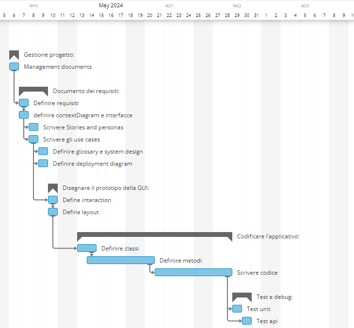

# Project Estimation - FUTURE
Date: 01/05/24

Version: V2

# Estimation approach
Consider the EZElectronics  project in FUTURE version (as proposed by your team in requirements V2), assume that you are going to develop the project INDEPENDENT of the deadlines of the course, and from scratch (not from V1)
# Estimate by size
### 
|                                                                                                        | Stima                       |             
| ------------------------------------------------------------------------------------------------------ | --------------------------- |  
| NC =  Estimated number of classes to be developed                                                      |  25                         |             
| A = Estimated average size per class, in LOC                                                           |  200                        | 
| S = Estimated size of project, in LOC (= NC * A)                                                       |  5000                       |
| E = Estimated effort, in person hours (here use productivity 10 LOC per person hour)                   |  500                        |   
| C = Estimated cost, in euro (here use 1 person hour cost = 30 euro)                                    |  15000                      | 
| Estimated calendar time, in calendar weeks (Assume team of 4 people, 8 hours per day, 5 days per week )|  3.125                      |               

# Estimate by product decomposition
### 
|         Nome componente   | Effort stimata (person hours)     |             
| ------------------------- | --------------------------------- | 
| requirement document      | 40                                |
| GUI prototype             | 25                                |
| design document           | 20                                |
| code                      | 400                               |
| unit tests                | 50                                |
| api tests                 | 50                                |
| management documents      | 30                                |
| TOTALE                    | 615                               |

# Estimate by activity decomposition
### 
|         Nome attività                | Effort stimata (person hours)     |             
| ------------------------------------ | --------------------------------- |
| Gestione progetto                    |                                   |
| management documents                 | 20                                |
| Documento dei requisiti              |                                   |
| Definire requisiti                   | 15                                |
| definire contextDiagram e interfacce | 4                                 |
| Scrivere Stories and personas        | 3                                 |
| Scrivere gli use cases               | 40                                |
| Definire glossary e system design    | 6                                 |
| Definire deployment diagram          | 4                                 |
| Disegnare il prototipo della GUI     |                                   |
| Define interaction                   | 5                                 |
| Define layout                        | 25                                |
| Codificare l'applicativo             |                                   |
| Definire classi                      | 50                                |
| Definire metodi                      | 150                               |
| Scrivere codice                      | 200                               |
| Test e debug                         |                                   |
| Test unit                            | 50                                |
| Test api                             | 50                                |
| TOTALE                               | 612                               |

###

# Summary

Report here the results of the three estimation approaches. The  estimates may differ. Discuss here the possible reasons for the difference

|                                    | Effort stimata (person hour)            | Durata stimata     (calendar weeks) |
| ---------------------------------- | --------------------------------------- | ----------------------------------- |
| estimate by size                   | 500                                     | 3.125                               |
| estimate by product decomposition  | 615                                     | ~3.84                               |
| estimate by activity decomposition | 612                                     | ~3.82                               |

