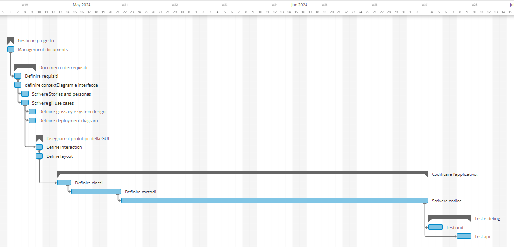

# Project Estimation - FUTURE
Date: 01/05/24

Version: V2

# Estimation approach
Consider the EZElectronics  project in FUTURE version (as proposed by your team in requirements V2), assume that you are going to develop the project INDEPENDENT of the deadlines of the course, and from scratch (not from V1)
# Estimate by size
### 
|                                                                                                        | Stima                       |             
| ------------------------------------------------------------------------------------------------------ | --------------------------- |  
| NC =  Estimated number of classes to be developed                                                      |  9                         |             
| A = Estimated average size per class, in LOC                                                           |  1500 (considerando anche il front-end)                       | 
| S = Estimated size of project, in LOC (= NC * A)                                                       |  13500                       |
| E = Estimated effort, in person hours (here use productivity 10 LOC per person hour)                   |  1350 person hours                       |   
| C = Estimated cost, in euro (here use 1 person hour cost = 30 euro)                                    |  40500                     | 
| Estimated calendar time, in calendar weeks (Assume team of 4 people, 8 hours per day, 5 days per week )|  8.50                      |               

# Estimate by product decomposition
### 
|         Nome componente   | Effort stimata (person hours)     |             
| ------------------------- | --------------------------------- | 
| requirement document      | 40                                |
| GUI prototype             | 35                                |
| design document           | 30                                |
| code                      | 1250                               |
| unit tests                | 40                                |
| api tests                 | 40                                |
| management documents      | 20                                |
| TOTALE                    | 1455                               |

# Estimate by activity decomposition
### 
|         Nome attività                | Effort stimata (person hours)     |             
| ------------------------------------ | --------------------------------- |
| Gestione progetto                    |                                   |
| management documents                 | 20                                |
| Documento dei requisiti              |                                   |
| Definire requisiti                   | 25                                |
| definire contextDiagram e interfacce | 4                                 |
| Scrivere Stories and personas        | 3                                 |
| Scrivere gli use cases               | 35                                |
| Definire glossary e system design    | 6                                 |
| Definire deployment diagram          | 4                                 |
| Disegnare il prototipo della GUI     |                                   |
| Define interaction                   | 5                                 |
| Define layout                        | 30                                |
| Codificare l'applicativo             |                                   |
| Definire classi                      | 50                                |
| Definire metodi                      | 150                               |
| Scrivere codice                      | 1100                               |
| Test e debug                         |                                   |
| Test unit                            | 50                                |
| Test api                             | 50                                |
| TOTALE                               | 1532                              |

###

# Summary

Consideriamo la stima "by size" la meno precisa visto che tiene conto solo delle linee di codice scritte e non del tempo impiegato per
le fasi di project management, planning e la creazione dei documenti ad esso necessari.
Le altre due stime sono piu' precise in quanto tengono conto delle altre fasi di progetto.

|                                    | Effort stimata (person hour)            | Durata stimata     (calendar weeks) |
| ---------------------------------- | --------------------------------------- | ----------------------------------- |
| estimate by size                   | 1350                                     | 8.50
| estimate by product decomposition  | 1455                                     | ~9.10 |
| estimate by activity decomposition | 1532                                     | ~9.50  |

