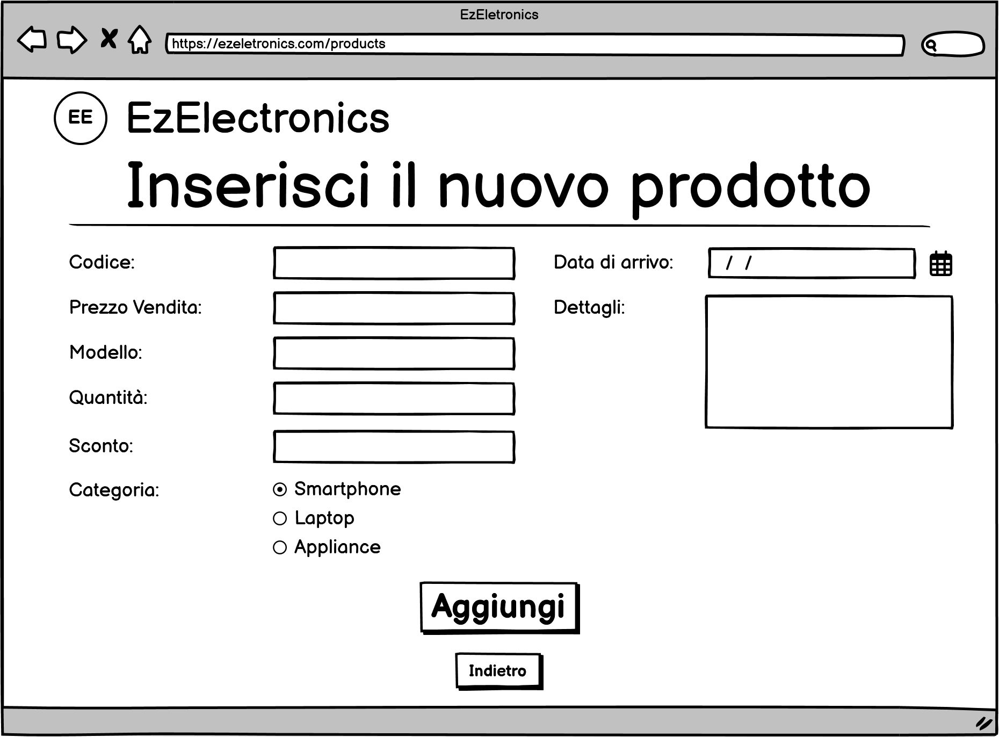

# Graphical User Interface Prototype - CURRENT

Authors: Alessandra Cicciarelli, Filippo Forte, Giulio Arecco, Riccardo Daniele Turco

Date: 21/04/2024

Version: 1.6

## Pagina Principale

## Schermata di registrazione

## Schermata di login

## Schermata di visualizzazione prodotti (da utente customer)

### Schermata di visualizzazione prodotti con menu a tendina esteso (da utente customer)

### Carrello (da utente customer)

Si accede alla pagina premendo sull'icona del carrello sulla navbar

### Storia dei carrelli (da utente customer)

## Schermata di visualizzazione prodotti (da utente manager)

### Schermata di visualizzazione prodotti con menu a tendina esteso (da utente manager)

### Inserisci un nuovo prodotto (da utente manager)

Si accede alla pagina tramite il bottone "Aggiungi Prodotto" sulla navbar

### Registrazione arrivi (da utente manager)

Si accede alla pagina tramite il bottone "Registrazione Arrivi" sulla navbar

## Profilo (da utente customer e manager)

## Esempio funzionamento filtri

## Esempio Errori

