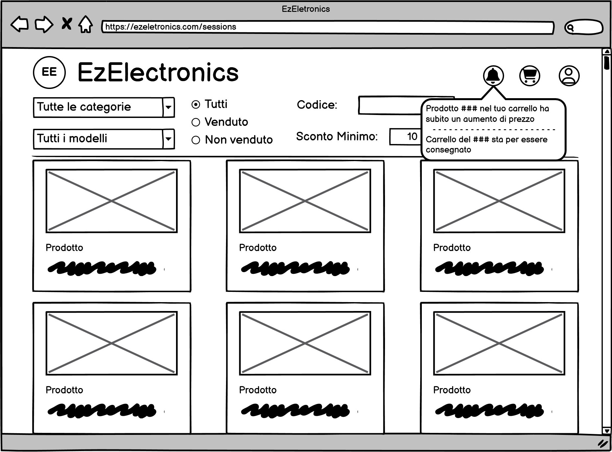
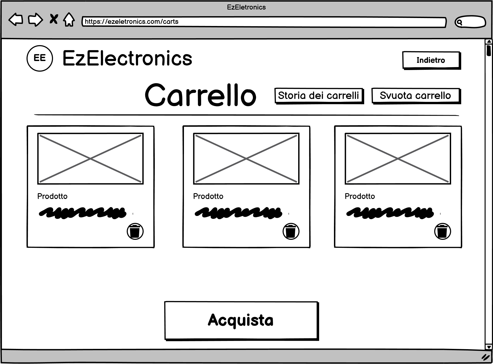
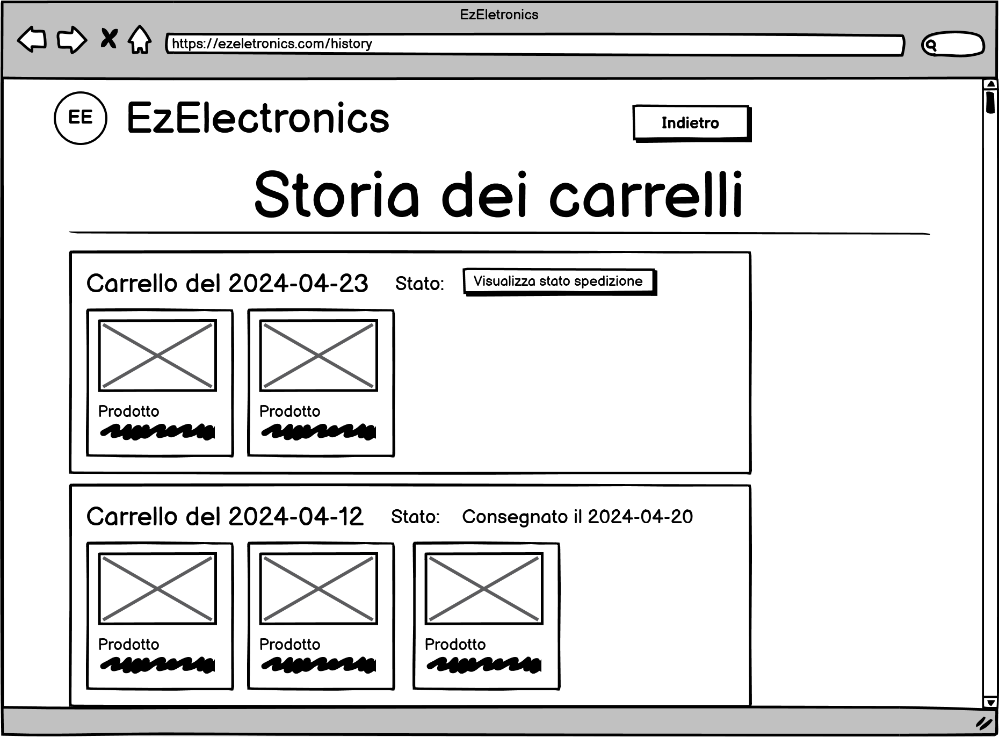
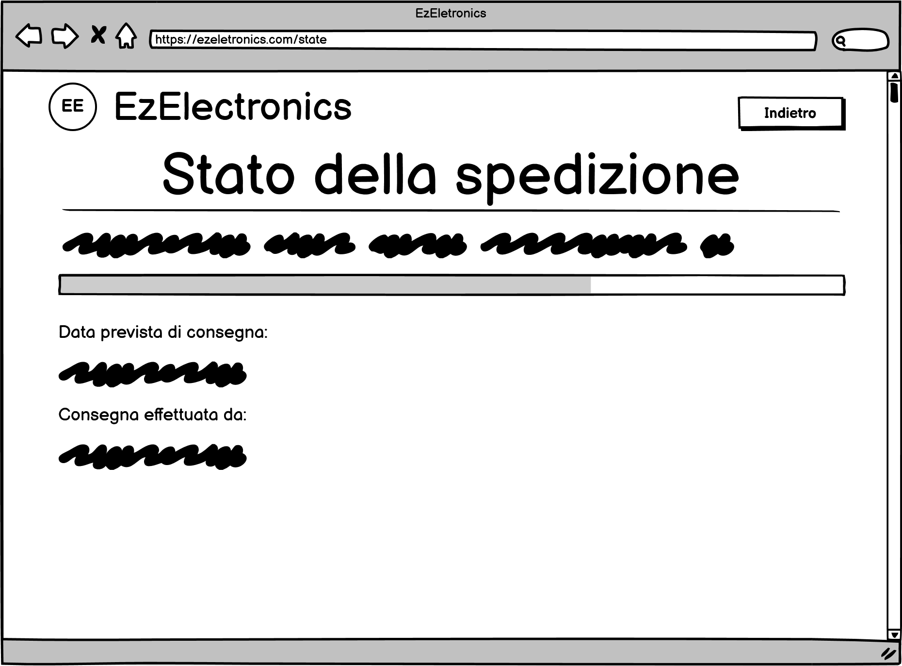
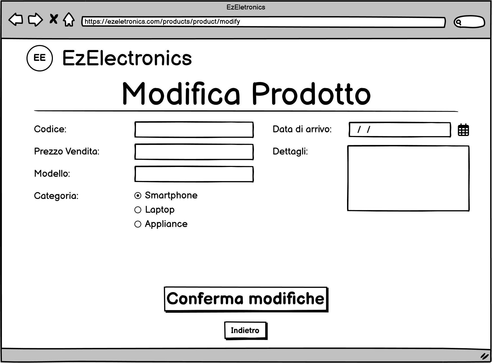

# Graphical User Interface Prototype - CURRENT

Authors: Alessandra Cicciarelli, Filippo Forte, Giulio Arecco, Riccardo Daniele Turco

Date: 23/04/2024

Version: 2.5

## Pagina Principale

## Schermata di registrazione Customer

## Schermata di login

## Schermata di visualizzazione prodotti (da utente customer)

### Schermata di visualizzazione prodotti con  menu a tendina esteso (da utente customer)

### Centro notifiche (da utente customer)

### Carrello (da utente customer)

Si accede alla pagina premendo sull'icona del carrello sulla navbar

### Acquista (da utente customer)

### Modifica metodo di pagamento (da utente customer)

### Modifica indirizzo di spedizione (da utente customer)

### Storia dei carrelli (da utente customer)

Si accede alla pagina tramite la voce nel menu a tendina nella navbar o tramite i pulsanti appositi

### Stato della spedizione (da utente customer)

### Lista dei desideri (da utente customer)

Si accede alla pagina tramite la voce nel menu a tendina nella navbar

### Prodotto (da utente customer)

Si accede alla pagina premendo sull'icona del prodotto desiderato

## Profilo (da utente customer)

### Modifica Profilo (da utente customer)

## Schermata di visualizzazione prodotti (da utente manager)

### Schermata di visualizzazione prodotti con  menu a tendina esteso (da utente manager)

### Sconta prodotto (da utente manager)

### Inserisci un nuovo prodotto (da utente manager)

Si accede alla pagina tramite il bottone "Aggiungi Prodotto" sulla navbar

### Registrazione arrivi (da utente manager)

Si accede alla pagina tramite il bottone "Registrazione Arrivi" sulla navbar

### Modifica prodotto (da utente manager)

## Profilo (da utente manager)

## Esempio Errori

