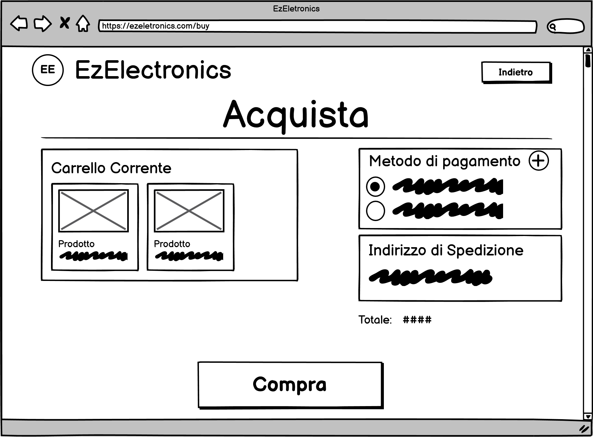
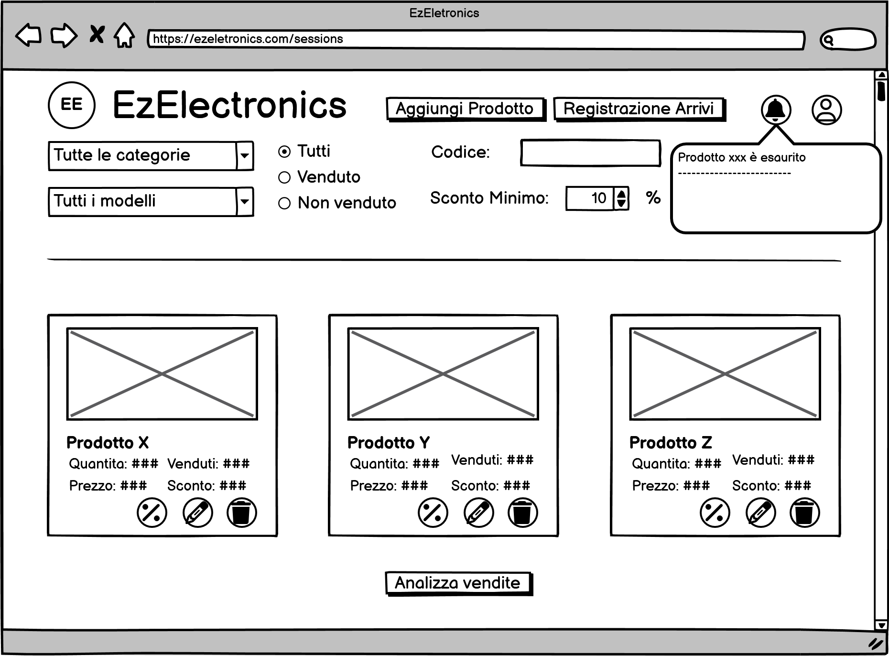

# Graphical User Interface Prototype - CURRENT

Authors: Alessandra Cicciarelli, Filippo Forte, Giulio Arecco, Riccardo Daniele Turco

Date: 23/04/2024

Version: 2.5

## Pagina Principale

## Scrermata di registrazione Customer

## Scrermata di registrazione Manager

## Scrermata di login

## Scrermata di visualizzazione prodotti (da utente customer)

### Prodotto (da utente customer)

Si accede alla pagina premendo sull'icona del prodotto desiderato

### Carrello (da utente customer)

Si accede alla pagina premendo sull'icona del carrello sulla navbar

### Acquista (da utente customer)

### Modifica metodo di pagamento (da utente customer)

### Modifica indirizzo di spedizione (da utente customer)

### Storia dei carrelli (da utente customer)

Si accede alla pagina tramite la voce nel menu a tendina nella navbar o tramite i pulsanti appositi

### Stato della spedizione (da utente customer)

### Lista dei desideri (da utente customer)

Si accede alla pagina tramite la voce nel menu a tendina nella navbar

### Centro notifiche (da utente customer)

## Scrermata di visualizzazione prodotti (da utente manager)

### Inserisci un nuovo prodotto (da utente manager)

Si accede alla pagina tramite il bottone "Aggiungi Prodotto" sulla navbar per la versione da PC mentre attraverso il bottone corrispondente situato in basso da cellulare

### Registrazione arrivi (da utente manager)

Si accede alla pagina tramite il bottone "Registrazione Arrivi" sulla navbar per la versione da PC mentre attraverso il bottone corrispondente situato in basso da cellulare

### Modifica prodotto (da utente manager)

### Sconta prodotto (da utente manager)

## Profilo (da utente customer e manager)

## Modifica Profilo (da utente customer e manager)

