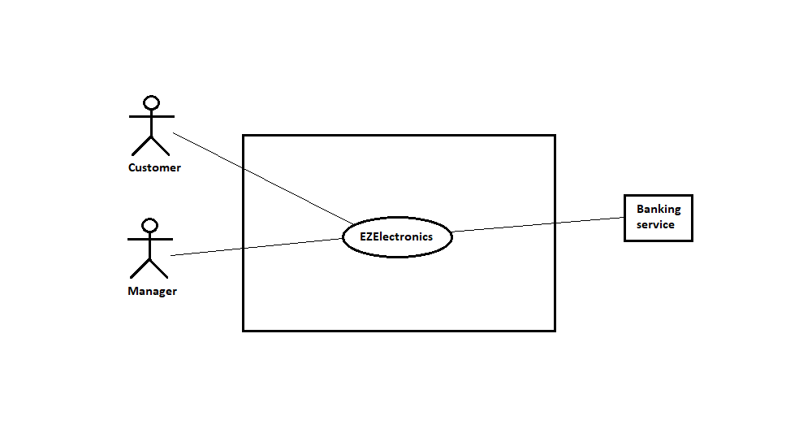

# Requirements Document - current EZElectronics

Date:

Version: V1 - description of EZElectronics in CURRENT form (as received by teachers)

| Version number | Change |
| :------------: | :----: |
|                |        |

# Contents

- [Requirements Document - current EZElectronics](#requirements-document---current-ezelectronics)
- [Contents](#contents)
- [Informal description](#informal-description)
- [Stakeholders](#stakeholders)
- [Context Diagram and interfaces](#context-diagram-and-interfaces)
  - [Context Diagram](#context-diagram)
  - [Interfaces](#interfaces)
- [Stories and personas](#stories-and-personas)
- [Functional and non functional requirements](#functional-and-non-functional-requirements)
  - [Functional Requirements](#functional-requirements)
  - [Non Functional Requirements](#non-functional-requirements)
- [Use case diagram and use cases](#use-case-diagram-and-use-cases)
  - [Use case diagram](#use-case-diagram)
    - [Use case 1, UC1](#use-case-1-uc1)
      - [Scenario 1.1](#scenario-11)
      - [Scenario 1.2](#scenario-12)
      - [Scenario 1.x](#scenario-1x)
    - [Use case 2, UC2](#use-case-2-uc2)
    - [Use case x, UCx](#use-case-x-ucx)
- [Glossary](#glossary)
- [System Design](#system-design)
- [Deployment Diagram](#deployment-diagram)

# Informal description

EZElectronics (read EaSy Electronics) is a software application designed to help managers of electronics stores to manage their products and offer them to customers through a dedicated website. Managers can assess the available products, record new ones, and confirm purchases. Customers can see available products, add them to a cart and see the history of their past purchases.

# Stakeholders

| Stakeholder name | Description                                                              |
| :--------------: | :----------------------------------------------------------------------: |
| Customer         | Individual who wants to buy something                                    |
| Manager          | Manager who provides products to the application                         |
| Banking service  | Service for monetary transactions                                        |
| Developers       | Group that created the application                                       |
| Shipping service | Service for the shipment of products to the user                         |
| Admin            | Individual who manage the users and the application                      |

# Context Diagram and interfaces

## Context Diagram

## Interfaces

|   Actor          | Logical Interface                                        | Physical Interface |
| :--------------: | :------------------------------------------------------: | :----------------: |
| Customer         | GUI (interface for viewing products and purchasing)      | Smartphone / PC    |
| Manager          | GUI (interface for view and add products)                | Smartphone / PC    |
| Admin            | GUI (interface for view, add products and control users) | Smartphone / PC    |
| Banking service  | APIs                                                     | Internet           |
| Shipping service | APIs                                                     | Internet           |

# Stories and personas

**Persona 1**: male, high-income professional, married, with children, 50 years-old  
Story: wants to purchase a new, <u>state-of-the-art</u> smart-TV for his living room: needs to find the <u>best price/discount</u> among different stores.  

**Persona 2**: female, undergraduate, 20 years-old  
Story: wants to purchase a <u>cheap</u> smartphone to replace her old and slow one: needs to find the <u>best cost-performance solution</u>.  
  
**Persona 3**: female, married, with children, 60 years-old  
Story: wants to purchase a radio for her 85 year-old mother who lives alone, to keep her company.    
  
**Persona 4**: male, has been working for a few years, 28 years-old  
Story: wants to build a cutting-edge gaming PC: needs to find the best prices for all the components, might buy <u>different items from different stores</u>.  

**Persona 5**: male, store manager, 45 years-old  
Story: needs to <u>add a newly released model</u> of a product to the website and <u>remove an old</u>, out-of-stock one.  

**Persona 6**: female, store manager, 50 years-old  
Story: needs to <u>register the arrival</u> of a set of products and <u>apply a discount</u> for the products of a specific model.

# Functional and non functional requirements

## Functional Requirements

| ID        | Description                                     |
|:----------|:------------------------------------------------|
| **FR1**   | **Access management**                           |
| FR1.1     | User registration                               |
| FR1.2     | Registered user log in                          |
| FR1.3     | Registered user log out                         |
| **FR2**   | **User management**                             |
| FR2.1     | View all registered users                       |
| FR2.2     | Filter users by role                            |
| FR2.3     | Search a user by username                       |
| FR2.4     | Delete a user given its username                |
| **FR3**   | **Product management**                          |
| FR3.1     | View all products                               |
| FR3.2     | Add a new product                               |
| FR3.3     | Remove a product                                |
| FR3.4     | Register a product's date of arrival            |
| FR3.5     | Filter products by sale status, category, model |
| **FR4**   | **Shopping cart management**                    |
| FR4.1     | View the user's current cart                    |
| FR4.2     | Add a product to cart                           |
| FR4.3     | Remove a product from the cart                  |
| FR4.4     | Purchase the products added to the cart         |
| FR4.5     | View the history of carts the user purchased    |
| FR4.6     | Delete the current cart                         |

## Non Functional Requirements

| ID    | Type (efficiency, reliability, ..) | Description                                                                                                                                                                                                    | Refers to    |
|:------|:----------------------------------:|:---------------------------------------------------------------------------------------------------------------------------------------------------------------------------------------------------------------|:------------:|
| NFR1  | Efficiency                         | The system must respond within 0.5 seconds since any user action (excluding page loading times)                                                                                                                | /            |
| NFR2  | Efficiency                         | Web pages must load within 6 seconds since last user request (depending on network conditions)                                                                                                                 | /            |
| NFR3  | Efficiency                         | No app installation needed for the end-user, every functionality has to be accessible from the website via an internet browser                                                                                 | /            |
| NFR4  | Security                           | Only system administrators can access user management functionalities                                                                                                                                          | F2.x         |
| NFR5  | Security                           | User data treatment must meet GDPR                                                                                                                                                                             | /            |
| NFR5  | Security                           | Some product functionalities can only be used by managers                                                                                                                                                      | F3.(2, 3, 4) |
| NFR5  | Security                           | All shopping cart functionalities can only be used by customers                                                                                                                                                | F4.x         |
| NFR6  | Usability                          | Customers don't need any training                                                                                                                                                                              | /            |
| NFR7  | Usability                          | Managers need a maximum of one hour of training                                                                                                                                                                | /            |
| NFR8  | Reliability                        | The system cannot exhibit more than 2 malfunctions per year                                                                                                                                                    | /            |
| NFR9  | Reliability                        | The website cannot require more than one 1 maintenance session every 2 months                                                                                                                                  | /            |
| NFR10 | Reliability                        | Maintenance sessions cannot last more than 4 hours                                                                                                                                                             | /            |
| NFR11 | Reliability                        | Every user should not report more than 1  previously unreported bug per year                                                                                                                                   | /            |
| NFR12 | Portability                        | The web site must be accessible from the following browsers (oldest supported version specified): Chrome (v: 79), Firefox (v: 72), Safari (v: 13.0.5), Opera (v: 65), Edge (v: 79), Samsung Internet (v: 11.2) | /            |

# Use case diagram and use cases

## Use case diagram

\<next describe here each use case in the UCD>

### Use case 1, UC1 : Access management : Autenticazione

| Actors Involved  |    Utente                                                                   |
| :--------------: | :------------------------------------------------------------------: |
|   Precondition   | -- |
|  Post condition  | L'utente risulta autenticato  |
| Nominal Scenario | L'utente si autentica nel sistema inserendo username e password e l'autenticazione va a buon fine.      |
|     Variants     |                     --                   |
|    Exceptions    | 1.a L'utente non risulta registrato al sistema. 
   1.b L'utente commette errori nell'inserimento di username e/o password, il sistema mostra un errore e il caso d'uso riprende dall'inserimento dei dati.  
          |

##### Scenario 1.1

\<describe here scenarios instances of UC1>

\<a scenario is a sequence of steps that corresponds to a particular execution of one use case>

\<a scenario is a more formal description of a story>

\<only relevant scenarios should be described>

|  Scenario 1.1  |                                                                            |
| :------------: | :------------------------------------------------------------------------: |
|  Precondition  | \<Boolean expression, must evaluate to true before the scenario can start> |
| Post condition |  \<Boolean expression, must evaluate to true after scenario is finished>   |
|     Step#      |                                Description                                 |
|       1        |                                                                            |
|       2        |                                                                            |
|      ...       |                                                                            |

##### Scenario 1.2

##### Scenario 1.x

### Use case 2, UC2

| Actors Involved  |                                                                      |
| :--------------: | :------------------------------------------------------------------: |
|   Precondition   | \<Boolean expression, must evaluate to true before the UC can start> |
|  Post condition  |  \<Boolean expression, must evaluate to true after UC is finished>   |
| Nominal Scenario |         \<Textual description of actions executed by the UC>         |
|     Variants     |                      \<other normal executions>                      |
|    Exceptions    |                        \<exceptions, errors >                        |

##### Scenario 2.1

\<describe here scenarios instances of UC1>

\<a scenario is a sequence of steps that corresponds to a particular execution of one use case>

\<a scenario is a more formal description of a story>

\<only relevant scenarios should be described>

|  Scenario 2.1  |                                                                            |
| :------------: | :------------------------------------------------------------------------: |
|  Precondition  | \<Boolean expression, must evaluate to true before the scenario can start> |
| Post condition |  \<Boolean expression, must evaluate to true after scenario is finished>   |
|     Step#      |                                Description                                 |
|       1        |                                                                            |
|       2        |                                                                            |
|      ...       |                                                                            |

##### Scenario 2.2

##### Scenario 2.x

### Use case 3, UC3

| Actors Involved  |                                                                      |
| :--------------: | :------------------------------------------------------------------: |
|   Precondition   | \<Boolean expression, must evaluate to true before the UC can start> |
|  Post condition  |  \<Boolean expression, must evaluate to true after UC is finished>   |
| Nominal Scenario |         \<Textual description of actions executed by the UC>         |
|     Variants     |                      \<other normal executions>                      |
|    Exceptions    |                        \<exceptions, errors >                        |

##### Scenario 3.1

\<describe here scenarios instances of UC1>

\<a scenario is a sequence of steps that corresponds to a particular execution of one use case>

\<a scenario is a more formal description of a story>

\<only relevant scenarios should be described>

|  Scenario 1.1  |                                                                            |
| :------------: | :------------------------------------------------------------------------: |
|  Precondition  | \<Boolean expression, must evaluate to true before the scenario can start> |
| Post condition |  \<Boolean expression, must evaluate to true after scenario is finished>   |
|     Step#      |                                Description                                 |
|       1        |                                                                            |
|       2        |                                                                            |
|      ...       |                                                                            |

##### Scenario 3.2

##### Scenario 3.x

### Use case 4, UC4: Shopping cart management (Add a product to cart)

| Actors Involved  |     Utente                                                                 |
| :--------------: | :------------------------------------------------------------------: |
|   Precondition   | L'utente risulta autenticato |
|  Post condition  |  Il prodotto viene aggiunto correttamente al carrello   |
| Nominal Scenario |         L'utente aggiunge un prodotto al suo carrello         |
|     Variants     |                      \<other normal executions>                      |
|    Exceptions    |       Il prodotto non viene aggiunto correttamente al carrello e viene mostrato un errore            |

##### Scenario 4.1

|  Scenario 4.1  |                   Aggiunta di un prodotto al carrello                                                         |
| :------------: | :------------------------------------------------------------------------: |
|  Precondition  | L'utente risulta autenticato nel sistema e il prodotto esiste |
| Post condition | Il prodotto è inserito nel carrello   |
|     Step#      |                        <b> Description    </b>                               |
|       1        |  l'utente seleziona il prodotto che vuole aggiungere al carrello                                                                          |
|       2        |    l'utente aggiunge il prodotto al carrello                                                                        |
|      3       |     il sistema aggiorna il carrello dell'utente aggiungendo il prodotto                                                                       |
|      4      |    il caso d'uso termina con successo
##### Scenario 3.2

##### Scenario 3.x

### Use case 2, UC2

..

### Use case x, UCx

..

# Glossary

# System Design

\<describe here system design>

\<must be consistent with Context diagram>

# Deployment Diagram

