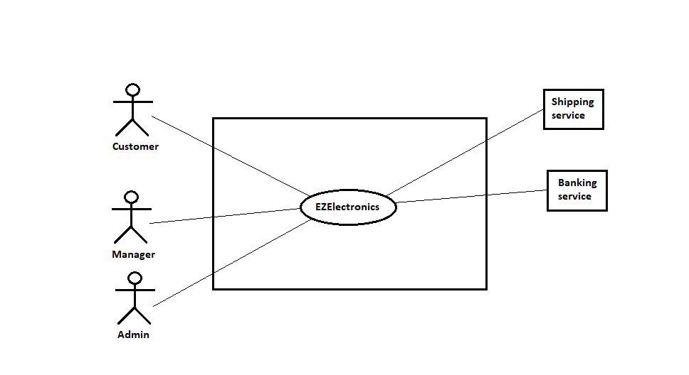
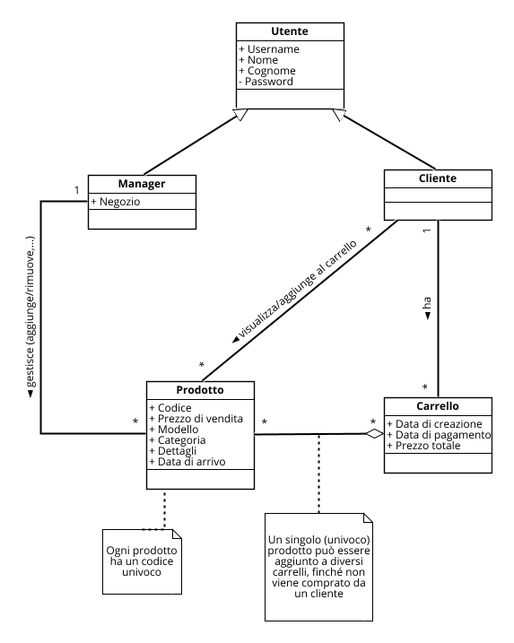

# Requirements Document - current EZElectronics

Date:

Version: V1 - description of EZElectronics in CURRENT form (as received by teachers)

| Version number | Change |
| :------------: | :----: |
|        V1      |        |

# Contents

- [Requirements Document - current EZElectronics](#requirements-document---current-ezelectronics)
- [Contents](#contents)
- [Informal description](#informal-description)
- [Stakeholders](#stakeholders)
- [Context Diagram and interfaces](#context-diagram-and-interfaces)
  - [Context Diagram](#context-diagram)
  - [Interfaces](#interfaces)
- [Stories and personas](#stories-and-personas)
- [Functional and non functional requirements](#functional-and-non-functional-requirements)
  - [Functional Requirements](#functional-requirements)
  - [Non Functional Requirements](#non-functional-requirements)
- [Use case diagram and use cases](#use-case-diagram-and-use-cases)
  - [Use case diagram](#use-case-diagram)
    - [Use case 1, UC1](#use-case-1-uc1)
      - [Scenario 1.1](#scenario-11)
      - [Scenario 1.2](#scenario-12)
      - [Scenario 1.x](#scenario-1x)
    - [Use case 2, UC2](#use-case-2-uc2)
    - [Use case x, UCx](#use-case-x-ucx)
- [Glossary](#glossary)
- [System Design](#system-design)
- [Deployment Diagram](#deployment-diagram)

# Informal description

EZElectronics (read EaSy Electronics) is a software application designed to help managers of electronics stores to manage their products and offer them to customers through a dedicated website. Managers can assess the available products, record new ones, and confirm purchases. Customers can see available products, add them to a cart and see the history of their past purchases.

# Stakeholders

| Stakeholder name | Description                                                              |
| :--------------: | :----------------------------------------------------------------------: |
| Customer         | Individual who wants to buy something                                    |
| Manager          | Manager who provides products to the application                         |
| Banking service  | Service for monetary transactions                                        |
| Developers       | Group that created the application                                       |
| Shipping service | Service for the shipment of products to the user                         |
| Admin            | Individual who manage the users and the application                      |

# Context Diagram and interfaces

## Context Diagram

## Interfaces

|   Actor          | Logical Interface                                        | Physical Interface |
| :--------------: | :------------------------------------------------------: | :----------------: |
| Customer         | GUI (interface for viewing products and purchasing)      | Smartphone / PC    |
| Manager          | GUI (interface for viewing and add products)                | Smartphone / PC    |
| Admin            | GUI (interface for viewing, add products and control users) | Smartphone / PC    |
| Banking service  | APIs                                                     | Internet           |
| Shipping service | APIs                                                     | Internet           |

# Stories and personas

**Persona 1**: male, high-income professional, married, with children, 50 years-old  
Story: wants to purchase a new, <u>state-of-the-art</u> smart-TV for his living room: needs to find the <u>best price</u> among the best TVs in the store.

**Persona 2**: female, undergraduate, 20 years-old  
Story: wants to purchase a <u>cheap</u> smartphone to replace her old and slow one: needs to find the <u>best cost-performance solution</u>.  
  
**Persona 3**: female, married, with children, 60 years-old  
Story: wants to purchase a radio for her 85 year-old mother who lives alone, to keep her company.    
  
**Persona 4**: male, has been working for a few years, 28 years-old  
Story: wants to build a cutting-edge gaming PC: wants to check the trend of the prices of the components he is interested in.  

**Persona 5**: male, store manager, 45 years-old  
Story: needs to <u>add a newly released model</u> of a product to the website and <u>remove an old</u>, out-of-stock one.  

**Persona 6**: female, store manager, 50 years-old  
Story: needs to <u>register the arrival</u> of a set of products and <u>apply a discount</u> for the products of a specific model.

# Functional and non functional requirements

## Functional Requirements

| ID        | Description                                     |
|:----------|:------------------------------------------------|
| **FR1**   | **Access management**                           |
| FR1.1     | User registration                               |
| FR1.2     | Registered user log in                          |
| FR1.3     | Registered user log out                         |
| **FR2**   | **User management**                             |
| FR2.1     | View all registered users                       |
| FR2.2     | Filter users by role                            |
| FR2.3     | Search a user by username                       |
| FR2.4     | Delete a user given its username                |
| **FR3**   | **Product management**                          |
| FR3.1     | View all products                               |
| FR3.2     | Add a new product                               |
| FR3.3     | Remove a product                                |
| FR3.4     | Register the arrival of a new (set of) product(s) |
| FR3.5     | Filter products by sale status, category, model |
| **FR4**   | **Shopping cart management**                    |
| FR4.1     | View the user's current cart                    |
| FR4.2     | Add a product to cart                           |
| FR4.3     | Remove a product from the cart                  |
| FR4.4     | Purchase the products added to the cart         |
| FR4.5     | View the history of carts the user purchased    |
| FR4.6     | Delete the current cart                         |

## Non Functional Requirements

| ID    | Type (efficiency, reliability, ..) | Description                                                                                                                                                                                                    | Refers to    |
|:------|:----------------------------------:|:---------------------------------------------------------------------------------------------------------------------------------------------------------------------------------------------------------------|:------------:|
| NFR1  | Efficiency                         | The system must respond within 0.5 seconds since any user action (excluding page loading times)                                                                                                                | /            |
| NFR2  | Efficiency                         | Web pages must load within 6 seconds since last user request (depending on network conditions)                                                                                                                 | /            |
| NFR3  | Efficiency                         | No app installation needed for the end-user, every functionality has to be accessible from the website via an internet browser                                                                                 | /            |
| NFR4  | Security                           | Only system administrators can access user management functionalities                                                                                                                                          | F2.x         |
| NFR5  | Security                           | User data treatment must meet GDPR                                                                                                                                                                             | /            |
| NFR5  | Security                           | Some product functionalities can only be used by managers                                                                                                                                                      | F3.(2, 3, 4) |
| NFR5  | Security                           | All shopping cart functionalities can only be used by customers                                                                                                                                                | F4.x         |
| NFR6  | Usability                          | Customers don't need any training                                                                                                                                                                              | /            |
| NFR7  | Usability                          | Managers need a maximum of one hour of training                                                                                                                                                                | /            |
| NFR8  | Reliability                        | The number of malfunctions per year must be less than 2                                                                                                                                                 | /            |
| NFR9  | Reliability                        | The website cannot require more than one 1 maintenance session every 2 months                                                                                                                                  | /            |
| NFR10 | Reliability                        | Maintenance sessions cannot last more than 4 hours                                                                                                                                                             | /            |
| NFR11 | Reliability                        | Every user should not report more than 1  previously unreported bug per year                                                                                                                                   | /            |
| NFR12 | Portability                        | The web site must be accessible from the following browsers (oldest supported version specified): Chrome (v: 79), Firefox (v: 72), Safari (v: 13.0.5), Opera (v: 65), Edge (v: 79), Samsung Internet (v: 11.2) | /            |

# Use case diagram and use cases

## Use case diagram

\<next describe here each use case in the UCD>

### Use case 1, UC1 Registrazione

| Actors Involved  |                                                              Utente, Manager        |
| :--------------: | :------------------------------------------------------------------: |
|   Precondition   | -- |
|  Post condition  |  L'utente/manager risulta registrato correttamente nel sistema.  |
| Nominal Scenario |  L'utente/manager inserisce tutti i dati richiesti per la registrazione e sceglie il ruolo con cui registrarsi nel sistema.        |
|     Variants     |   \<other normal executions>  ??????     |
|    Exceptions    |  I dati inseriti non sono corretti o l'utente risulta già registrato, il sistema ritorna un errore e la registrazione non va a buon fine          |

##### Scenario 1.1

|  Scenario 1.1  |                                                                            |
| :------------: | :------------------------------------------------------------------------: |
|  Precondition  | -- |
| Post condition |  L'utente/manager risulta registrato correttamente nel sistema  |
|     Step#      |                                Description                                 |
|       1        |   L'utente chiede di registrarsi al sistema.                                                         |
|       2        |                                                        Il sistema chiede i dati necessari per la registrazione                |
|      3      |                                                          L'utente inserisce i dati richiesti       |
|       4      |                                                          L'utente seleziona il ruolo con cui registrarsi(manager o utente)             |
|    5     |                                                           il sistema salva i dati e viene creato il nuovo utente/manager               |

### Use case 2, UC2 Login

| Actors Involved  |    Utente/Manager                                                                  |
| :--------------: | :------------------------------------------------------------------: |
|   Precondition   | L'utente è registrato nel sistema |
|  Post condition  | L'utente/manager risulta loggato |
| Nominal Scenario | L'utente inserisce username e password e accede al sistema    |
|     Variants     |                   |
|    Exceptions    | L'utente inserisce dati errati e viene ritornato un errore      |

##### Scenario 2.1

|  Scenario 2.1  |                                                                            |
| :------------: | :------------------------------------------------------------------------: |
|  Precondition  |L'utente è registrato nel sistema |
| Post condition |L'utente/manager risulta loggato  |
|     Step#      |                                Description                                 |
|       1        |  L'utente chiede di accedere al sistema                                                                          |
|       2        | Il sistema chiede username e password                                                                           |
|      3       |                                                         L'utente inserisce username a password         |
|      4      |                                                         Il sistema valida i dati        |
|      5      |                                                         L'utente risulta loggato        |

### Use case 3, UC3 Logout

| Actors Involved  |  Utente/Manager                                                                    |
| :--------------: | :------------------------------------------------------------------: |
|   Precondition   | L'utente è loggato |
|  Post condition  | Viene eseguito il logout   |
| Nominal Scenario | L'utente chiede al sistema di effettuare il logout e questo viene effettuato con successo      |
|     Variants     |                          |
|    Exceptions    |                             |

##### Scenario 3.1

|  Scenario 1.1  |                                                                            |
| :------------: | :------------------------------------------------------------------------: |
|  Precondition  | L'utente è loggato|
| Post condition |  Viene eseguito il logout   |
|     Step#      |                                Description                                 |
|       1        |                                                        L'utente chiede al sistema di effettuare il logout                   |
|       2        |                                                        Il sistema effettua il logout per l'utente                    |

### Use case 4, UC4 Visualizza tutti i prodotti

| Actors Involved  |  Utente/Manager                                                                    |
| :--------------: | :------------------------------------------------------------------: |
|   Precondition   | L'utente è loggato |
|  Post condition  | Vengono mostrati tutti i prodotti   |
| Nominal Scenario | L'utente chiede al sistema di visualizzare tutti i prodotti e li vengono mostrati     |
|     Variants     |                          |
|    Exceptions    |                             |

##### Scenario 4.1

|  Scenario 4.1  |                                                                            |
| :------------: | :------------------------------------------------------------------------: |
|  Precondition  | L'utente è loggato|
| Post condition | Vengono mostrati tutti i prodotti   |
|     Step#      |                                Description                                 |
|       1        |                                                        L'utente chiede al sistema di visualizzare tutti i prodotti presenti               |
|       2        |                                                        Il sistema mostra tutti i prodotti presenti                   |

### Use case 5, UC5 Aggiungi nuovo prodotto

| Actors Involved  |  Manager                                                                    |
| :--------------: | :------------------------------------------------------------------: |
|   Precondition   | L'utente è loggato ed ha il ruolo Manager |
|  Post condition  | Il prodotto viene aggiunto correttamente   |
| Nominal Scenario | Il manager chiede di aggiungere un nuovo prodotto, inserisce tutti i dati richiesti e il prodotto viene aggiunto correttamente     |
|     Variants     |                          |
|    Exceptions    | Il prodotto è già presente o la data di arrivo è successiva a quella corrente                            |

##### Scenario 5.1

|  Scenario 5.1  |                                                                            |
| :------------: | :------------------------------------------------------------------------: |
|  Precondition  | L'utente è loggato ed ha il ruolo Manager|
| Post condition | Il prodotto viene aggiunto correttamente   |
|     Step#      |                                Description                                 |
|       1        |                                                        Il manager chiede di aggiungere un nuovo prodotto               |
|       2        |                                                        Il sistema chiede tutti i dati necessari per l'aggiunta                |
|3 | Il manager inserisce tutti i dati richiesti
|4 | Il sistema valida i dati e li salva
|5| Il prodotto viene aggiunto correttamente

### Use case 6, UC6 Rimuovi un prodotto

| Actors Involved  | Manager                                                                    |
| :--------------: | :------------------------------------------------------------------: |
|   Precondition   | L'utente è loggato ed ha il ruolo Manager |
|  Post condition  | Il prodotto viene rimosso    |
| Nominal Scenario | Il manager chiede al sistema di rimuovere un prodotto e questo viene rimosso correttamente    |
|     Variants     |                          |
|    Exceptions    |Il prodotto che si vuole rimuovere non è presente, viene ritornato un errore                           |

##### Scenario 6.1

|  Scenario 6.1  |                                                                            |
| :------------: | :------------------------------------------------------------------------: |
|  Precondition  | L'utente è loggato ed ha il ruolo Manager|
| Post condition | Il prodotto viene rimosso  |
|     Step#      |                                Description                                 |
|       1        |                                                        Il manager chiede al sistema di rimuovere un prodotto            |
|       2        |                                                        Il sistema chiede il codice del prodotto che si vuole rimuovere                   |
|3| L'utente inserisce il codice
|4| Il sistema verifica che il codice sia presente 
|5| Il prodotto viene rimosso
### Use case 7, UC7 Registra arrivi

| Actors Involved  | Manager                                                                    |
| :--------------: | :------------------------------------------------------------------: |
|   Precondition   | L'utente è loggato ed ha il ruolo Manager |
|  Post condition  | Vengono registrati correttamente l'arrivo di un set di prodotti   |
| Nominal Scenario | Il manager chiede al sistema di registrare l'arrivo di un set di prodotti dello stesso modello e vengono registrati correttamente    |
|     Variants     |                          |
|    Exceptions    |La data di arrivo è successiva a quella corrente e viene mostrato un errore
##### Scenario 7.1

|  Scenario 7.1  |                                                                            |
| :------------: | :------------------------------------------------------------------------: |
|  Precondition  | L'utente è loggato ed ha il ruolo Manager|
| Post condition | Vengono registrati correttamente l'arrivo di un set di prodotti    |
|     Step#      |                                Description                                 |
|       1        |                                                        Il manager chiede al sistema di registrare l'arrivo di un set di prodotti           |
|       2        |                                                        Il sistema i dati necessari per la registrazione di un arrivo                   |
|3| L'utente inserisce i dati
|4| Il sistema valida i dati e li salva
|5| Il'arrivo viene registrato correttamente
### Use case 8, UC8 Filtra prodotti

| Actors Involved  | Utente/Manager                                                                    |
| :--------------: | :------------------------------------------------------------------: |
|   Precondition   | L'utente è loggato  |
|  Post condition  | Vengono mostrati i prodotti che rispecchiano il filtro inserito dall'utente  |
| Nominal Scenario | L'utente chiede di visualizzare solo i prodotti che rispecchiano un determinato filtro    |
|     Variants     |                          |
|    Exceptions    |
##### Scenario 8.1

|  Scenario 8.1  |                                                                     Filtro per categoria       | 
| :------------: | :------------------------------------------------------------------------: |
|  Precondition  | L'utente è loggato |
| Post condition | Vengono mostrati i prodotti che rispecchiano la categoria inserita dall'utente   |
|     Step#      |                                Description                                 |
|       1        |                                                        L'utente chiede di visualizzare i prodotti di una certa categoria          |
|       2        |                                                        Il sistema chiede la categoria             |
|3| L'utente inserisce la categoria
|4| Il sistema mostra i prodotti appartenenti alla categoria inserita dall'utente
##### Scenario 8.2
|  Scenario 8.2  |                                                                     Filtro per modello       | 
| :------------: | :------------------------------------------------------------------------: |
|  Precondition  | L'utente è loggato |
| Post condition | Vengono mostrati i prodotti che rispecchiano il modello inserito dall'utente   |
|     Step#      |                                Description                                 |
|       1        |                                                        L'utente chiede di visualizzare i prodotti di un certo modello          |
|       2        |                                                        Il sistema chiede il modello            |
|3| L'utente inserisce il modello
|4| Il sistema mostra i prodotti con modello corrispondente a quello inserito dall'utente
# Glossary

# System Design

# Deployment Diagram

