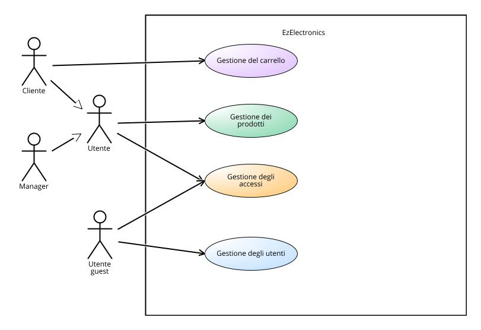
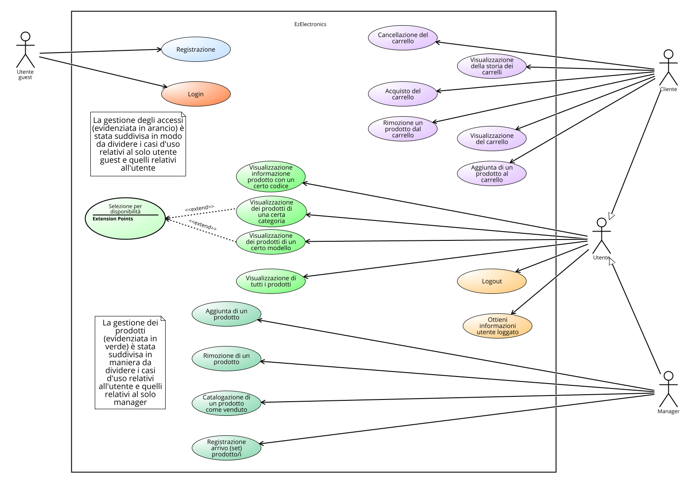

# Requirements Document - current EZElectronics

Date:

Version: V1 - description of EZElectronics in CURRENT form (as received by teachers)

| Version number | Change |
| :------------: | :----: |
|        V1      |        |

# Contents

- [Requirements Document - current EZElectronics](#requirements-document---current-ezelectronics)
- [Contents](#contents)
- [Informal description](#informal-description)
- [Stakeholders](#stakeholders)
- [Context Diagram and interfaces](#context-diagram-and-interfaces)
  - [Context Diagram](#context-diagram)
  - [Interfaces](#interfaces)
- [Stories and personas](#stories-and-personas)
- [Functional and non functional requirements](#functional-and-non-functional-requirements)
  - [Functional Requirements](#functional-requirements)
  - [Table of Rights](#table-of-rights)
  - [Non Functional Requirements](#non-functional-requirements)
- [Use case diagram and use cases](#use-case-diagram-and-use-cases)
  - [Use case diagram summary](#use-case-diagram-summary)
  - [Use case diagram](#use-case-diagram)
    - [Use case 1.1, UC1.1](#use-case-11-uc11)
      - [Scenario 1.1.1](#scenario-111)
      - [Scenario 1.1.2](#scenario-112)
    - [Use case 1.2, UC1.2](#use-case-12-uc12)
      - [Scenario 1.2](#scenario-12)
    - [Use case 1.3, UC1.3](#use-case-13-uc13)
      - [Scenario 1.3](#scenario-13)
    - [Use case 2.1, UC2.1](#use-case-21-uc21)
      - [Scenario 2.1.1](#scenario-211)
      - [Scenario 2.1.2](#scenario-212)
    - [Use case 3.1, UC3.1](#use-case-31-uc31)
      - [Scenario 3.1](#scenario-31)
    - [Use case 3.2, UC3.2](#use-case-32-uc32)
      - [Scenario 3.2.1](#scenario-321)
      - [Scenario 3.2.2](#scenario-322)
      - [Scenario 3.2.3](#scenario-323)
    - [Use case 3.3, UC3.3](#use-case-33-uc33)
      - [Scenario 3.3.1](#scenario-331)
      - [Scenario 3.3.2](#scenario-332)
    - [Use case 3.4, UC3.4](#use-case-34-uc34)
      - [Scenario 3.4.1](#scenario-341)
      - [Scenario 3.4.2](#scenario-342)
    - [Use case 3.5, UC3.5](#use-case-35-uc35)
      - [Scenario 3.5](#scenario-35)
    - [Use case 3.6, UC3.6](#use-case-36-uc36)
    - [Use case 3.7, UC3.7](#use-case-37-uc37)
      - [Scenario 3.7](#scenario-37)
    - [Use case 3.8, UC3.8](#use-case-38-uc38)
      - [Scenario 3.8.1](#scenario-381)
      - [Scenario 3.8.2](#scenario-382)
      - [Scenario 3.8.3](#scenario-383)
      - [Scenario 3.8.4](#scenario-384)  
    - [Use case 4.1, UC4.1](#use-case-41-uc41)
      - [Scenario 4.1](#scenario-41)
    - [Use case 4.2, UC4.2](#use-case-42-uc42)
      - [Scenario 4.2.1](#scenario-421)
      - [Scenario 4.2.2](#scenario-422)
      - [Scenario 4.2.3](#scenario-423)
      - [Scenario 4.2.4](#scenario-424)
    - [Use case 4.3, UC4.3](#use-case-43-uc43)
      - [Scenario 4.3.1](#scenario-431)
      - [Scenario 4.3.2](#scenario-432)
      - [Scenario 4.3.3](#scenario-433)
      - [Scenario 4.3.4](#scenario-434)
      - [Scenario 4.3.5](#scenario-435)
    - [Use case 4.4, UC4.4](#use-case-44-uc44)
      - [Scenario 4.4.1](#scenario-441)
      - [Scenario 4.4.2](#scenario-442)
      - [Scenario 4.4.3](#scenario-443)
    - [Use case 4.5, UC4.5](#use-case-45-uc45)
      - [Scenario 4.5](#scenario-45)
    - [Use case 4.6, UC4.6](#use-case-46-uc46)
      - [Scenario 4.6.1](#scenario-461)
      - [Scenario 4.6.2](#scenario-462)
- [Glossary](#glossary)
- [System Design](#system-design)
- [Deployment Diagram](#deployment-diagram)

# Informal description

EZElectronics (read EaSy Electronics) is a software application designed to help managers of electronics stores to manage their products and offer them to customers through a dedicated website. Managers can assess the available products, record new ones, and confirm purchases. Customers can see available products, add them to a cart and see the history of their past purchases.

# Stakeholders

| Nome dello Stakeholder | Descrizione                                                                     |
| :--------------------: | :-----------------------------------------------------------------------------: |
| Cliente                | Individuo che accede al sito web per visualizzare o comprare prodotti           |
| Manager                | Manager dello store fisico che puo' gestire i prodotti sul sito                 |
| Sviluppatori           | Il team di sviluppatori del sistema                                             |
| Utente guest           | Utente che non ha ancora effettuato la fase di login o la fase di registrazione |

# Context Diagram and interfaces

## Context Diagram

## Interfaces

| Attore           | Interfaccia logica                                                            | Interfaccia fisica |
| :--------------: | :--------------------------------------------------------------------------:  | :----------------: |
| Cliente          | GUI (interfaccia per navigare il sito, visualizzare e comprare prodotti)      | Browser Web        |
| Manager          | GUI (interfaccia per navigare il sito, visualizzare e gestire i prodotti)     | Browser Web        |
| Utente guest     | GUI (interfaccia per registrarsi o loggarsi nel sito)                         | Browser Web        |

# Stories and personas

**Persona 1**: uomo, professionista ad alto reddito, sposato, con figli, 50 anni  
Storia: vuole acquistare una nuova smart-TV <u>all'avanguardia</u> per il suo salotto: deve trovare il prezzo migliore tra le TV top di gamma presenti nel negozio.

**Persona 2**: donna, studentessa universitaria, 20 anni  
Storia: vuole acquistare uno smartphone <u>economico</u> per sostituire quello vecchio e lento: deve trovare la <u>migliore soluzione costo-prestazioni</u>.  
  
**Persona 4**: uomo, lavora da pochi anni, 28 anni  
Storia: vuole acquistare un PC da gioco all'avanguardia: vuole controllare i prezzi dei PC a cui è interessato.  

**Persona 5**: uomo, manager di un negozio, 45 anni  
Storia: deve <u>aggiungere al sito web un modello appena uscito</u> di un prodotto e <u>rimuoverne uno vecchio</u>, esaurito.  

**Persona 6**: donna, manager del negozio, 50 anni  
Storia: deve <u>registrare l'arrivo</u> di una serie di prodotti e la loro quantità.

# Functional and non functional requirements

## Functional Requirements

| ID      | Descrizione                                                                        |
|:--------|:-----------------------------------------------------------------------------------|
| **FR1** | **Gestione degli accessi**                                                         |
| FR1.1   | Login di un utente registrato                                                      |
| FR1.2   | Logout di un utente registrato                                                     |
| FR1.3   | Possibilità di ottenere le informazioni relative all'utente correntemente loggato  |
| **FR2** | **Gestione degli utenti**                                                          |
| FR2.1   | Registrazione di un nuovo utente                                                   |
| **FR3** | **Gestione dei prodotti**                                                          |
| FR3.1   | Visualizzazione di tutti i prodotti                                                |
| FR3.2   | Aggiunta di un nuovo prodotto                                                      |
| FR3.3   | Rimozione di un prodotto                                                           |
| FR3.4   | Registrazione dell'arrivo di un nuovo (insieme di) prodotti                        |
| FR3.5   | Visualizza informazioni prodotti di una certa categoria (opzionale: selezione per disponibilità)|
| FR3.6   | Visualizza informazioni prodotti di un certo modello (opzionale: selezione per disponibilità) |
| FR3.7   | Visualizza informazioni di un prodotto con un determinato codice |
| FR3.8   | Catalogazione prodotto come venduto |
| **FR4** | **Gestione del carrello**                                                          |
| FR4.1   | Visualizzazione del carrello attuale del cliente                                   |
| FR4.2   | Aggiunta di un prodotto al carrello attuale                                        |
| FR4.3   | Rimozione di un prodotto dal carrello attuale                                      |
| FR4.4   | Acquisto del carrello attuale                                 |
| FR4.5   | Visualizzazione dello storico dei carrelli acquistati dal cliente                  |
| FR4.6   | Cancellazione del carrello                                  |

\* Le API utilizzate solo per testing non sono state considerate nei Functional Requirements

## Table of rights

| Codice - Descrizione                                                                             | Utente Guest | Cliente | Manager |
| ------------------------------------------------------------------------------------------------ | :----------: | :-----: | :-----: |
| FR1.1 Login di un utente registrato                                                              |       X      |         |         |
| FR1.2 Logout di un utente registrato                                                             |              |    X    |    X    |
| FR1.3 Possibilità di ottenere le informazioni relative all'utente correntemente loggato          |              |    X    |    X    |
| FR2.1 Registrazione di un nuovo utente                                                           |       X      |         |         |
| FR3.1 Visualizzazione di tutti i prodotti                                                        |              |    X    |    X    |
| FR3.2 Aggiunta di un nuovo prodotto                                                              |              |         |    X    |
| FR3.3 Rimozione di un prodotto                                                                   |              |         |    X    |
| FR3.4 Registrazione dell'arrivo di un nuovo (insieme di) prodotti                                |              |         |    X    |
| FR3.5 Visualizza informazioni prodotti di una certa categoria (opzionale: parametro disponibile) |              |    X    |    X    |
| FR3.6 Visualizza informazioni prodotti di un certo modello (opzionale: parametro disponibile)    |              |    X    |    X    |
| FR3.7 Visualizza informazioni di un prodotto con un determinato codice                           |              |    X    |    X    |
| FR3.8 Catalogazione prodotto come venduto                                                        |              |         |    X    |
| FR4.1 Visualizzazione del carrello attuale del cliente                                           |              |    X    |         |
| FR4.2 Aggiunta di un prodotto al carrello attuale                                                |              |    X    |         |
| FR4.3 Rimozione di un prodotto dal carrello attuale                                              |              |    X    |         |
| FR4.4 Acquisto del carrello attuale                                                              |              |    X    |         |
| FR4.5 Visualizzazione dello storico dei carrelli acquistati dal cliente                          |              |    X    |         |
| FR4.6 Cancellazione del carrello                                                                 |              |    X    |         |

## Non Functional Requirements

| ID    | Tipo (efficienza, affidabilita', ...) | Descrizione                              | Si riferisce a  |
|:------|:-------------------------------------:|:-----------------------------------------|:---------------:|
| NFR1  | Efficienza      | Non è richiesta alcuna installazione per l'utente, ogni funzionalità deve essere accessibile dal sito web tramite un browser internet               | /    |
| NFR2  | Usabilita'      | I clienti non hanno bisogno di alcuna formazione                     | /    |
| NFR3  | Usabilita'      | I manager hanno bisogno di un massimo di tre ore di formazione       | /    |
| NFR4  | Affidabilita'   | Il sistema deve avere un uptime del 99%                              | /    |

# Use case diagram and use cases

## Use case diagram Summary

## Use case diagram

### Use case 1.1, UC1.1

| Actors Involved  |                                           Utente guest                                           |
| :--------------: | :----------------------------------------------------------------------------------------------: |
|   Precondition   |                                L'utente guest ha un profilo registrato nel sistema               |
|  Post condition  |                                     L'utente risulta loggato                                     |
| Nominal Scenario |                 L'utente guest inserisce username e password e accede al sistema (1.1.1)           |
|     Variants     |                                                                                                  |
|    Exceptions    | L'utente guest inserisce dati errati (non previsto dalle API, ma presente nel file userDAO.ts) (1.1.2) |

#### Scenario 1.1.1

|  Scenario 1.1.1  |             Login corretto             |
| :------------: | :------------------------------------: |
|  Precondition  |   L'utente guest ha un profilo registrato nel sistema    |
| Post condition |        L'utente risulta loggato        |
|     Step#      |              Description               |
|       1        | L'utente guest chiede di accedere al sistema |
|       2        | Il sistema chiede username e password  |
|       3        | L'utente guest inserisce username a password |
|       4        |        Il sistema valida i dati        |
|       5        |        L'utente risulta loggato        |

#### Scenario 1.1.2

| Scenario 1.1.2 |                         Login errato                          |
| :------------: | :-----------------------------------------------------------: |
|  Precondition  |               L'utente guest ha un profilo registrato nel sistema               |
| Post condition |                                                               |
|     Step#      |                          Description                          |
|       1        |            L'utente guest chiede di accedere al sistema             |
|       2        |             Il sistema chiede username e password             |
|       3        |            L'utente guest inserisce username a password             |
|       4        | Il sistema rileva un errore nei dati e lo comunica all'utente |

### Use case 1.2, UC1.2

| Actors Involved  |                                      Utente (Cliente/Manager)                             |
| :--------------: | :---------------------------------------------------------------------------------------: |
|   Precondition   |                                    L'utente è loggato                                     |
|  Post condition  |                                 Viene eseguito il logout                                  |
| Nominal Scenario | L'utente chiede al sistema di effettuare il logout e questo viene effettuato con successo |
|     Variants     |                                                                                           |
|    Exceptions    |                                                                                           |

#### Scenario 1.2

|  Scenario 1.2  |                                                    |
| :------------: | :------------------------------------------------: |
|  Precondition  |                 L'utente è loggato                 |
| Post condition |              Viene eseguito il logout              |
|     Step#      |                    Description                     |
|       1        | L'utente chiede al sistema di effettuare il logout |
|       2        |     Il sistema effettua il logout per l'utente     |

### Use case 1.3, UC1.3

| Actors Involved  |                                   Utente (Cliente/Manager)                           |
| :--------------: | :----------------------------------------------------------------------------------: |
|   Precondition   |                                  L'utente è loggato                                  |
|  Post condition  |           Vengono mostrate le informazioni dell'utente attualmente loggato           |
| Nominal Scenario | L'utente chiede al sistema di visualizzare le sue informazioni e vengono mostrate |
|     Variants     |                                                                                      |
|    Exceptions    |                                                                                      |

#### Scenario 1.3

|  Scenario 1.3  |                                                                  |
| :------------: | :--------------------------------------------------------------: |
|  Precondition  |                        L'utente è loggato                        |
| Post condition | Vengono mostrate le informazioni dell'utente attualmente loggato |
|     Step#      |                           Description                            |
|       1        |    L'utente chiede al sistema di mostrare le sue informazioni    |
|       2        |           Il sistema mostra le informazioni all'utente           |

### Use case 2.1, UC2.1

| Actors Involved  |                                    Utente guest                      |
| :--------------: | :------------------------------------------------------------------: |
|   Precondition   | --                                                                   |
|  Post condition  |  L'utente risulta registrato correttamente nel sistema.              |
| Nominal Scenario |  L'utente guest inserisce tutti i dati richiesti per la registrazione e sceglie il ruolo con cui registrarsi nel sistema.  (2.1.1)     |
|     Variants     |                                                                      |
|    Exceptions    | L'utente risulta già registrato  (2.1.2)                             |

#### Scenario 2.1.1

|  Scenario 2.1.1  |                      Registrazione corretta                       |
| :------------: | :---------------------------------------------------------------: |
|  Precondition  |                                --                                 |
| Post condition |   L'utente risulta registrato correttamente nel sistema           |
|     Step#      |                            Description                            |
|       1        |            L'utente guest chiede di registrarsi al sistema.             |
|       2        |      Il sistema chiede i dati necessari per la registrazione      |
|       3        |                L'utente guest inserisce i dati richiesti                |
|       4        | L'utente guest seleziona il ruolo con cui registrarsi(manager o utente) |
|       5        |  Il sistema salva i dati e viene creato il nuovo utente   |

#### Scenario 2.1.2

| Scenario 2.1.2 |                                       Registrazione errata                                       |
| :------------: | :----------------------------------------------------------------------------------------------: |
|  Precondition  |                                                --                                                |
| Post condition |                                                                                                  |
|     Step#      |                                           Description                                            |
|       1        |                            L'utente guest chiede di registrarsi al sistema.                            |
|       2        |                     Il sistema chiede i dati necessari per la registrazione                      |
|       3        |                               L'utente guest inserisce i dati richiesti                                |
|       4        |                L'utente guest seleziona il ruolo con cui registrarsi(manager o utente)                 |
|       5        | Il sistema rileva un errore in quanto lo username dell'utente esiste già e lo comunica all'utente |

### Use case 3.1, UC3.1

| Actors Involved  |                                  Utente (Cliente/Manager)                                  |
| :--------------: | :-------------------------------------------------------------------------------: |
|   Precondition   |                                L'utente è loggato                                 |
|  Post condition  |                         Vengono mostrati tutti i prodotti                         |
| Nominal Scenario | L'utente chiede al sistema di visualizzare tutti i prodotti e li vengono mostrati |
|     Variants     |                                                                                   |
|    Exceptions    |                                                                                   |

#### Scenario 3.1

|  Scenario 3.1  |                                                                      |
| :------------: | :------------------------------------------------------------------: |
|  Precondition  |                          L'utente è loggato                          |
| Post condition |                  Vengono mostrati tutti i prodotti                   |
|     Step#      |                             Description                              |
|       1        | L'utente chiede al sistema di visualizzare tutti i prodotti presenti |
|       2        |             Il sistema mostra tutti i prodotti presenti              |

### Use case 3.2, UC3.2

| Actors Involved  |                                                               Manager                                                                |
| :--------------: | :----------------------------------------------------------------------------------------------------------------------------------: |
|   Precondition   |                                              L'utente è loggato ed ha il ruolo Manager                                               |
|  Post condition  |                                               Il prodotto viene aggiunto correttamente                                               |
| Nominal Scenario | Il manager chiede di aggiungere un nuovo prodotto, inserisce tutti i dati richiesti e il prodotto viene aggiunto correttamente (3.2.1) |
|     Variants     |                                                                                                                                      |
|    Exceptions    |                    Il prodotto è già presente (3.2.2) o la data di arrivo è successiva a quella corrente (3.2.3)                     |

#### Scenario 3.2.1

|  Scenario 3.2.1  |         Aggiunta corretta di un nuovo prodotto          |
| :------------: | :-----------------------------------------------------: |
|  Precondition  |        L'utente è loggato ed ha il ruolo Manager        |
| Post condition |        Il prodotto viene aggiunto correttamente         |
|     Step#      |                       Description                       |
|       1        |    Il manager chiede di aggiungere un nuovo prodotto    |
|       2        | Il sistema chiede tutti i dati necessari per l'aggiunta |
|       3        |       Il manager inserisce tutti i dati richiesti       |
|       4        |           Il sistema valida i dati e li salva           |
|       5        |        Il prodotto viene aggiunto correttamente         |

#### Scenario 3.2.2

| Scenario 3.2.2 |                 Aggiunta errata di un nuovo prodotto (prodotto esistente)                  |
| :------------: | :----------------------------------------------------------------------------------------: |
|  Precondition  |                         L'utente è loggato ed ha il ruolo Manager                          |
| Post condition |                                                                                            |
|     Step#      |                                        Description                                         |
|       1        |                     Il manager chiede di aggiungere un nuovo prodotto                      |
|       2        |                  Il sistema chiede tutti i dati necessari per l'aggiunta                   |
|       3        |                        Il manager inserisce tutti i dati richiesti                         |
|       4        | Il sistema rileva un errore in quanto il prodotto è già esistente e lo comunica al manager |

#### Scenario 3.2.3

| Scenario 3.2.3 |               Aggiunta errata di un nuovo prodotto (data di arrivo successiva alla data corrente)               |
| :------------: | :-------------------------------------------------------------------------------------------------------------: |
|  Precondition  |                                    L'utente è loggato ed ha il ruolo Manager                                    |
| Post condition |                                    Il prodotto viene aggiunto correttamente                                     |
|     Step#      |                                                   Description                                                   |
|       1        |                                Il manager chiede di aggiungere un nuovo prodotto                                |
|       2        |                             Il sistema chiede tutti i dati necessari per l'aggiunta                             |
|       3        |                                   Il manager inserisce tutti i dati richiesti                                   |
|       4        | Il sistema rileva un errore in quanto la data di arrivo è successiva a quella corrente e lo comunica al manager |

### Use case 3.3, UC3.3

| Actors Involved  |                                             Manager                                              |
| :--------------: | :----------------------------------------------------------------------------------------------: |
|   Precondition   |                            L'utente è loggato ed ha il ruolo Manager                             |
|  Post condition  |                                    Il prodotto viene rimosso                                     |
| Nominal Scenario | Il manager chiede al sistema di rimuovere un prodotto e questo viene rimosso correttamente (3.3.1) |
|     Variants     |                                                                                                  |
|    Exceptions    |                    Il prodotto che si vuole rimuovere non è presente (3.3.2)                     |

#### Scenario 3.3.1

|  Scenario 3.3.1  |                       Rimozione corretta                        |
| :------------: | :-------------------------------------------------------------: |
|  Precondition  |            L'utente è loggato ed ha il ruolo Manager            |
| Post condition |                    Il prodotto viene rimosso                    |
|     Step#      |                           Description                           |
|       1        |      Il manager chiede al sistema di rimuovere un prodotto      |
|       2        | Il sistema chiede il codice del prodotto che si vuole rimuovere |
|       3        |                  Il manager inserisce il codice                   |
|       4        |         Il sistema verifica che il codice sia presente          |
|       5        |                    Il prodotto viene rimosso                    |

#### Scenario 3.3.2

| Scenario 3.3.2 |                                        Rimozione errata                                         |
| :------------: | :---------------------------------------------------------------------------------------------: |
|  Precondition  |                            L'utente è loggato ed ha il ruolo Manager                            |
| Post condition |                                                                                                 |
|     Step#      |                                           Description                                           |
|       1        |                      Il manager chiede al sistema di rimuovere un prodotto                      |
|       2        |                 Il sistema chiede il codice del prodotto che si vuole rimuovere                 |
|       3        |                                  Il manager inserisce il codice                                 |
|       4        | Il sistema rileva un errore in quanto il prodotto non risulta presente e lo comunica al manager |

### Use case 3.4, UC3.4

| Actors Involved  |                                                                 Manager                                                                 |
| :--------------: | :-------------------------------------------------------------------------------------------------------------------------------------: |
|   Precondition   |                                                L'utente è loggato ed ha il ruolo Manager                                                |
|  Post condition  |                                     Vengono registrati correttamente l'arrivo di un set di prodotti                                     |
| Nominal Scenario | Il manager chiede al sistema di registrare l'arrivo di un set di prodotti dello stesso modello e vengono registrati correttamente (3.4.1) |
|     Variants     |                                                                                                                                         |
|    Exceptions    |                                        La data di arrivo è successiva a quella corrente (3.4.2)                                         |

#### Scenario 3.4.1

|  Scenario 3.4.1  |                       Registrazione arrivi corretta                       |
| :------------: | :-----------------------------------------------------------------------: |
|  Precondition  |                 L'utente è loggato ed ha il ruolo Manager                 |
| Post condition |      Vengono registrati correttamente l'arrivo di un set di prodotti      |
|     Step#      |                                Description                                |
|       1        | Il manager chiede al sistema di registrare l'arrivo di un set di prodotti |
|       2        |       Il sistema i dati necessari per la registrazione di un arrivo       |
|       3        |                         Il manager inserisce i dati                         |
|       4        |                    Il sistema valida i dati e li salva                    |
|       5        |                  L'arrivo viene registrato correttamente                  |

#### Scenario 3.4.2

| Scenario 3.4.2 |                                           Registrazione arrivi errata                                           |
| :------------: | :-------------------------------------------------------------------------------------------------------------: |
|  Precondition  |                                    L'utente è loggato ed ha il ruolo Manager                                    |
| Post condition |                                                                                                                 |
|     Step#      |                                                   Description                                                   |
|       1        |                    Il manager chiede al sistema di registrare l'arrivo di un set di prodotti                    |
|       2        |                          Il sistema i dati necessari per la registrazione di un arrivo                          |
|       3        |                                            Il manager inserisce i dati                                          |
|       4        | Il sistema rileva un errore in quanto la data di arrivo è successiva a quella corrente e lo comunica al manager |

### Use case 3.5, UC3.5

| Actors Involved  | Utente (Cliente/Manager)                                                                   |
| :--------------: | :------------------------------------------------------------------: |
|   Precondition   | L'utente è loggato  |
|  Post condition  | Vengono mostrati i prodotti la cui categoria corrisponde a quella inserita dall'utente  |
| Nominal Scenario | L'utente chiede di visualizzare solo i prodotti di una determinata categoria   |
|     Variants     |                          |
|    Exceptions    ||

#### Scenario 3.5

|  Scenario 3.5  | Visualizza informazioni prodotti di una certa categoria (opzionale: parametro disponibile)      |
| :------------: | :------------------------------------------------------------------------: |
|  Precondition  | L'utente è loggato |
| Post condition | Vengono mostrati i prodotti la cui categoria corrisponde a quella inserita dall'utente   |
|     Step#      |                                Description                                 |
|       1        |                                                        L'utente chiede di visualizzare i prodotti di una determinata categoria          |
|       2        |                                                        Il sistema chiede la categoria             |
|3| L'utente inserisce la categoria|
|4| Il sistema mostra i prodotti la cui categoria corrisponde a quella inserita dall'utente|

### Use case 3.6, UC3.6

| Actors Involved  | Utente (Cliente/Manager)                                                                    |
| :--------------: | :------------------------------------------------------------------: |
|   Precondition   | L'utente è loggato  |
|  Post condition  | Vengono mostrati i prodotti il cui modello corrisponde a quello inserito dall'utente  |
| Nominal Scenario | L'utente chiede di visualizzare solo i prodotti di un determinato modello   |
|     Variants     |                          |
|    Exceptions    ||

#### Scenario 3.6

|  Scenario 3.6  | Visualizza informazioni prodotti di un certo modello(opzionale: selezione per disponibilità)      |
| :------------: | :------------------------------------------------------------------------: |
|  Precondition  | L'utente è loggato |
| Post condition | Vengono mostrati i prodotti il cui modello corrisponde a quello inserito dall'utente   |
|     Step#      |                                Description                                 |
|       1        |L'utente chiede di visualizzare i prodotti di un determinato modello, con una certa disponibilità (tutti i prodotti, solo quelli venduti, solo quelli non ancora venduti)|
|       2        |                                                        Il sistema chiede il modello            |
|3| L'utente inserisce il modello|
|4| Il sistema chiede di specificare la disponibilità dei prodotti |
|5| L'utente specifica la disponibilità dei prodotti |
|6| Il sistema mostra i prodotti il cui modello e la cui disponibilità corrispondono a quelli inseriti dall'utente|

### Use case 3.7, UC3.7

| Actors Involved  | Utente (Cliente/Manager)                                                                    |
| :--------------: | :------------------------------------------------------------------: |
|   Precondition   | L'utente è loggato  |
|  Post condition  | Vengono mostrate le informazioni del prodotto con il codice inserito dall'utente  |
| Nominal Scenario | L'utente chiede di visualizzare un prodotto inserendo il suo codice e gli viene mostrato   |
|     Variants     |                          |
|    Exceptions    ||

#### Scenario 3.7

|  Scenario 3.7  | Visualizza informazioni prodotti di un certo modello(opzionale: parametro disponibile)      |
| :------------: | :------------------------------------------------------------------------: |
|  Precondition  | L'utente è loggato |
| Post condition | Vengono mostrate le informazioni del prodotto con il codice inserito dall'utente   |
|     Step#      |                                Description                                 |
|       1        |                                                        L'utente chiede di visualizzare le informazioni di un prodotto di cui inserisce il codice |
|       2        |                                                        Il sistema chiede il codice            |
|3| L'utente inserisce il codice|
|4| Il sistema mostra il prodotto corrispondente al codice inserito|

### Use case 3.8, UC3.8

| Actors Involved  |Manager                                                                    |
| :--------------: | :------------------------------------------------------------------: |
|   Precondition   | Il manager è loggato  |
|  Post condition  | Il prodotto viene catalogato come venduto  |
| Nominal Scenario | Il manager chiede di catalogare un prodotto come venduto (3.8.1)  |
|     Variants     |                          |
|    Exceptions    | Il prodotto non esiste (3.8.2), la data di vendita risulta precedente alla data di arrivo o successiva a quella corrente (3.8.3) o il prodotto risulta già venduto (3.8.4) |

#### Scenario 3.8.1

|  Scenario 3.8.1 |                                                                    Catalogazione corretta del prodotto come venduto    |
| :------------: | :------------------------------------------------------------------------: |
|  Precondition  | Il manager è loggato |
| Post condition | Il prodotto viene catalogato come venduto    |
|     Step#      |                                Description                                 |
|       1        |                                                      Il manager seleziona il prodotto che vuole catalogare come venduto e inserisce la data di vendita        |
|       2        |                                           Il sistema valida le informazioni          |
|3| Il prodotto risulta venduto |

#### Scenario 3.8.2

|  Scenario 3.8.2  |                                                                    Catalogazione errata del prodotto come venduto    |
| :------------: | :------------------------------------------------------------------------: |
|  Precondition  | Il manager è loggato |
| Post condition | Il prodotto viene catalogato come venduto    |
|     Step#      |                                Description                                 |
|       1        |                                                      Il manager seleziona il prodotto che vuole catalogare come venduto e inserisce la data di vendita        |
|       2        |  Il sistema rileva un errore in quanto il prodotto non esiste e lo comunica al manager |

#### Scenario 3.8.3

|  Scenario 3.8.3  |                                                                    Catalogazione errata del prodotto come venduto    |
| :------------: | :------------------------------------------------------------------------: |
|  Precondition  | Il manager è loggato |
| Post condition | Il prodotto viene catalogato come venduto    |
|     Step#      |                                Description                                 |
|       1        |                                                      Il manager seleziona il prodotto che vuole catalogare come venduto e inserisce la data di vendita        |
|       2        |Il sistema rileva un errore in quanto la data di vendita risulta precedente alla data di arrivo o successiva a quella corrente e lo comunica al manager   |

#### Scenario 3.8.4

|  Scenario 3.8.4  |                                                                    Catalogazione errata del prodotto come venduto    |
| :------------: | :------------------------------------------------------------------------: |
|  Precondition  | Il manager è loggato |
| Post condition | Il prodotto viene catalogato come venduto    |
|     Step#      |                                Description                                 |
|       1        | Il manager seleziona il prodotto che vuole catalogare come venduto e inserisce la data di vendita |
|       2        | Il sistema rileva un errore in quanto il prodotto risulta già venduto e lo comunica al manager |

### Use case 4.1, UC4.1

| Actors Involved  |                                  Cliente                                   |
| :--------------: | :------------------------------------------------------------------------: |
|   Precondition   |                            Il cliente è loggato                            |
|  Post condition  |           Viene mostrato il carrello attuale del cliente loggato           |
| Nominal Scenario | Il cliente chiede di visualizzare il suo carrello attuale e viene mostrato |
|     Variants     |                                                                            |
|    Exceptions    |                                                                            |

#### Scenario 4.1

|  Scenario 4.1  |     Visualizzazione del carrello attuale del cliente      |
| :------------: | :-------------------------------------------------------: |
|  Precondition  |                   Il cliente è loggato                    |
| Post condition |  Viene mostrato il carrello attuale del cliente loggato   |
|     Step#      |                        Description                        |
|       1        | Il cliente chiede di visualizzare il suo carrello attuale |
|       2        |          Il sistema mostra il carrello corrente           |

### Use case 4.2, UC4.2

| Actors Involved  |                                                 Cliente                                                 |
| :--------------: | :-----------------------------------------------------------------------------------------------------: |
|   Precondition   |                                          Il cliente è loggato                                           |
|  Post condition  |                      Il prodotto viene aggiunto correttamente al carrello attuale                       |
| Nominal Scenario | Il cliente chiede di aggiungere un prodotto al suo carrello e questo viene aggiunto correttamente (4.2.1) |
|     Variants     |                                                                                                         |
|    Exceptions    | Il prodotto non esiste (4.2.2), il prodotto è già presente in un altro carrello (4.2.3) o il prodotto non è disponibile (4.2.4) |

#### Scenario 4.2.1

|  Scenario 4.2.1  |    Aggiunta corretta di un prodotto al carrello attuale    |
| :------------: | :--------------------------------------------------------: |
|  Precondition  |                    Il cliente è loggato                    |
| Post condition |    Il prodotto viene aggiunto correttamente al carrello    |
|     Step#      |                        Description                         |
|       1        | Il cliente seleziona il prodotto da aggiungere al carrello |
|       2        | Il sistema verifica che il prodotto possa essere aggiunto  |
|       3        |          Il prodotto risulta aggiunto al carrello          |

#### Scenario 4.2.2

| Scenario 4.2.2 |                     Aggiunta errata di un prodotto al carrello attuale                     |
| :------------: | :----------------------------------------------------------------------------------------: |
|  Precondition  |                                    Il cliente è loggato                                    |
| Post condition |                                                                                            |
|     Step#      |                                        Description                                         |
|       1        |                 Il cliente seleziona il prodotto da aggiungere al carrello                 |
|       2        | Il sistema rileva un errore in quanto il prodotto non è esistente e lo comunica al cliente |

#### Scenario 4.2.3

| Scenario 4.2.3 |     Aggiunta errata di un prodotto al carrello attuale     |
| :------------: | :--------------------------------------------------------: |
|  Precondition  |                    Il cliente è loggato                    |
| Post condition |                                                            |
|     Step#      |                        Description                         |
|       1        | Il cliente seleziona il prodotto da aggiungere al carrello |
|       2        | Il sistema rileva un errore in quanto il prodotto risulta essere presente in un altro carrello e lo comunica al cliente |

#### Scenario 4.2.4

| Scenario 4.2.4 |                              Aggiunta errata di un prodotto al carrello attuale                              |
| :------------: | :----------------------------------------------------------------------------------------------------------: |
|  Precondition  |                                             Il cliente è loggato                                             |
| Post condition |                                                                                                              |
|     Step#      |                                                 Description                                                  |
|       1        |                          Il cliente seleziona il prodotto da aggiungere al carrello                          |
|       2        | Il sistema rileva un errore in quanto il prodotto risulta venduto (non disponibile) e lo comunica al cliente |

### Use case 4.3, UC4.3

| Actors Involved  |                                              Cliente                                               |
| :--------------: | :------------------------------------------------------------------------------------------------: |
|   Precondition   |                                        Il cliente è loggato                                        |
|  Post condition  |                               Il prodotto viene rimosso dal carrello                               |
| Nominal Scenario | Il cliente chiede di rimuovere un prodotto dal carrello e questo viene rimosso correttamente (4.3.1) |
|     Variants     |                                                                                                    |
|    Exceptions    | Il prodotto non è nel carrello (4.3.2), non esiste (4.3.3), è già stato venduto (4.3.4) o il cliente non ha alcun carrello (4.3.5) |

#### Scenario 4.3.1

|  Scenario 4.3.1  |   Rimozione corretta di un prodotto dal carrello attuale    |
| :------------: | :---------------------------------------------------------: |
|  Precondition  |                    Il cliente è loggato                     |
| Post condition |           Il prodotto viene rimosso dal carrello            |
|     Step#      |                         Description                         |
|       1        | Il cliente chiede di rimuovere un prodotto dal suo carrello |
|       2        |     Il sistema verifica che il prodotto sia rimovibile      |
|       3        |          Il prodotto risulta rimosso correttamente          |

#### Scenario 4.3.2

| Scenario 4.3.2 |                     Rimozione errata di un prodotto dal carrello attuale                      |
| :------------: | :-------------------------------------------------------------------------------------------: |
|  Precondition  |                                     Il cliente è loggato                                      |
| Post condition |                                                                                               |
|     Step#      |                                          Description                                          |
|       1        |                  Il cliente chiede di rimuovere un prodotto dal suo carrello                  |
|       2        | Il sistema rileva un errore in quanto il prodotto non è nel carrello e lo comunica al cliente |

#### Scenario 4.3.3

| Scenario 4.3.3 |                 Rimozione errata di un prodotto dal carrello attuale                  |
| :------------: | :-----------------------------------------------------------------------------------: |
|  Precondition  |                                 Il cliente è loggato                                  |
| Post condition |                                                                                       |
|     Step#      |                                      Description                                      |
|       1        |              Il cliente chiede di rimuovere un prodotto dal suo carrello              |
|       2        | Il sistema rileva un errore in quanto il prodotto non esiste e lo comunica al cliente |

#### Scenario 4.3.4

| Scenario 4.3.4 |                      Rimozione errata di un prodotto dal carrello attuale                      |
| :------------: | :--------------------------------------------------------------------------------------------: |
|  Precondition  |                                      Il cliente è loggato                                      |
| Post condition |                                                                                                |
|     Step#      |                                          Description                                           |
|       1        |                  Il cliente chiede di rimuovere un prodotto dal suo carrello                   |
|       2        | Il sistema rileva un errore in quanto il prodotto è già stato venduto e lo comunica al cliente |

#### Scenario 4.3.5

| Scenario 4.3.5 |                      Rimozione errata di un prodotto dal carrello attuale                       |
| :------------: | :---------------------------------------------------------------------------------------------: |
|  Precondition  |                                      Il cliente è loggato                                       |
| Post condition |                                                                                                 |
|     Step#      |                                           Description                                           |
|       1        |                   Il cliente chiede di rimuovere un prodotto dal suo carrello                   |
|       2        | Il sistema rileva un errore in quanto il cliente non ha alcun carrello e lo comunica al cliente |

### Use case 4.4, UC4.4

| Actors Involved  |                                             Cliente                                             |
| :--------------: | :---------------------------------------------------------------------------------------------: |
|   Precondition   |                                      Il cliente è loggato                                       |
|  Post condition  |                     L'acquisto del carrello viene effettuato correttamente                      |
| Nominal Scenario | Il cliente chiede di acquistare il carrello attuale e questo viene eseguito correttamente (4.4.1) |
|     Variants     |                                                                                                 |
|    Exceptions    |     Il carrello è vuoto (4.4.2), o non esiste alcun carrello per il cliente loggato (4.4.3)     |

#### Scenario 4.4.1

|  Scenario 4.4.1  |                        Acquisto corretto del carrello                        |
| :------------: | :--------------------------------------------------------------------------: |
|  Precondition  |                             Il cliente è loggato                             |
| Post condition |            L'acquisto del carrello viene effettuato correttamente            |
|     Step#      |                                 Description                                  |
|       1        | Il cliente chiede di acquistare i prodotti presenti nel suo carrello attuale |
|       2        |               Il sistema verifica che la richiesta sia valida                |
|       3        |   Il sistema calcola il totale del carrello e imposta la data di pagamento   |
|       4        |                        Il carrello risulta acquistato                        |

#### Scenario 4.4.2

| Scenario 4.4.2 |                           Acquisto errato del carrello attuale                           |
| :------------: | :--------------------------------------------------------------------------------------: |
|  Precondition  |                                   Il cliente è loggato                                   |
| Post condition |                                                                                          |
|     Step#      |                                       Description                                        |
|       1        |       Il cliente chiede di acquistare i prodotti presenti nel suo carrello attuale       |
|       2        | Il sistema rileva un errore in quanto il carrello risulta vuoto e lo comunica al cliente |

#### Scenario 4.4.3

| Scenario 4.4.3 |                                    Acquisto errato del carrello attuale                                    |
| :------------: | :--------------------------------------------------------------------------------------------------------: |
|  Precondition  |                                            Il cliente è loggato                                            |
| Post condition |                                                                                                            |
|     Step#      |                                                Description                                                 |
|       1        |                Il cliente chiede di acquistare i prodotti presenti nel suo carrello attuale                |
|       2        | Il sistema rileva un errore in quanto il cliente non risulta avere alcun carrello e lo comunica al cliente |

### Use case 4.5, UC4.5 

| Actors Involved  |                            Cliente                            |
| :--------------: | :-----------------------------------------------------------: |
|   Precondition   |                     Il cliente è loggato                      |
|  Post condition  |     Vengono mostrati tutti i carrelli del cliente loggato     |
| Nominal Scenario | Il cliente chiede di visualizzare la storia dei suoi carrelli |
|     Variants     |                                                               |
|    Exceptions    |                                                               |

#### Scenario 4.5

|  Scenario 4.5  |         Visualizzazione della cronologia dei carrelli         |
| :------------: | :-----------------------------------------------------------: |
|  Precondition  |                     Il cliente è loggato                      |
| Post condition |     Vengono mostrati tutti i carrelli del cliente loggato     |
|     Step#      |                          Description                          |
|       1        | Il cliente chiede di visualizzare la storia dei suoi carrelli |
|       2        |     Il sistema mostra la storia dei carrelli del cliente      |

### Use case 4.6, UC4.6

| Actors Involved  |                                            Cliente                                             |
| :--------------: | :--------------------------------------------------------------------------------------------: |
|   Precondition   |                                      Il cliente è loggato                                      |
|  Post condition  |                    Viene cancellato il carrello attuale del cliente loggato                    |
| Nominal Scenario | Il cliente chiede di cancellare il suo carrello attuale e viene cancellato correttamente (4.6.1) |
|     Variants     |                                                                                                |
|    Exceptions    |                            Il cliente non ha alcun carrello (4.6.2)                            |

#### Scenario 4.6.1

|  Scenario 4.6.1  | Cancellazione corretta del carrello attuale del cliente  |
| :------------: | :------------------------------------------------------: |
|  Precondition  |                   Il cliente è loggato                   |
| Post condition | Viene cancellato il carrello attuale del cliente loggato |
|     Step#      |                       Description                        |
|       1        | Il cliente chiede di cancellare il suo carrello attuale  |
|       2        |         Il sistema elimina il carrello corrente          |

#### Scenario 4.6.2

| Scenario 4.6.2 |                        Cancellazione errata del carrello attuale del cliente                         |
| :------------: | :--------------------------------------------------------------------------------------------------: |
|  Precondition  |                                         Il cliente è loggato                                         |
| Post condition |                                                                                                      |
|     Step#      |                                             Description                                              |
|       1        |                       Il cliente chiede di cancellare il suo carrello attuale                        |
|       2        | Il sistema rileva un errore in quanto non esiste alcun carrello del cliente e lo comunica al cliente |

# Glossary

- Utente
  - Persona registrata al sistema
  - Può visualizzare i prodotti
  - Può avere ruolo di cliente o di manager
- Cliente
  - Utente che dispone di un carrello in cui inserire i prodotti che vuole acquistare
  - Può visualizzare lo storico dei carrelli per cui ha pagato
- Manager
  - Utente responsabile del negozio fisico
  - Ogni manager ha la possibilità di gestire i prodotti sul sito web (vedi [Functional Requirements](#functional-requirements) e [Table of Rights](#table-of-rights))
- Prodotto
  - Prodotto in vendita sul sito web
  - Ogni singolo prodotto ha un codice univoco
  - Ogni prodotto viene aggiunto da un manager al sito web
- Carrello
  - Ogni carrello è proprietà di un singolo cliente
  - Contiene i prodotti in esso inseriti dal cliente proprietario
  - Quando il cliente paga per il carrello, l'evento viene registrato (nel carrello, campo <i>Pagato</i>) insieme alla data in cui è avvenuto

# System Design

# Deployment Diagram

