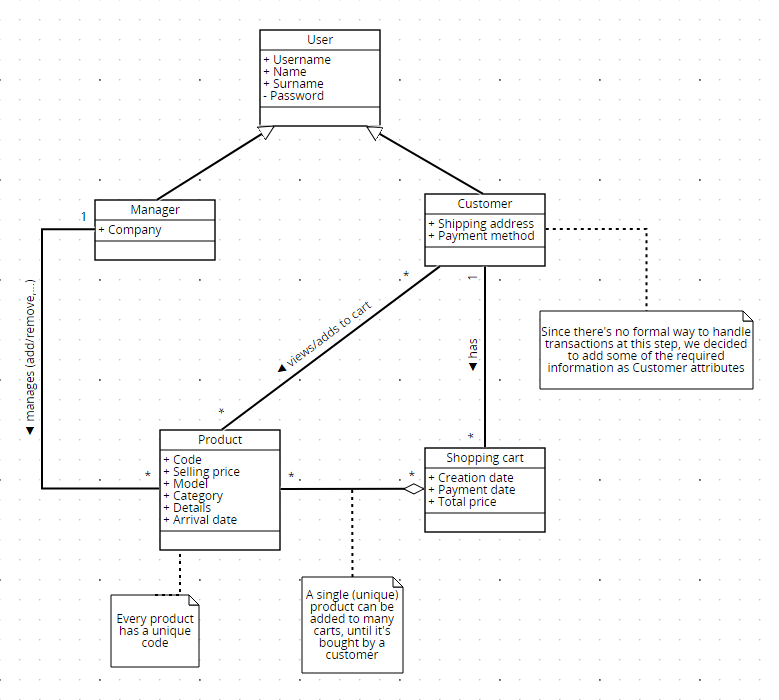

# Requirements Document - current EZElectronics

Date:

Version: V1 - description of EZElectronics in CURRENT form (as received by teachers)

| Version number | Change |
| :------------: | :----: |
|        V2      |        |

# Contents

- [Requirements Document - current EZElectronics](#requirements-document---current-ezelectronics)
- [Contents](#contents)
- [Informal description](#informal-description)
- [Stakeholders](#stakeholders)
- [Context Diagram and interfaces](#context-diagram-and-interfaces)
  - [Context Diagram](#context-diagram)
  - [Interfaces](#interfaces)
- [Stories and personas](#stories-and-personas)
- [Functional and non functional requirements](#functional-and-non-functional-requirements)
  - [Functional Requirements](#functional-requirements)
  - [Non Functional Requirements](#non-functional-requirements)
- [Use case diagram and use cases](#use-case-diagram-and-use-cases)
  - [Use case diagram](#use-case-diagram)
    - [Use case 1, UC1](#use-case-1-uc1)
      - [Scenario 1.1](#scenario-11)
      - [Scenario 1.2](#scenario-12)
      - [Scenario 1.x](#scenario-1x)
    - [Use case 2, UC2](#use-case-2-uc2)
    - [Use case x, UCx](#use-case-x-ucx)
- [Glossary](#glossary)
- [System Design](#system-design)
- [Deployment Diagram](#deployment-diagram)

# Informal description

EZElectronics (read EaSy Electronics) is a software application designed to help managers of electronics stores to manage their products and offer them to customers through a dedicated website. Managers can assess the available products, record new ones, and confirm purchases. Customers can see available products, add them to a cart and see the history of their past purchases.

# Stakeholders

| Nome dello Stakeholder | Descrizione                                                              |
| :--------------------: | :----------------------------------------------------------------------: |
| Cliente                | Individuo che accede al sito web per visualizzare o comprare prodotti    |
| Manager                | Manager dello store fisico che puo' gestire i prodotti sul sito          |
| Servizio bancario      | Servizio per transazioni monetarie                                       |
| Sviluppatori           | Il team di sviluppatori del sistema                                      |
| Servizio di spedizione | Servizio per la spedizione dei prodotti                                  |
| Amministratore         | Amministratore del sistema                                               |

# Context Diagram and interfaces

## Context Diagram

## Interfaces

| Attore                 | Interfaccia logica                                                         | Interfaccia fisica |
| :--------------------: | :-----------------------------------------------------------------------:  | :----------------: |
| Cliente                | GUI (interfaccia per navigare il sito, visualizzare e comprare prodotti)   | Smartphone / PC    |
| Manager                | GUI (interfaccia per navigare il sito, visualizzare e gestire i prodotti)  | Smartphone / PC    |
| Amministratore         | GUI (interfaccia per visualizzare e gestire i prodotti e gli utenti)       | Smartphone / PC    |
| Servizio bancario      | APIs                                                                       | Internet           |
| Servizio di spedizione | APIs                                                                       | Internet           |

# Stories and personas

**Persona 1**: male, high-income professional, married, with children, 50 years-old  
Story: wants to purchase a new, <u>state-of-the-art</u> smart-TV for his living room: needs to find the <u>best price</u> among the best TVs in the store.

**Persona 2**: female, undergraduate, 20 years-old  
Story: wants to purchase a <u>cheap</u> smartphone to replace her old and slow one: needs to find the <u>best cost-performance solution</u>.  
  
**Persona 3**: female, married, with children, 60 years-old  
Story: wants to purchase a radio for her 85 year-old mother who lives alone, to keep her company.
  
**Persona 4**: male, has been working for a few years, 28 years-old  
Story: wants to build a cutting-edge gaming PC: wants to check the trend of the prices of the components he is interested in.  

**Persona 5**: male, store manager, 45 years-old  
Story: needs to <u>add a newly released model</u> of a product to the website and <u>remove an old</u>, out-of-stock one.  

**Persona 6**: female, store manager, 50 years-old  
Story: needs to <u>register the arrival</u> of a set of products and <u>apply a discount</u> for the products of a specific model.

# Functional and non functional requirements

## Functional Requirements

| ID| Descrizione                                                          |
|:--------|:-----------------------------------------------------------------------------------|
| **FR1** | **Gestione degli accessi**                                           |
| FR1.1| Login di un utente registrato                                        |
| FR1.2| Logout di un utente registrato                                       |
| FR1.3| Possibilità di ottenere le informazioni relative all'utente correntemente loggato |
| **FR2** | **Gestione degli utenti**                                         |
| FR2.1| Registrazione di un nuovo utente                                     |
| FR2.2| Modifica informazioni utente********                                 |
| **FR3** | **Gestione dei prodotti**                                         |
| FR3.1| Visualizzazione di tutti i prodotti                                  |
| FR3.2| Aggiunta di un nuovo prodotto                                        |
| FR3.3| Rimozione di un prodotto                                             |
| FR3.4| Registrazione dell'arrivo di un nuovo (insieme di) prodotti          |
| FR3.5| Filtraggio di prodotti per categoria, modello, codice e disponibilità|
| FR3.6| Catalogazione di un prodotto come venduto                            |
| FR3.7| Aggiungi sconto ad un prodotto*************                          |
| FR3.8| Filtra prodotti per sconto***************                            |
| FR3.9| Traccia prezzo di un prodotto***************                         |
| FR3.10| Visualizza lista dei desideri***************                        |
| FR3.11| Aggiungi prodotto alla lista dei desideri***************            |
| FR3.12| Rimuovi prodotto dalla lista dei desideri***************            |
| **FR4** | **Gestione del carrello**                                         |
| FR4.1| Visualizzazione del carrello attuale del cliente                     |
| FR4.2| Aggiunta di un prodotto al carrello attuale                          |
| FR4.3| Rimozione di un prodotto dal carrello attuale                        |
| FR4.4| Acquisto dei prodotti aggiunti al carrello attuale                   |
| FR4.5| Visualizzazione della cronologia dei carrelli acquistati dal cliente |
| FR4.6| Cancellazione del carrello                                           |
| **FR5** | **Gestione spedizioni**                                           |
| FR5.1| Aggiunta indirizzo di spedizione*************                        |
| FR5.2| Modifica indirizzo di spedizione*************                        |
| FR5.3| Eliminazione indirizzo di spedizione*************                    |
| FR5.4| Segna carrello come spedito*************                             |
| FR5.5| Visualizza stato ordine*************                                 |
| **FR6** | **Gestione pagamenti**                                            |
| FR6.1| Aggiungi metodo di pagamento*************                            |
| FR6.2| Rimuovi metodo di pagamento*************                             |
| **FR7** | **Gestione statistiche**                                          |
| FR7.1| Visualizza statistiche ordini*************                           |
| FR7.2| Visualizza statistiche prodotti*************                         |
| **FR8** | **Gestione notifiche**                                            |
| FR8.1| Gestione notifiche*************                                      |

## Non Functional Requirements

| ID    | Type (efficiency, reliability, ..) | Description                                                                                                                                                                                                    | Refers to    |
|:------|:----------------------------------:|:---------------------------------------------------------------------------------------------------------------------------------------------------------------------------------------------------------------|:------------:|
| NFR1  | Efficiency                         | The system must respond within 0.5 seconds since any user action (excluding page loading times)                                                                                                                | /            |
| NFR2  | Efficiency                         | Web pages must load within 6 seconds since last user request (depending on network conditions)                                                                                                                 | /            |
| NFR3  | Efficiency                         | No app installation needed for the end-user, every functionality has to be accessible from the website via an internet browser                                                                                 | /            |
| NFR4  | Security                           | Only system administrators can access user management functionalities                                                                                                                                          | F2.x         |
| NFR5  | Security                           | User data treatment must meet GDPR                                                                                                                                                                             | /            |
| NFR5  | Security                           | Some product functionalities can only be used by managers                                                                                                                                                      | F3.(2, 3, 4) |
| NFR5  | Security                           | All shopping cart functionalities can only be used by customers                                                                                                                                                | F4.x         |
| NFR6  | Usability                          | Customers don't need any training                                                                                                                                                                              | /            |
| NFR7  | Usability                          | Managers need a maximum of three hours of training                                                                                                                                                                | /            |
| NFR8  | Reliability                        | The number of malfunctions per year must be less than 2                                                                                                                                                 | /            |
| NFR9  | Reliability                        | The website cannot require more than one 1 maintenance session every 2 months                                                                                                                                  | /            |
| NFR10 | Reliability                        | Maintenance sessions cannot last more than 4 hours                                                                                                                                                             | /            |
| NFR11 | Reliability                        | Every user should not report more than 1  previously unreported bug per year                                                                                                                                   | /            |
| NFR12 | Portability                        | The web site must be accessible from the following browsers (oldest supported version specified): Chrome (v: 79), Firefox (v: 72), Safari (v: 13.0.5), Opera (v: 65), Edge (v: 79), Samsung Internet (v: 11.2) | /            |

# Use case diagram and use cases

## Use case diagram

### Use case 1.1, UC1.1 Login

| Actors Involved  |    Utente                                                                |
| :--------------: | :------------------------------------------------------------------: |
|   Precondition   | L'utente è registrato nel sistema |
|  Post condition  | L'utente risulta loggato |
| Nominal Scenario | L'utente inserisce username e password e accede al sistema    |
|     Variants     |                   |
|    Exceptions    | L'utente inserisce dati errati e viene ritornato un errore      |

##### Scenario 1.1

|  Scenario 1.1  |                                                                            |
| :------------: | :------------------------------------------------------------------------: |
|  Precondition  |L'utente è registrato nel sistema |
| Post condition |L'utente risulta loggato  |
|     Step#      |                                Description                                 |
|       1        |  L'utente chiede di accedere al sistema                                                                          |
|       2        | Il sistema chiede username e password                                                                           |
|      3       |                                                         L'utente inserisce username a password         |
|      4      |                                                         Il sistema valida i dati        |
|      5      |                                                         L'utente risulta loggato        |

### Use case 1.2, UC1.2 Logout

| Actors Involved  |  Utente                                                                   |
| :--------------: | :------------------------------------------------------------------: |
|   Precondition   | L'utente è loggato |
|  Post condition  | Viene eseguito il logout   |
| Nominal Scenario | L'utente chiede al sistema di effettuare il logout e questo viene effettuato con successo      |
|     Variants     |                          |
|    Exceptions    |                             |

##### Scenario 1.2

|  Scenario 1.2  |                                                                            |
| :------------: | :------------------------------------------------------------------------: |
|  Precondition  | L'utente è loggato|
| Post condition |  Viene eseguito il logout   |
|     Step#      |                                Description                                 |
|       1        |                                                        L'utente chiede al sistema di effettuare il logout                   |
|       2        |                                                        Il sistema effettua il logout per l'utente                    |

### Use case 1.3, UC1.3 Possibilità di ottenere le informazioni relative all'utente correntemente loggato

| Actors Involved  |  Utente                                                                    |
| :--------------: | :------------------------------------------------------------------: |
|   Precondition   | L'utente è loggato |
|  Post condition  | Vengono mostrate le informazioni dell'utente attualmente loggato   |
| Nominal Scenario | L'utente chiede al sistema di visualizzare le sue informazioni e li vengono mostrate      |
|     Variants     |                          |
|    Exceptions    |                             |

##### Scenario 1.3

|  Scenario 1.3  |                                  |
| :------------: | :------------------------------------------------------------------------: |
|  Precondition  | L'utente è loggato|
| Post condition |  Vengono mostrate le informazioni dell'utente attualmente loggato   |
|     Step#      |                                Description                                 |
|       1        |                                                        L'utente chiede al sistema di mostrare le sue informazioni                   |
|       2        |                                                        Il sistema mostra le informazioni all'utente                 |

### Use case 2.1 , UC2.1 Registrazione

| Actors Involved  |                                                              Utente guest       |
| :--------------: | :------------------------------------------------------------------: |
|   Precondition   | -- |
|  Post condition  |  L'utente/manager risulta registrato correttamente nel sistema.  |
| Nominal Scenario |  L'utente/manager inserisce tutti i dati richiesti per la registrazione e sceglie il ruolo con cui registrarsi nel sistema.        |
|     Variants     |        |
|    Exceptions    |  I dati inseriti non sono corretti o l'utente risulta già registrato, il sistema ritorna un errore e la registrazione non va a buon fine          |

##### Scenario 2.1

|  Scenario 2.1  |                                                                            |
| :------------: | :------------------------------------------------------------------------: |
|  Precondition  | -- |
| Post condition |  L'utente/manager risulta registrato correttamente nel sistema  |
|     Step#      |                                Description                                 |
|       1        |   L'utente chiede di registrarsi al sistema.                                                         |
|       2        |                                                        Il sistema chiede i dati necessari per la registrazione                |
|      3      |                                                          L'utente inserisce i dati richiesti       |
|       4      |                                                          L'utente seleziona il ruolo con cui registrarsi(manager o utente)             |
|    5     |                                                           il sistema salva i dati e viene creato il nuovo utente/manager               |

### Use case 3.1, UC3.1 Visualizza tutti i prodotti

| Actors Involved  |  Utente/Manager                                                                    |
| :--------------: | :------------------------------------------------------------------: |
|   Precondition   | L'utente è loggato |
|  Post condition  | Vengono mostrati tutti i prodotti   |
| Nominal Scenario | L'utente chiede al sistema di visualizzare tutti i prodotti e li vengono mostrati     |
|     Variants     |                          |
|    Exceptions    |                             |

##### Scenario 3.1

|  Scenario 3.1  |                                                                            |
| :------------: | :------------------------------------------------------------------------: |
|  Precondition  | L'utente è loggato|
| Post condition | Vengono mostrati tutti i prodotti   |
|     Step#      |                                Description                                 |
|       1        |                                                        L'utente chiede al sistema di visualizzare tutti i prodotti presenti               |
|       2        |                                                        Il sistema mostra tutti i prodotti presenti                   |

### Use case 3.2, UC3.2 Aggiungi nuovo prodotto

| Actors Involved  |  Manager                                                                    |
| :--------------: | :------------------------------------------------------------------: |
|   Precondition   | L'utente è loggato ed ha il ruolo Manager |
|  Post condition  | Il prodotto viene aggiunto correttamente   |
| Nominal Scenario | Il manager chiede di aggiungere un nuovo prodotto, inserisce tutti i dati richiesti e il prodotto viene aggiunto correttamente     |
|     Variants     |                          |
|    Exceptions    | Il prodotto è già presente o la data di arrivo è successiva a quella corrente                            |

##### Scenario 3.2

|  Scenario 3.2  |                                                                            |
| :------------: | :------------------------------------------------------------------------: |
|  Precondition  | L'utente è loggato ed ha il ruolo Manager|
| Post condition | Il prodotto viene aggiunto correttamente   |
|     Step#      |                                Description                                 |
|       1        |                                                        Il manager chiede di aggiungere un nuovo prodotto               |
|       2        |                                                        Il sistema chiede tutti i dati necessari per l'aggiunta                |
|3 | Il manager inserisce tutti i dati richiesti
|4 | Il sistema valida i dati e li salva
|5| Il prodotto viene aggiunto correttamente

### Use case 3.3, UC3.3 Rimozione di un prodotto

| Actors Involved  | Manager                                                                    |
| :--------------: | :------------------------------------------------------------------: |
|   Precondition   | L'utente è loggato ed ha il ruolo Manager |
|  Post condition  | Il prodotto viene rimosso    |
| Nominal Scenario | Il manager chiede al sistema di rimuovere un prodotto e questo viene rimosso correttamente    |
|     Variants     |                          |
|    Exceptions    |Il prodotto che si vuole rimuovere non è presente, viene ritornato un errore                           |

##### Scenario 3.3

|  Scenario 3.3  |                                                                            |
| :------------: | :------------------------------------------------------------------------: |
|  Precondition  | L'utente è loggato ed ha il ruolo Manager|
| Post condition | Il prodotto viene rimosso  |
|     Step#      |                                Description                                 |
|       1        |                                                        Il manager chiede al sistema di rimuovere un prodotto            |
|       2        |                                                        Il sistema chiede il codice del prodotto che si vuole rimuovere                   |
|3| L'utente inserisce il codice
|4| Il sistema verifica che il codice sia presente
|5| Il prodotto viene rimosso

### Use case 3.4, UC3.4 Registrazione dell'arrivo di un nuovo (insieme di) prodotto/i

| Actors Involved  | Manager                                                                    |
| :--------------: | :------------------------------------------------------------------: |
|   Precondition   | L'utente è loggato ed ha il ruolo Manager |
|  Post condition  | Vengono registrati correttamente l'arrivo di un set di prodotti   |
| Nominal Scenario | Il manager chiede al sistema di registrare l'arrivo di un set di prodotti dello stesso modello e vengono registrati correttamente    |
|     Variants     |                          |
|    Exceptions    |La data di arrivo è successiva a quella corrente e viene mostrato un errore

##### Scenario 3.4

|  Scenario 3.4 |                                                                            |
| :------------: | :------------------------------------------------------------------------: |
|  Precondition  | L'utente è loggato ed ha il ruolo Manager|
| Post condition | Vengono registrati correttamente l'arrivo di un set di prodotti    |
|     Step#      |                                Description                                 |
|       1        |                                                        Il manager chiede al sistema di registrare l'arrivo di un set di prodotti           |
|       2        |                                                        Il sistema i dati necessari per la registrazione di un arrivo                   |
|3| L'utente inserisce i dati
|4| Il sistema valida i dati e li salva
|5| Il'arrivo viene registrato correttamente

### Use case 3.5, UC3.5 Filtraggio di prodotti per categoria, modello, codice e disponibilità

| Actors Involved  | Utente/Manager                                                                    |
| :--------------: | :------------------------------------------------------------------: |
|   Precondition   | L'utente è loggato  |
|  Post condition  | Vengono mostrati i prodotti che rispecchiano il filtro inserito dall'utente  |
| Nominal Scenario | L'utente chiede di visualizzare solo i prodotti che rispecchiano un determinato filtro    |
|     Variants     |                          |
|    Exceptions    |

##### Scenario 3.5

|  Scenario 3.5  |                                                                     Filtraggio di prodotti per categoria, modello, codice e disponibilità       |
| :------------: | :------------------------------------------------------------------------: |
|  Precondition  | L'utente è loggato |
| Post condition | Vengono mostrati i prodotti che rispecchiano il filtro inserito dall'utente   |
|     Step#      |                                Description                                 |
|       1        |                                                        L'utente chiede di visualizzare i prodotti che rispecchiano un determinato filtro          |
|       2        |                                                        Il sistema chiede il filtro             |
|3| L'utente inserisce il filtro
|4| Il sistema mostra i prodotti appartenenti al filtro inserito dall'utente

### Use case 3.6, UC3.6 Cataloga prodotto come venduto

| Actors Involved  |Manager                                                                    |
| :--------------: | :------------------------------------------------------------------: |
|   Precondition   | Il manager è loggato  |
|  Post condition  | Il prodotto viene catalogato come venduto  |
| Nominal Scenario | Il manager chiede di catalogare un prodotto come venduto   |
|     Variants     |                          |
|    Exceptions    | Il prodotto non esiste, la data di vendita risulta successiva alla data di arrivo o a quella corrente o il prodotto risulta già venduto

##### Scenario 3.6

|  Scenario 3.6  |                                                                    Cataloga prodotto come venduto    |
| :------------: | :------------------------------------------------------------------------: |
|  Precondition  | Il manager è loggato |
| Post condition | Il prodotto viene catalogato come venduto    |
|     Step#      |                                Description                                 |
|       1        |                                                      Il manager seleziona il prodotto che vuole catalogare come venduto e inserisce la data di vendita        |
|       2        |                                           Il sistema valida le informazioni          |
|3| Il prodotto risulta venduto
### Use case 3.7, UC3.7 Aggiungi sconto ad un prodotto

| Actors Involved  |Manager                                                                    |
| :--------------: | :------------------------------------------------------------------: |
|   Precondition   | Il manager è loggato  |
|  Post condition  | Lo sconto viene aggiunto al prodotto  |
| Nominal Scenario | Il manager aggiunge uno sconto ad un prodotto   |
|     Variants     |                          |
|    Exceptions    | Il prodotto non esiste

##### Scenario 3.7

|  Scenario 3.7 |                                                                    Aggiungi sconto ad un prodotto  |
| :------------: | :------------------------------------------------------------------------: |
|  Precondition  | Il manager è loggato |
| Post condition | Lo sconto viene aggiunto al prodotto     |
|     Step#      |                                Description                                 |
|       1        | Il manager seleziona il prodotto a cui vuole aggiungere lo sconto        |
|       2        | Il manager inserisce la percentuale di sconto                   |
|3| Lo sconto viene aggiunto correttamente al prodotto
### Use case 3.8, UC3.8 Filtra prodotti per sconto (????)

| Actors Involved  |Cliente                                                                    |
| :--------------: | :------------------------------------------------------------------: |
|   Precondition   | Il cliente è loggato  |
|  Post condition  | Vengono mostrati i prodotti filtrati in base allo sconto inserito dal cliente  |
| Nominal Scenario | Il cliente inserisce uno sconto e vengono mostrati solo i prodotti che rispecchiano il filtro   |
|     Variants     |                          |
|    Exceptions    |

##### Scenario 3.8

|  Scenario 3.8 |                                                                    Filtra prodotti per sconto  |
| :------------: | :------------------------------------------------------------------------: |
|  Precondition  | Il cliente è loggato |
| Post condition | Vengono mostrati i prodotti filtrati in base allo sconto inserito dal cliente     |
|     Step#      |                                Description                                 |
|       1        | Il cliente chiede di filtrare i prodotti per sconto e inserisce lo sconto
|       2        | Il sistema mostra solo i prodotti che risultano avere lo sconto inserito dall'utente
### Use case 3.9, UC3.9 Traccia prezzo di un prodotto 

| Actors Involved  |Cliente                     |
| :--------------: | :------------------------------------------------------------------: |
|   Precondition   | Il cliente è loggato  |
|  Post condition  |??? |
| Nominal Scenario | Il cliente vuole tracciare il prezzo di un prodotto e ogni volta che questo cambia gli viene inviata una notifica   |
|     Variants     |                          |
|    Exceptions    | Il prodotto non esiste

##### Scenario 3.9

|  Scenario 3.9 |Traccia prezzo di un prodotto |
| :------------: | :------------------------------------------------------------------------: |
|  Precondition  | Il cliente è loggato |
| Post condition | ???    |
|     Step#      |                                Description                                 |
|       1        | Il cliente seleziona il prodotto di cui vuole tracciare il prezzo     |
|       2        | Il sistema invia una notifica ogni volta che il prezzo del prodotto selezionato cambia
### Use case 3.10, UC3.10 Visualizza lista dei desideri

| Actors Involved  |Cliente                                                                    |
| :--------------: | :------------------------------------------------------------------: |
|   Precondition   | Il cliente è loggato  |
|  Post condition  | La lista dei desideri viene visualizzata corretamente |
| Nominal Scenario | Il cliente chiede di visualizzare la sua lista dei desideri e questa viene visualizzata correttamente  |
|     Variants     |                          |
|    Exceptions    | 
##### Scenario 3.10

|  Scenario 3.10  |                                                                    Visualizza lista dei desideri    |
| :------------: | :------------------------------------------------------------------------: |
|  Precondition  | Il cliente è loggato |
| Post condition |  La lista dei desideri viene visualizzata corretamente   |
|     Step#      |                                Description                                 |
|       1        |Il cliente chiede di visualizzare la sua lista dei desideri      |
|       2        |Il sistema mostra al cliente la sua lista dei desideri          |
### Use case 3.11, UC3.11 Aggiungi prodotto alla lista dei desideri

| Actors Involved  |Cliente                                                                    |
| :--------------: | :------------------------------------------------------------------: |
|   Precondition   | Il cliente è loggato  |
|  Post condition  | Il prodotto viene aggiunto ala lista |
| Nominal Scenario | Il cliente chiede di aggiungere un prodotto alla lista dei desideri e questo viene aggiunto  |
|     Variants     |                          |
|    Exceptions    | Il prodotto non esiste

##### Scenario 3.11

|  Scenario 3.11 |                                                                    Aggiungi prodotto alla lista dei desideri    |
| :------------: | :------------------------------------------------------------------------: |
|  Precondition  | Il cliente è loggato |
| Post condition | Il prodotto viene aggiunto alla lista    |
|     Step#      |                                Description                                 |
|       1        |Il cliente chiede di aggiungere un prodotto alla lista dei desideri   |
|       2        | Il sistema aggiunge il prodotto alla lista

### Use case 3.12, UC3.12 Rimuovi prodotto dalla lista dei desideri

| Actors Involved  |Cliente                                                                    |
| :--------------: | :------------------------------------------------------------------: |
|   Precondition   | Il cliente è loggato  |
|  Post condition  | Il prodotto viene rimosso dalla lista |
| Nominal Scenario | Il cliente chiede di rimuovere un prodotto alla lista dei desideri e questo viene rimosso   |
|     Variants     |                          |
|    Exceptions    | 
##### Scenario 3.12

|  Scenario 3.12 |                                                                    Rimuovi prodotto dalla lista dei desideri  |
| :------------: | :------------------------------------------------------------------------: |
|  Precondition  | Il cliente è loggato, il prodotto è nella lista |
| Post condition | Il prodotto viene rimosso dalla lista   |
|     Step#      |                                Description                                 |
|       1        | Il cliente chiede di aggiungere un prodotto alla lista dei desideri    |
|       2        | Il sistema rimuove il prodotto dalla lista

### Use case 4.1, UC4.1  Visualizzazione del carrello attuale del cliente  

| Actors Involved  | Cliente                                                                   |
| :--------------: | :------------------------------------------------------------------: |
|   Precondition   | Il cliente è loggato  |
|  Post condition  | Viene mostrato il carrello attuale del cliente loggato  |
| Nominal Scenario | Il cliente chiede di visualizzare il suo carrello attuale e viene mostrato    |
|     Variants     |                          |
|    Exceptions    |

##### Scenario 4.1

|  Scenario 4.1  |                                                                     Visualizzazione del carrello attuale del cliente     |
| :------------: | :------------------------------------------------------------------------: |
|  Precondition  | Il cliente è loggato |
| Post condition |Viene mostrato il carrello attuale del cliente loggato   |
|     Step#      |                                Description                                 |
|       1        |                                                        Il cliente chiede di visualizzare il suo carrello attuale          |
|       2        |                                                        Il sistema mostra il carrello corrente|

### Use case 4.2, UC4.2 Aggiunta di un prodotto al carrello attuale

| Actors Involved  | Cliente                                                                   |
| :--------------: | :------------------------------------------------------------------: |
|   Precondition   | Il cliente è loggato  |
|  Post condition  | Il prodotto viene aggiunto correttamente al carrello attuale  |
| Nominal Scenario | Il cliente chiede di aggiungere un prodotto al suo carrello   |
|     Variants     |                          |
|    Exceptions    | Il prodotto non esiste, il prodotto è già presente in un altro carrello o il prodotto non è disponibile|

##### Scenario 4.2

|  Scenario 4.2  |                                                                     Aggiunta di un prodotto al carrello attuale    |
| :------------: | :------------------------------------------------------------------------: |
|  Precondition  | Il cliente è loggato |
| Post condition |Il prodotto viene aggiunto correttamente al carrello  |
|     Step#      |                                Description                                 |
|       1        |                                                        Il cliente seleziona il prodotto da aggiungere al carrello          |
|       2        |                                                        Il sistema verifica che il prodotto possa essere aggiunto |
|3| Il prodotto risulta aggiunto al carrello|

### Use case 4.3, UC4.3 Rimozione di un prodotto dal carrello attuale

| Actors Involved  | Cliente                                                                   |
| :--------------: | :------------------------------------------------------------------: |
|   Precondition   | Il cliente è loggato  |
|  Post condition  | Il prodotto viene rimosso dal carrello  |
| Nominal Scenario | Il cliente chiede di rimuovere un prodotto dal carrello   |
|     Variants     |                          |
|    Exceptions    | Il prodotto non è nel carrello, non esiste, è già stato venduto o il cliente non ha alcun carrello

##### Scenario 4.3

|  Scenario 4.3  |                                                                     Rimozione di un prodotto dal carrello attuale     |
| :------------: | :------------------------------------------------------------------------: |
|  Precondition  | Il cliente è loggato |
| Post condition | Il prodotto viene rimosso dal carrello   |
|     Step#      |                                Description                                 |
|       1        |                                                        Il cliente chiede di rimuovere un prodotto dal suo carrello         |
|       2        |                                                        Il sistema verifica che il prodotto sia rimovibile|
|3| Il prodotto risulta rimosso correttamente

### Use case 4.4, UC4.4 Acquisto dei prodotti aggiunti al carrello attuale

| Actors Involved  | Cliente                                                                   |
| :--------------: | :------------------------------------------------------------------: |
|   Precondition   | Il cliente è loggato  |
|  Post condition  | L'acquisto del carrello viene effettuato correttamente  |
| Nominal Scenario | Il cliente chiede di acquistare il carrello attuale |
|     Variants     |                          |
|    Exceptions    | Il carrello è vuoto, o non esiste alcun carrello per il cliente loggato

##### Scenario 4.4

|  Scenario 4.4  |                                                                      Acquisto dei prodotti aggiunti al carrello attuale    |
| :------------: | :------------------------------------------------------------------------: |
|  Precondition  | Il cliente è loggato |
| Post condition |L'acquisto del carrello viene effettuato correttamente    |
|     Step#      |                                Description                                 |
|       1        |                                                        Il cliente chiede di acquistare i prodotti presenti nel suo carrello attuale          |
|       2        |                                                        Il sistema verifica che la richiesta sia valida|
|3| Il sistema calcola il totale del carrello e imposta la data di pagamento
|4| Il carrello risulta acquistato

### Use case 4.5 , UC4.5 Visualizzazione della cronologia dei carrelli acquistati dal cliente

| Actors Involved  | Cliente                                                                   |
| :--------------: | :------------------------------------------------------------------: |
|   Precondition   | Il cliente è loggato  |
|  Post condition  | Vengono mostrati tutti i carrelli del cliente loggato  |
| Nominal Scenario | Il cliente chiede di visualizzare la storia dei suoi carrelli    |
|     Variants     |                          |
|    Exceptions    |

##### Scenario 4.5

|  Scenario 4.5  |                                                                     Visualizzazione della cronologia dei carrelli     |
| :------------: | :------------------------------------------------------------------------: |
|  Precondition  | Il cliente è loggato |
| Post condition | Vengono mostrati tutti i carrelli del cliente loggato   |
|     Step#      |                                Description                                 |
|       1        |                                                        Il cliente chiede di visualizzare la storia dei suoi carrelli          |
|       2        |                                                        Il sistema mostra la storia dei carrelli del cliente|

### Use case 4.6 , UC4.6 Cancellazione del carrello

| Actors Involved  | Cliente                                                                   |
| :--------------: | :------------------------------------------------------------------: |
|   Precondition   | Il cliente è loggato  |
|  Post condition  | Viene cancellato il carrello attuale del cliente loggato  |
| Nominal Scenario | Il cliente chiede di cancellare il suo carrello attuale    |
|     Variants     |                          |
|    Exceptions    | Il cliente non ha alcun carrello

##### Scenario 4.6

|  Scenario 4.6  |                                                                     Cancellazione del carrello attuale del cliente     |
| :------------: | :------------------------------------------------------------------------: |
|  Precondition  | Il cliente è loggato |
| Post condition |Viene cancellato il carrello attuale del cliente loggato   |
|     Step#      |                                Description                                 |
|       1        |                                                        Il cliente chiede di cancellare il suo carrello attuale          |
|       2        |                                                        Il sistema elimina il carrello corrente|

# Glossary

# System Design

\<describe here system design>

\<must be consistent with Context diagram>

# Deployment Diagram

