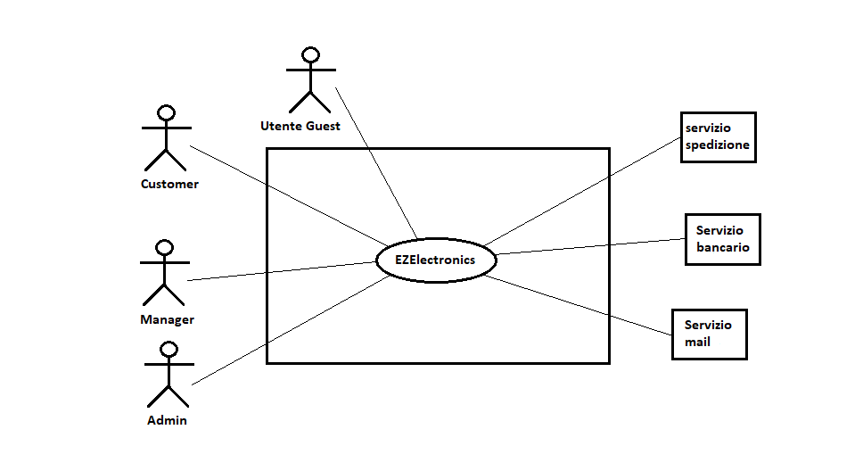
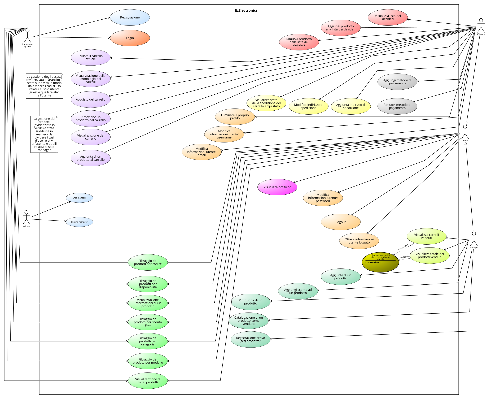
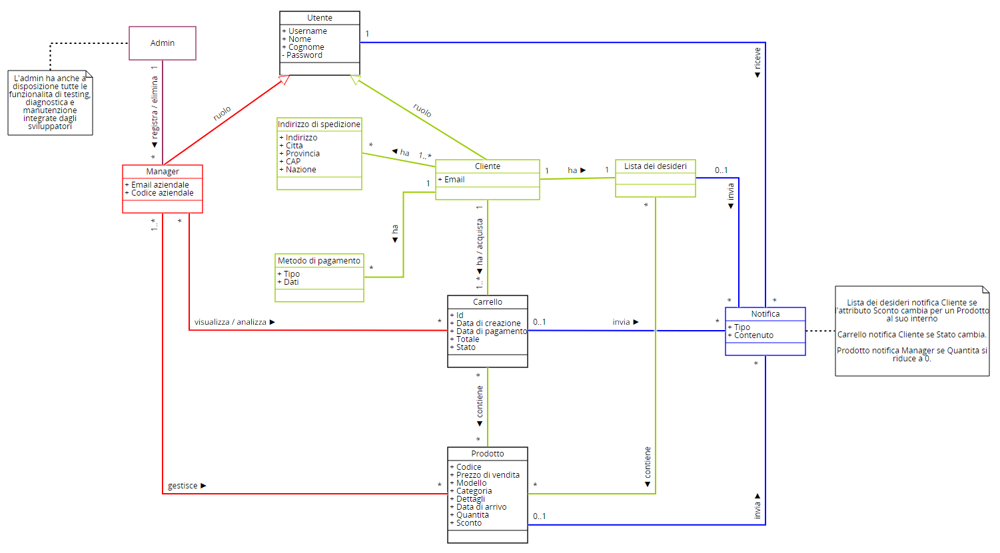

# Requirements Document - current EZElectronics

Date:

Version: V1 - description of EZElectronics in CURRENT form (as received by teachers)

| Version number| Change|
| :------------:| :----:|
|        V2     |       |

# Contents

- [Requirements Document - current EZElectronics](#requirements-document---current-ezelectronics)
- [Contents](#contents)
- [Informal description](#informal-description)
- [Stakeholders](#stakeholders)
- [Context Diagram and interfaces](#context-diagram-and-interfaces)
  - [Context Diagram](#context-diagram)
  - [Interfaces](#interfaces)
- [Stories and personas](#stories-and-personas)
- [Functional and non functional requirements](#functional-and-non-functional-requirements)
  - [Functional Requirements](#functional-requirements)
  - [Table of Rights](#table-of-rights)
  - [Non Functional Requirements](#non-functional-requirements)
- [Use case diagram and use cases](#use-case-diagram-and-use-cases)
  - [Use case diagram summary](#use-case-diagram-summary)
  - [Use case diagram](#use-case-diagram)
[Use case diagram](#use-case-diagram)
    - [Use case 1.1, UC1.1](#use-case-11-uc11)
      - [Scenario 1.1.1](#scenario-111)
      - [Scenario 1.1.2](#scenario-112)
    - [Use case 1.2, UC1.2](#use-case-12-uc12)
      - [Scenario 1.2](#scenario-12)
    - [Use case 1.3, UC1.3](#use-case-13-uc13)
      - [Scenario 1.3](#scenario-13)
    - [Use case 2.1, UC2.1](#use-case-21-uc21)
      - [Scenario 2.1.1](#scenario-211)
      - [Scenario 2.1.2](#scenario-212)
    - [Use case 3.1, UC3.1](#use-case-31-uc31)
      - [Scenario 3.1](#scenario-31)
    - [Use case 3.2, UC3.2](#use-case-32-uc32)
      - [Scenario 3.2.1](#scenario-321)
      - [Scenario 3.2.2](#scenario-322)
      - [Scenario 3.2.3](#scenario-323)
    - [Use case 3.3, UC3.3](#use-case-33-uc33)
      - [Scenario 3.3.1](#scenario-331)
      - [Scenario 3.3.2](#scenario-332)
    - [Use case 3.4, UC3.4](#use-case-34-uc34)
      - [Scenario 3.4.1](#scenario-341)
      - [Scenario 3.4.2](#scenario-342)
    - [Use case 3.5, UC3.5](#use-case-35-uc35)
      - [Scenario 3.5](#scenario-35)
    - [Use case 3.6, UC3.6](#use-case-36-uc36)
    - [Use case 3.7, UC3.7](#use-case-37-uc37)
      - [Scenario 3.7](#scenario-37)
    - [Use case 3.8, UC3.8](#use-case-38-uc38)
      - [Scenario 3.8.1](#scenario-381)
      - [Scenario 3.8.2](#scenario-382)
      - [Scenario 3.8.3](#scenario-383)
      - [Scenario 3.8.4](#scenario-384)  
    - [Use case 3.9, UC3.9](#use-case-39-uc39)
    - [Use case 3.10, UC3.10](#use-case-310-uc310)
    - [Use case 3.11, UC3.11](#use-case-311-uc311)
    - [Use case 3.12, UC3.12](#use-case-312-uc312)
    - [Use case 4.1, UC4.1](#use-case-41-uc41)
      - [Scenario 4.1](#scenario-41)
    - [Use case 4.2, UC4.2](#use-case-42-uc42)
      - [Scenario 4.2.1](#scenario-421)
      - [Scenario 4.2.2](#scenario-422)
      - [Scenario 4.2.3](#scenario-423)
      - [Scenario 4.2.4](#scenario-424)
    - [Use case 4.3, UC4.3](#use-case-43-uc43)
      - [Scenario 4.3.1](#scenario-431)
      - [Scenario 4.3.2](#scenario-432)
      - [Scenario 4.3.3](#scenario-433)
      - [Scenario 4.3.4](#scenario-434)
      - [Scenario 4.3.5](#scenario-435)
    - [Use case 4.4, UC4.4](#use-case-44-uc44)
      - [Scenario 4.4.1](#scenario-441)
      - [Scenario 4.4.2](#scenario-442)
      - [Scenario 4.4.3](#scenario-443)
    - [Use case 4.5, UC4.5](#use-case-45-uc45)
      - [Scenario 4.5](#scenario-45)
    - [Use case 4.6, UC4.6](#use-case-46-uc46)
      - [Scenario 4.6.1](#scenario-461)
      - [Scenario 4.6.2](#scenario-462)
    - [Use case 5.1, UC5.1](#use-case-51-uc51)
      - [Scenario 5.1.1](#scenario-511)
      - [Scenario 5.1.2](#scenario-512)
    - [Use case 5.2, UC5.2](#use-case-52-uc52)
      - [Scenario 5.2.1](#scenario-521)
      - [Scenario 5.2.2](#scenario-522)
    - [Use case 5.3, UC5.3](#use-case-53-uc53)
    - [Use case 5.4, UC5.4](#use-case-54-uc54)
    - [Use case 6.1, UC6.1](#use-case-61-uc61)
    - [Use case 6.2, UC6.2](#use-case-62-uc62)
    - [Use case 7.1, UC7.1](#use-case-71-uc71)
    - [Use case 7.2, UC7.2](#use-case-72-uc72)

- [Glossary](#glossary)
- [System Design](#system-design)
- [Deployment Diagram](#deployment-diagram)

# Informal description

EZElectronics (read EaSy Electronics) is a software application designed to help managers of electronics stores to manage their products and offer them to customers through a dedicated website. Managers can assess the available products, record new ones, and confirm purchases. Customers can see available products, add them to a cart and see the history of their past purchases.

# Stakeholders

| Nome dello Stakeholder| Descrizione                                                                    |
| :--------------------:| :-----------------------------------------------------------------------------:|
| Cliente               | Individuo che accede al sito web per visualizzare o comprare prodotti          |
| Manager               | Manager dello store fisico che puo' gestire i prodotti sul sito                |
| Servizio di pagamento | Servizio per transazioni monetarie                                             |
| Sviluppatori          | Il team di sviluppatori del sistema                                            |
| Servizio di spedizione| Servizio per la spedizione dei prodotti                                        |
| Amministratore        | Amministratore del sistema                                                     |
| Utente guest          | Utente che non ha ancora effettuato la fase di login o la fase di registrazione|
| Servizio mail         | Servizio per scrivere ed inviare delle mail                                    |

# Context Diagram and interfaces

## Context Diagram

## Interfaces

| Attore                | Interfaccia logica                                                        | Interfaccia fisica|
| :--------------------:| :-----------------------------------------------------------------------: | :----------------:|
| Cliente               | GUI (interfaccia per navigare il sito, visualizzare e comprare prodotti)  | Browser Web       |
| Manager               | GUI (interfaccia per navigare il sito, visualizzare e gestire i prodotti) | Browser Web       |
| Utente guest          | GUI (interfaccia per visualizzare i prodotti e per l'autenticazione)      | Browser Web       |
| Amministratore        | CLI (interfaccia per registrare ed eliminare manager, testing)            | PC                |
| Servizio di pagamento | APIs                                                                      | Internet          |
| Servizio di spedizione| APIs                                                                      | Internet          |
| Servizio mail         | APIs                                                                      | Internet          |

# Stories and personas

**Persona 1**: uomo, professionista ad alto reddito, sposato, con figli, 50 anni  
Storia: vuole acquistare una nuova smart-TV <u>all'avanguardia</u> per il suo salotto: deve trovare il <u>prezzo migliore</u> tra le migliori TV presenti nel negozio.

**Persona 2**: donna, studentessa universitaria, 20 anni  
Storia: vuole acquistare uno smartphone <u>economico</u> per sostituire quello vecchio e lento: deve trovare la <u>migliore soluzione costo-prestazioni</u>.  
  
**Persona 3**: donna, sposata, con figli, 60 anni  
Storia: vuole acquistare una radio per la madre di 85 anni che vive da sola, per tenerle compagnia.
  
**Persona 4**: uomo, lavora da pochi anni, 28 anni  
Storia: vuole assemblare un PC da gioco all'avanguardia: vuole controllare l'andamento dei prezzi dei componenti a cui e' interessato.  

**Persona 5**: uomo, manager di un negozio, 45 anni  
Storia: deve <u>aggiungere al sito web un modello appena uscito</u> di un prodotto e <u>rimuoverne uno vecchio</u>, esaurito.  

**Persona 6**: donna, manager del negozio, 50 anni  
Storia: deve <u>registrare l'arrivo</u> di una serie di prodotti e <u>applicare uno sconto</u> per i prodotti di un modello specifico.

**Persona 7**: uomo, appena sposato, 30 anni  
Storia: si deve trasferire nella sua nuova casa e sta aspettando di essere <u>notificato</u> del fatto che gli articoli da cucina che ha aggiunto alla <u>lista dei desideri</u> sono stati <u>scontati</u>.

**Persona 8**: donna, sposata, con figli, 38 anni  
Storia: vuole regalare a suo figlio una console da gioco, <u>spedendola ad un indirizzo diverso</u> da quello a cui vive per evitare di insospettirlo.

# Functional and non functional requirements

## Functional Requirements

| ID| Descrizione                                                                              |
|:--------|:-----------------------------------------------------------------------------------|
| **FR1**| **Gestione degli accessi**                                                          |
| FR1.1| Login di un utente registrato                                                         |
| FR1.2| Logout di un utente registrato                                                        |
| FR1.3| Possibilità di ottenere le informazioni relative all'utente correntemente loggato     |
| **FR2**| **Gestione degli utenti**                                                           |
| FR2.1| Registrazione di un nuovo utente                                                      |
| FR2.2| Modifica informazioni utente: username di un cliente loggato                          |
| FR2.3| Modifica informazioni utente: email di un cliente loggato                             |
| FR2.4| Modifica informazioni utente: password di un utente loggato                           |
| FR2.5| Eliminare il proprio profilo         |
| FR2.6| Elimina profilo utente                                                                |
| **FR3**| **Gestione dei prodotti**                                                           |
| FR3.1| Visualizzazione di tutti i prodotti                                                   |
| FR3.2| Visualizzazione delle informazioni di un prodotto                                     |
| FR3.3| Aggiunta di un nuovo prodotto                                                         |
| FR3.4| Rimozione di un prodotto                                                              |
| FR3.5| Registrazione dell'arrivo di un nuovo (insieme di) prodotti                           |
| FR3.6| Filtraggio dei prodotti per categoria                                                 |
| FR3.7| Filtraggio dei prodotti per modello                                                   |
| FR3.8| Filtraggio dei prodotti per disponibilità                                             |
| FR3.9| Aggiungi sconto ad un prodotto                                          |
| FR3.10| Filtraggio informazioni prodotti per sconto (maggiore o uguale a quello indicato)    |
| FR3.11| Aggiorna la quantità disponibile di un prodotto quando viene venduto                 |
| **FR4**| **Gestione del carrello**                                                           |
| FR4.1| Visualizzazione del carrello attuale del cliente                                      |
| FR4.2| Aggiunta di un prodotto al carrello attuale                                           |
| FR4.3| Rimozione di un prodotto dal carrello attuale                                         |
| FR4.4| Acquisto dei prodotti aggiunti al carrello attuale                                    |
| FR4.5| Visualizzazione della cronologia dei carrelli acquistati dal cliente                  |
| FR4.6| Svuota il carrello attuale                                                            |
| **FR5**| **Gestione spedizioni**                                                             |
| FR5.1| Aggiunta indirizzo di spedizione   |
| FR5.2| Modifica indirizzo di spedizione                                         |
| FR5.3| Visualizza stato della spedizione del carrello acquistato                |
| **FR6**| **Gestione pagamenti**                                                              |
| FR6.1| Aggiungi metodo di pagamento                                           |
| FR6.2| Rimuovi metodo di pagamento                                             |
| **FR7**| **Analisi vendite**                                                                 |
| FR7.1| Visualizza carrelli venduti (filtri opzionali: intervallo di date, categoria prodotto, modello prodotto)                                                                                      |
| FR7.2| Visualizza totale dei prodotti venduti (in base ai filtri specificati in FR7.1)       |
| **FR8**| **Gestione notifiche**                                                              |
| FR8.1| Invio di una email di notifica al cliente quando un prodotto all'interno della sua lista dei desideri riceve uno sconto|
| FR8.3| Invio di una email di notifica al cliente quando lo stato della sua spedizione viene aggiornato |
| FR8.4| Invio di una email di notifica al cliente quando un prodotto nel suo carrello viene esaurito (prima che lui lo acquisti)|
| FR8.5| Invio di una email di notifica al manager quando un prodotto viene esaurito           |
|**FR9**| **Gestione lista dei desideri**                                                      |
| FR9.1| Visualizza lista dei desideri                                                         |
| FR9.2| Aggiungi prodotto alla lista dei desideri                                             |
| FR9.3| Rimuovi prodotto dalla lista dei desideri                                             |

## Table of rights

| Codice - Descrizione                                                                            |Utente Guest | Cliente | Manager |
| ----------------------------------------------------------------------------------------------- |:----------: | :-----: | :-----: |
| FR1.1 Login di un utente registrato                                                             |     X     |           |           |
| FR1.2 Logout di un utente registrato                                                            |           |     X     |     X     |
| FR1.3 Possibilità di ottenere le informazioni relative all'utente correntemente loggato         |           |     X     |     X     |
| FR2.1 Registrazione di un nuovo utente                                                          |     X     |           |           |
| FR2.2 Modifica informazioni utente: username di un cliente loggato                              |           |     X     |           |
| FR2.3 Modifica informazioni utente: email di un cliente loggato                                 |           |     X     |           |
| FR2.4 Modifica informazioni utente: password di un utente loggato                               |           |     X     |     X     |
| FR2.5 Eliminare il proprio profilo ******** (AGGIUNTO)                                          |           |           |           |
| FR2.6 Elimina profilo utente                                                                    |           |           |           |
| FR2.7 Visualizza utenti (????? anche per ruolo)                                                 |           |           |           |
| FR3.1 Visualizzazione di tutti i prodotti                                                       |     X     |     X     |     X     |
| FR3.2 Aggiunta di un nuovo prodotto                                                             |           |           |     X     |
| FR3.3 Rimozione di un prodotto                                                                  |           |           |     X     |
| FR3.4 Registrazione dell'arrivo di un nuovo (insieme di) prodotti                               |           |           |     X     |
| FR3.5 Visualizza informazioni prodotti di una certa categoria (opzionale: parametro disponibile)|     X     |     X     |     X     |
| FR3.6 Visualizza informazioni prodotti di un certo modello (opzionale: parametro disponibile)   |     X     |     X     |     X     |
| FR3.7 Visualizza informazioni di un prodotto con un determinato codice                          |     X     |     X     |     X     |
| FR3.8 Aggiungi sconto ad un prodotto                                                            |           |           |     X     |
| FR3.9 Filtra prodotti per sconto                                                                |           |     X     |     X     |
| FR3.10 Visualizza storico prezzi di un prodotto                                                 |           |     X     |     X     |
| FR3.11 Aggiungi prodotto alla lista dei desideri                                                |           |     X     |           |
| FR3.12 Rimuovi prodotto dalla lista dei desideri                                                |           |     X     |           |
| FR4.1 Visualizzazione del carrello attuale del cliente                                          |           |     X     |           |
| FR4.2 Aggiunta di un prodotto al carrello attuale                                               |           |     X     |           |
| FR4.3 Rimozione di un prodotto dal carrello attuale                                             |           |     X     |           |
| FR4.4 Acquisto dei prodotti aggiunti al carrello attuale                                        |           |     X     |           |
| FR4.5 Visualizzazione della cronologia dei carrelli acquistati dal cliente                      |           |     X     |           |
| FR4.6 Cancellazione del carrello attuale                                                        |           |     X     |           |
| FR5.1 Aggiunta indirizzo di spedizione                                                          |           |     X     |           |
| FR5.2 Modifica indirizzo di spedizione                                                          |           |     X     |           |
| FR5.3 Visualizza stato della spedizione del carrello acquistato                                 |           |     X     |           |
| FR5.4 Visualizza stato ordine (non corrisponde a req funzionale??)                              |           |     X     |           |
| FR6.1 Aggiungi metodo di pagamento                                                              |           |     X     |           |
| FR6.2 Rimuovi metodo di pagamento                                                               |           |     X     |           |
| FR7.1 Visualizza statistiche relative allo stato degli ordini     (DA FARE)                     |           |           |     X     |
| FR7.2 Visualizza statistiche prodotti venduti in un range di date                               |           |           |     X     |
| FR8.1 Visualizzazione delle notifiche                                                           |           |           |           |
| FR8.2 Invio di una notifica al cliente quando un prodotto all'interno della sua lista dei desideri riceve uno sconto                                                                                            |           |           |           |
| FR8.3 Invio di una notifica al cliente quando lo stato della sua spedizione viene aggiornato    |           |           |           |
| FR8.4 Invio di una notifica al cliente quando un prodotto nel suo carrello viene esaurito       |           |           |           |
| FR8.5 Invio di una notifica al manager quando un prodotto viene esaurito                        |           |           |           |
| FR9.1 Visualizza lista dei desideri                                                             |           |     X     |           |
| FR9.2 Aggiungi prodotto alla lista dei desideri                                                 |           |     X     |           |
| FR9.3 Rimuovi prodotto dalla lista dei desideri                                                 |           |     X     |           |

## Non Functional Requirements

| ID| Tipo (efficienza, affidabilità, ...)| Descrizione             | Si riferisce a|
|:-:|:-----------------------------------:|:------------------------|:-------------:|
| NFR1 |  Efficienza  | Il sistema deve rispondere entro 0,5 secondi a partire da qualsiasi azione dell'utente (esclusi i tempi di caricamento delle pagine). |/|
| NFR2 |  Efficienza  | Le pagine Web devono essere caricate entro 6 secondi dall'ultima richiesta dell'utente (a seconda delle condizioni della rete) |/|
| NFR3 |  Efficienza  | Non è necessaria l'installazione di app per l'utente finale, ogni funzionalità deve essere accessibile dal sito web tramite un browser internet |/|
| NFR4 |  Sicurezza   | Il trattamento dei dati personali degli utenti deve essere conforme al GDPR |/|
| NFR5 |  Usabilità   | I clienti non hanno bisogno di alcuna formazione |/|
| NFR6 |  Usabilità   | I manager hanno bisogno di un massimo di tre ore di formazione  |/|
| NFR7 | Affidabilità | Il numero di malfunzionamenti all'anno deve essere inferiore a 2 |/|
| NFR8 | Affidabilità | Il sistema deve avere un uptime del 99% (considerando operazioni di manutenzione e malfunzionamenti) |/|
| NFR9 | Affidabilità | Ogni operazione di manutenzione non deve durare più di 4 ore |/|
| NFR10| Affidabilità | Ogni utente non deve segnalare più di 1 bug non segnalato in precedenza all'anno |/|
| NFR11| Portabilità  | Il sito web deve essere accessibile dai seguenti browser (specificando la versione più vecchia supportata): Chrome (v: 79), Firefox (v: 72), Safari (v: 13.0.5), Opera (v: 65), Edge (v: 79), Samsung Internet (v: 11.2) |/|

# Use case diagram and use cases

## Use Case Diagram Summary

## Use case diagram

### Use case 1.1, UC1.1

| Actors Involved  |                                           Cliente/Manager                                        |
| :--------------: | :----------------------------------------------------------------------------------------------: |
|   Precondition   |  L'utente è registrato nel sistema                                 |
|  Post condition  |                                     L'utente risulta loggato                                     |
| Nominal Scenario |                 L'utente inserisce username e password e accede al sistema (1.1)                 |
|     Variants     |                                                                                                  |
|    Exceptions    | L'utente inserisce dati errati (non previsto dalle API, ma presente nel file userDAO.ts) (1.1.1) |

#### Scenario 1.1

|  Scenario 1.1  |             Login corretto             |
| :------------: | :------------------------------------: |
|  Precondition  |   L'utente è registrato nel sistema    |
| Post condition |        L'utente risulta loggato        |
|     Step#      |              Description               |
|       1        | L'utente chiede di accedere al sistema |
|       2        | Il sistema chiede username e password  |
|       3        | L'utente inserisce username a password |
|       4        |        Il sistema valida i dati        |
|       5        |        L'utente risulta loggato        |

#### Scenario 1.1.1

| Scenario 1.1.1 |                         Login errato                          |
| :------------: | :-----------------------------------------------------------: |
|  Precondition  |               L'utente è registrato nel sistema               |
| Post condition |                                                               |
|     Step#      |                          Description                          |
|       1        |            L'utente chiede di accedere al sistema             |
|       2        |             Il sistema chiede username e password             |
|       3        |            L'utente inserisce username a password             |
|       4        | Il sistema rileva un errore nei dati e lo comunica all'utente |

### Use case 1.2, UC1.2

| Actors Involved  |                                          Utente                                           |
| :--------------: | :---------------------------------------------------------------------------------------: |
|   Precondition   |                                    L'utente è loggato                                     |
|  Post condition  |                                 Viene eseguito il logout                                  |
| Nominal Scenario | L'utente chiede al sistema di effettuare il logout e questo viene effettuato con successo |
|     Variants     |                                                                                           |
|    Exceptions    |                                                                                           |

#### Scenario 1.2

|  Scenario 1.2  |                                                    |
| :------------: | :------------------------------------------------: |
|  Precondition  |                 L'utente è loggato                 |
| Post condition |              Viene eseguito il logout              |
|     Step#      |                    Description                     |
|       1        | L'utente chiede al sistema di effettuare il logout |
|       2        |     Il sistema effettua il logout per l'utente     |

### Use case 1.3, UC1.3

| Actors Involved  |                                        Utente                                        |
| :--------------: | :----------------------------------------------------------------------------------: |
|   Precondition   |                                  L'utente è loggato                                  |
|  Post condition  |           Vengono mostrate le informazioni dell'utente attualmente loggato           |
| Nominal Scenario | L'utente chiede al sistema di visualizzare le sue informazioni e li vengono mostrate |
|     Variants     |                                                                                      |
|    Exceptions    |                                                                                      |

#### Scenario 1.3

|  Scenario 1.3  |                                                                  |
| :------------: | :--------------------------------------------------------------: |
|  Precondition  |                        L'utente è loggato                        |
| Post condition | Vengono mostrate le informazioni dell'utente attualmente loggato |
|     Step#      |                           Description                            |
|       1        |    L'utente chiede al sistema di mostrare le sue informazioni    |
|       2        |           Il sistema mostra le informazioni all'utente           |

### Use case 2.1 , UC2.1

| Actors Involved  |                      Utente guest                      |
| :-------------:  | :----------------------------------------------------: |
|  Precondition    |                           --                           |
| Post condition   | L'utente risulta registrato correttamente nel sistema. |
| Nominal Scenario |           L'utente inserisce tutti i dati richiesti per la registrazione e sceglie il ruolo con cui registrarsi nel sistema.    |
|     Variants     |                                                        |
|    Exceptions    | I dati inseriti non sono corretti o l'utente risulta già registrato, il sistema ritorna un errore e la registrazione non va a buon fine |

### Use case 2.1, UC2.1

| Actors Involved  |  Utente guest                      |
| :--------------: | :------------------------------------------------------------------: |
|   Precondition   | --                                                                   |
|  Post condition  | Il cliente risulta registrato correttamente nel sistema.              |
| Nominal Scenario |  L'utente guest inserisce tutti i dati richiesti per la registrazione e viene registrato come cliente (2.1)     |
|     Variants     |                                                                      |
|    Exceptions    | Il cliente risulta già registrato  (2.1.1)                             |

#### Scenario 2.1.1

|  Scenario 2.1.1  |                      Registrazione corretta                       |
| :------------: | :---------------------------------------------------------------: |
|  Precondition  |                                --                                 |
| Post condition |   Il cliente risulta registrato correttamente nel sistema   |
|     Step#      |                            Description                            |
|       1        | L'utente guest chiede di registrarsi al sistema.             |
|       2        |      Il sistema chiede i dati necessari per la registrazione      |
|       3        |  L'utente inserisce i dati richiesti                |
|       4        | Il sistema salva i dati e viene creato il nuovo cliente   |

#### Scenario 2.1.2

| Scenario 2.1.2 |                                       Registrazione errata                                       |
| :------------: | :----------------------------------------------------------------------------------------------: |
|  Precondition  |                                                --                                                |
| Post condition |                                                                                                  |
|     Step#      |                                           Description                                            |
|       1        | L'utente guest chiede di registrarsi al sistema.                            |
|       2        |   Il sistema chiede i dati necessari per la registrazione                      |
|       3        |  L'utente inserisce i dati richiesti                                |
|       4        | Il sistema rileva un errore in quanto l'username inserito esiste già e lo comunica |
### Use case 2.2, UC2.2

| Actors Involved  |  Admin   |
| :--------------: | :------------------------------------------------------------------: |
|   Precondition   | --                                                                   |
|  Post condition  |  Il manager risulta registrato correttamente nel sistema.              |
| Nominal Scenario |  L'admin crea un nuovo utente di tipo manager e inserisce l'email e  il codice aziendale  |
|     Variants     |                                                                      |
|    Exceptions    | Il manager risulta già registrato  (2.1.1)                             |

#### Scenario 2.2

|  Scenario 2.2  |                      Registrazione corretta del manager                      |
| :------------: | :---------------------------------------------------------------: |
|  Precondition  |                                --                                 |
| Post condition |   Il manager risulta registrato correttamente nel sistema   |
|     Step#      |                            Description                            |
|       1        | L'admin inserisce email e codice aziendale del nuovo manager                                                                              |
|       2        |  Il sistema salva i dati e viene creato il nuovo manager   |
#### Scenario 2.2.1

|  Scenario 2.2.1  |                      Registrazione errata del manager                       |
| :------------: | :---------------------------------------------------------------: |
|  Precondition  |                                --                                 |
| Post condition |      |
|     Step#      |                            Description                            |
|       1        | L'admin inserisce email e codice aziendale del nuovo manager                                                                              |
|       2        |  Il manager risulta già registrato, il sistema restituisce un errore   |
### Use case 2.3 , UC2.3

| Actors Involved  |                                          Cliente                                           |
| :--------------: | :---------------------------------------------------------------------------------------: |
|   Precondition   |                                    Il cliente è loggato                                     |
|  Post condition  |              Lo username del cliente risulta modificato correttamente               |
| Nominal Scenario | Il cliente inserisce il nuovo username da sostituire al precedente (2.3) |
|     Variants     |                                                                                           |
|    Exceptions    |          Lo username esiste già (2.3.1)         |

#### Scenario 2.3

| Scenario 2.3 |                       Modifica dello username (a buon fine)                        |
| :------------: | :--------------------------------------------------------------------------------: |
|  Precondition  |                                 Il cliente è loggato                                 |
| Post condition |           Il nuovo username fornito dal cliente viene salvato correttamente        |
|     Step#      |                                    Description                                     |
|       1        |           Il cliente chiede di modificare le informazioni del proprio profilo      |
|       2        |           Il cliente chiede di modificare il suo username     |
|       3        |                  Il sistema chiede di inserire un nuovo username                   |
|       4        |                        Il cliente inserisce il nuovo username                        |
|       5        |                Il sistema verifica che lo username sia disponibile                 |
|       6        | Lo username è disponibile: il sistema salva il nuovo username per il cliente attuale |

#### Scenario 2.3.1

| Scenario 2.3.1 |                       Modifica dello username (il nuovo username esiste già nel sistema)|
| :------------: | :--------------------------------------------------------------------------------: |
|  Precondition  |                                 Il cliente è loggato                                 |
| Post condition |           Lo username non è disponibile, le informazioni del cliente risultano invariate        |
|     Step#      |                                    Description                                     |
|       1        |           Il cliente chiede di modificare le informazioni del proprio profilo      |
|       2        |           Il cliente chiede di modificare il suo username            |
|       3        |                  Il sistema chiede di inserire un nuovo username                   |
|       4        |                        Il cliente inserisce il nuovo username                        |
|       5        |                Il sistema verifica che lo username sia disponibile                 |
|       6        | Lo username non è disponibile: il sistema mostra un errore e la procedura riprende dallo step #3 |

### Use case 2.4, UC2.4

| Actors Involved  |                                          Cliente                                           |
| :--------------: | :---------------------------------------------------------------------------------------: |
|   Precondition   |                                    Il cliente è loggato                                     |
|  Post condition  |              L'email del cliente risulta modificato correttamente               |
| Nominal Scenario | Il cliente inserisce la nuova email da sostituire alla precedente |
|     Variants     |                                                                                           |
|    Exceptions    |          La verifica dell'email non va a buon fine         |

#### Scenario 2.4.1

| Scenario 2.4.1 |                       Modifica dell'email (a buon fine)                        |
| :------------: | :--------------------------------------------------------------------------------: |
|  Precondition  |                                 Il cliente è loggato                                 |
| Post condition |           La nuova email fornita dal cliente viene salvata correttamente        |
|     Step#      |                                    Description                                     |
|       1        |           Il cliente chiede di modificare le informazioni del proprio profilo      |
|       2        |           Il cliente chiede di modificare la sua email |
|       3        |                  Il sistema chiede di inserire una nuova email                   |
|       4        |                        Il cliente inserisce la sua nuova email                       |
|       5        |                Il sistema invia un'email di verifica alla casella di posta elettronica del cliente |
|       6        | Il cliente verifica correttamente la sua nuova email, che viene sostituita alla precedente |

#### Scenario 2.4.2

| Scenario 2.4.2 |                       Modifica dell'email (verifica email non va a buon fine)      |
| :------------: | :--------------------------------------------------------------------------------: |
|  Precondition  |                                 Il cliente è loggato                                 |
| Post condition |           La nuova email fornita dal cliente non viene verificata correttamente: le informazioni del cliente risultano invariate        |
|     Step#      |                                    Description                                     |
|       1        |           Il cliente chiede di modificare le informazioni del proprio profilo      |
|       2        |           Il cliente chiede di modificare la sua email |
|       3        |                  Il sistema chiede di inserire una nuova email                   |
|       4        |                        Il cliente inserisce la sua nuova email                       |
|       5        |                Il sistema invia un'email di verifica alla casella di posta elettronica del cliente |
|       6        | Il sistema non riceve conferma della verifica della nuova email, le informazioni del cliente risultano invariate |

### Use case 2.5 , UC2.5

| Actors Involved  |                                          Utente                                          |
| :--------------: | :---------------------------------------------------------------------------------------: |
|   Precondition   |                                    L'utente è loggato                                     |
|  Post condition  |              La password dell'utente risulta modificata correttamente               |
| Nominal Scenario | L'utente inserisce e conferma la nuova password da sostituire alla precedente |
|     Variants     |                                                                                           |
|    Exceptions    |          Le due password inserite dall'utente non combaciano         |

#### Scenario 2.5.1

| Scenario 2.5.1 |                      Modifica della password (a buon fine)                      |
| :------------: | :-----------------------------------------------------------------------------: |
|  Precondition  |                               L'utente è loggato                                |
| Post condition |         La password dell'utente risulta modificata correttamente         |
|     Step#      |                                   Description                                   |
|       1        |          L'utente chiede di modificare le informazioni del suo account          |
|       2        |          L'utente chiede di modificare la sua password         |
|       3        |            Il sistema chiede di inserire due volte la nuova password            |
|       4        |                 L'utente inserisce due volte la nuova password                  |
|       5        |             Il sistema verifica che le password inserite combacino              |
|       6        | Le password combaciano: il sistema salva la nuova password per l'utente attuale |

#### Scenario 2.5.2

| Scenario 2.5.2 |               Modifica della password (la conferma password non va a buon fine)                |
| :------------: | :--------------------------------------------------------------------------------------------: |
|  Precondition  |                                       L'utente è loggato                                       |
| Post condition | La modifica della password non va a buon fine, le informazioni dell'utente risultano invariate |
|     Step#      |                                          Description                                           |
|       1        |          L'utente chiede di modificare le informazioni del suo account          |
|       2        |                 L'utente chiede di modificare la sua password                 |
|       3        |                   Il sistema chiede di inserire due volte la nuova password                    |
|       4        |                         L'utente inserisce due volte la nuova password                         |
|       5        |                     Il sistema verifica che le password inserite combacino                     |
|       6        | Le password non combaciano: il sistema mostra un errore e la procedura riprende dallo step #3 |
### Use case 2.6 , UC2.6

| Actors Involved  |                                          Cliente                                          |
| :--------------: | :---------------------------------------------------------------------------------------: |
|   Precondition   |    IL cliente è loggato                                     |
|  Post condition  | Il profilo del cliente risulta eliminato correttamente      |
| Nominal Scenario | Il cliente chiede di eliminare il proprio profilo e questo viene eliminato correttamente |
|     Variants     |                                                                                           |
|    Exceptions    |   |

#### Scenario 2.6

| Scenario 2.6 |                      Modifica della password (a buon fine)                      |
| :------------: | :-----------------------------------------------------------------------------: |
|  Precondition  |   Il cliente è loggato                                       |
| Post condition | Il profilo del cliente risulta eliminato correttamente       |
|     Step#      |                                   Description                                   |
|       1        |         Il cliente chiede di eliminare il proprio profilo    |
|       2        | Il sistema elimina il cliente e i suoi dati correttamente
### Use case 2.7 , UC2.7

| Actors Involved  |                                          Admin  |
| :--------------: | :---------------------------------------------------------------------------------------: |
|   Precondition   |  Il manager esiste nel sistema                             |
|  Post condition  |  Il manager viene eliminato correttamente   |
| Nominal Scenario | L'admin chiede di eliminare un manager dal sistema |
|     Variants     |                                                                                           |
|    Exceptions    |   |

#### Scenario 2.7.1

| Scenario 2.7.1 |    Eliminazione del profilo del manager |
| :------------: | :-----------------------------------------------------------------------------: |
|  Precondition  |  Il manager esiste nel sistema  |
| Post condition |   Il manager viene eliminato correttamente  |
|     Step#      |                                   Description                                   |
|       1        |   L'admin chiede di eliminare un manager dal sistema         |
|       2        |   L'admin inserisce l'email e il codice aziendale            |
|       3        |  Il sistema elimina il manager e i suoi dati

### Use case 3.1, UC3.1

| Actors Involved  |                                  Cliente/Manager                                  |
| :--------------: | :-------------------------------------------------------------------------------: |
|   Precondition   |                                L'utente è loggato                                 |
|  Post condition  |                         Vengono mostrati tutti i prodotti                         |
| Nominal Scenario | L'utente chiede al sistema di visualizzare tutti i prodotti e li vengono mostrati |
|     Variants     |                                                                                   |
|    Exceptions    |                                                                                   |

#### Scenario 3.1

|  Scenario 3.1  |                                                                      |
| :------------: | :------------------------------------------------------------------: |
|  Precondition  |                          L'utente è loggato                          |
| Post condition |                  Vengono mostrati tutti i prodotti                   |
|     Step#      |                             Description                              |
|       1        | L'utente chiede al sistema di visualizzare tutti i prodotti presenti |
|       2        |             Il sistema mostra tutti i prodotti presenti              |

### Use case 3.2, UC3.2

| Actors Involved  |                                                               Manager                                                                |
| :--------------: | :----------------------------------------------------------------------------------------------------------------------------------: |
|   Precondition   |                                              L'utente è loggato ed ha il ruolo Manager                                               |
|  Post condition  |                                               Il prodotto viene aggiunto correttamente                                               |
| Nominal Scenario | Il manager chiede di aggiungere un nuovo prodotto, inserisce tutti i dati richiesti e il prodotto viene aggiunto correttamente (3.2) |
|     Variants     |                                                                                                                                      |
|    Exceptions    |                    Il prodotto è già presente (3.2.1) o la data di arrivo è successiva a quella corrente (3.2.2)                     |

#### Scenario 3.2.1

|  Scenario 3.2.1  |         Aggiunta corretta di un nuovo prodotto          |
| :------------: | :-----------------------------------------------------: |
|  Precondition  |        L'utente è loggato ed ha il ruolo Manager        |
| Post condition |        Il prodotto viene aggiunto correttamente         |
|     Step#      |                       Description                       |
|       1        |    Il manager chiede di aggiungere un nuovo prodotto    |
|       2        | Il sistema chiede tutti i dati necessari per l'aggiunta |
|       3        |       Il manager inserisce tutti i dati richiesti       |
|       4        |           Il sistema valida i dati e li salva           |
|       5        |        Il prodotto viene aggiunto correttamente         |

#### Scenario 3.2.2

| Scenario 3.2.2 |                 Aggiunta errata di un nuovo prodotto (prodotto esistente)                  |
| :------------: | :----------------------------------------------------------------------------------------: |
|  Precondition  |                         L'utente è loggato ed ha il ruolo Manager                          |
| Post condition |                                                                                            |
|     Step#      |                                        Description                                         |
|       1        |                     Il manager chiede di aggiungere un nuovo prodotto                      |
|       2        |                  Il sistema chiede tutti i dati necessari per l'aggiunta                   |
|       3        |                        Il manager inserisce tutti i dati richiesti                         |
|       4        | Il sistema rileva un errore in quanto il prodotto è già esistente e lo comunica al manager |

#### Scenario 3.2.3

| Scenario 3.2.3 |               Aggiunta errata di un nuovo prodotto (data di arrivo successiva alla data corrente)               |
| :------------: | :-------------------------------------------------------------------------------------------------------------: |
|  Precondition  |                                    L'utente è loggato ed ha il ruolo Manager                                    |
| Post condition |                                    Il prodotto viene aggiunto correttamente                                     |
|     Step#      |                                                   Description                                                   |
|       1        |                                Il manager chiede di aggiungere un nuovo prodotto                                |
|       2        |                             Il sistema chiede tutti i dati necessari per l'aggiunta                             |
|       3        |                                   Il manager inserisce tutti i dati richiesti                                   |
|       4        | Il sistema rileva un errore in quanto la data di arrivo è successiva a quella corrente e lo comunica al manager |

### Use case 3.3, UC3.3

| Actors Involved  |                                             Manager                                              |
| :--------------: | :----------------------------------------------------------------------------------------------: |
|   Precondition   |                            L'utente è loggato ed ha il ruolo Manager                             |
|  Post condition  |                                    Il prodotto viene rimosso                                     |
| Nominal Scenario | Il manager chiede al sistema di rimuovere un prodotto e questo viene rimosso correttamente (3.3) |
|     Variants     |                                                                                                  |
|    Exceptions    |                    Il prodotto che si vuole rimuovere non è presente (3.3.1)                     |

#### Scenario 3.3.1

|  Scenario 3.3.1  |                       Rimozione corretta                        |
| :------------: | :-------------------------------------------------------------: |
|  Precondition  |            L'utente è loggato ed ha il ruolo Manager            |
| Post condition |                    Il prodotto viene rimosso                    |
|     Step#      |                           Description                           |
|       1        |      Il manager chiede al sistema di rimuovere un prodotto      |
|       2        | Il sistema chiede il codice del prodotto che si vuole rimuovere |
|       3        |                  Il manager inserisce il codice                   |
|       4        |         Il sistema verifica che il codice sia presente          |
|       5        |                    Il prodotto viene rimosso                    |

#### Scenario 3.3.2

| Scenario 3.3.2 |                                        Rimozione errata                                         |
| :------------: | :---------------------------------------------------------------------------------------------: |
|  Precondition  |                            L'utente è loggato ed ha il ruolo Manager                            |
| Post condition |                                                                                                 |
|     Step#      |                                           Description                                           |
|       1        |                      Il manager chiede al sistema di rimuovere un prodotto                      |
|       2        |                 Il sistema chiede il codice del prodotto che si vuole rimuovere                 |
|       3        |                                  Il manager inserisce il codice                                 |
|       4        | Il sistema rileva un errore in quanto il prodotto non risulta presente e lo comunica al manager |

### Use case 3.4, UC3.4

| Actors Involved  |                                                                 Manager                                                                 |
| :--------------: | :-------------------------------------------------------------------------------------------------------------------------------------: |
|   Precondition   |                                                L'utente è loggato ed ha il ruolo Manager                                                |
|  Post condition  |                                     Vengono registrati correttamente l'arrivo di un set di prodotti                                     |
| Nominal Scenario | Il manager chiede al sistema di registrare l'arrivo di un set di prodotti dello stesso modello e vengono registrati correttamente (3.4) |
|     Variants     |                                                                                                                                         |
|    Exceptions    |                                        La data di arrivo è successiva a quella corrente (3.4.1)                                         |

#### Scenario 3.4.1

|  Scenario 3.4.1  |                       Registrazione arrivi corretta                       |
| :------------: | :-----------------------------------------------------------------------: |
|  Precondition  |                 L'utente è loggato ed ha il ruolo Manager                 |
| Post condition |      Vengono registrati correttamente l'arrivo di un set di prodotti      |
|     Step#      |                                Description                                |
|       1        | Il manager chiede al sistema di registrare l'arrivo di un set di prodotti |
|       2        |       Il sistema i dati necessari per la registrazione di un arrivo       |
|       3        |                         Il manager inserisce i dati                         |
|       4        |                    Il sistema valida i dati e li salva                    |
|       5        |                  L'arrivo viene registrato correttamente                  |

#### Scenario 3.4.2

| Scenario 3.4.2 |                                           Registrazione arrivi errata                                           |
| :------------: | :-------------------------------------------------------------------------------------------------------------: |
|  Precondition  |                                    L'utente è loggato ed ha il ruolo Manager                                    |
| Post condition |                                                                                                                 |
|     Step#      |                                                   Description                                                   |
|       1        |                    Il manager chiede al sistema di registrare l'arrivo di un set di prodotti                    |
|       2        |                          Il sistema i dati necessari per la registrazione di un arrivo                          |
|       3        |                                            Il manager inserisce i dati                                          |
|       4        | Il sistema rileva un errore in quanto la data di arrivo è successiva a quella corrente e lo comunica al manager |

### Use case 3.5, UC3.5

| Actors Involved  | Cliente/Manager                                                                    |
| :--------------: | :------------------------------------------------------------------: |
|   Precondition   | L'utente è loggato  |
|  Post condition  | Vengono mostrati i prodotti che rispecchiano la categoria inserita dall'utente  |
| Nominal Scenario | L'utente chiede di visualizzare solo i prodotti che rispecchiano una determinata categoria   |
|     Variants     |                          |
|    Exceptions    ||

#### Scenario 3.5

|  Scenario 3.5  | Visualizza informazioni prodotti di una certa categoria (opzionale: parametro disponibile)      |
| :------------: | :------------------------------------------------------------------------: |
|  Precondition  | L'utente è loggato |
| Post condition | Vengono mostrati i prodotti che rispecchiano la categoria inserita dall'utente   |
|     Step#      |                                Description                                 |
|       1        |                                                        L'utente chiede di visualizzare i prodotti che rispecchiano una determinata categoria          |
|       2        |                                                        Il sistema chiede la categoria             |
|3| L'utente inserisce la categoria|
|4| Il sistema mostra i prodotti appartenenti alla categoria inserita dall'utente|

### Use case 3.6, UC3.6

| Actors Involved  | Cliente/Manager                                                                    |
| :--------------: | :------------------------------------------------------------------: |
|   Precondition   | L'utente è loggato  |
|  Post condition  | Vengono mostrati i prodotti che rispecchiano il modello inserito dall'utente  |
| Nominal Scenario | L'utente chiede di visualizzare solo i prodotti che rispecchiano un determinato modello   |
|     Variants     |                          |
|    Exceptions    ||

#### Scenario 3.6

|  Scenario 3.6  | Visualizza informazioni prodotti di un certo modello(opzionale: parametro disponibile)      |
| :------------: | :------------------------------------------------------------------------: |
|  Precondition  | L'utente è loggato |
| Post condition | Vengono mostrati i prodotti che rispecchiano il modello inserito dall'utente   |
|     Step#      |                                Description                                 |
|       1        |                                                        L'utente chiede di visualizzare i prodotti che rispecchiano un determinato modello |
|       2        |                                                        Il sistema chiede il modello            |
|3| L'utente inserisce il modello|
|4| Il sistema mostra i prodotti appartenenti al modello inserito dall'utente|

### Use case 3.7, UC3.7

| Actors Involved  | Cliente/Manager                                                                    |
| :--------------: | :------------------------------------------------------------------: |
|   Precondition   | L'utente è loggato  |
|  Post condition  | Vengono mostrate le informazioni del prodotto con il codice inserito dall'utente  |
| Nominal Scenario | L'utente chiede di visualizzare un prodotto inserendo il suo codice e gli viene mostrato   |
|     Variants     |                          |
|    Exceptions    ||

#### Scenario 3.7

|  Scenario 3.7  | Visualizza informazioni prodotti di un certo modello(opzionale: parametro disponibile)      |
| :------------: | :------------------------------------------------------------------------: |
|  Precondition  | L'utente è loggato |
| Post condition | Vengono mostrate le informazioni del prodotto con il codice inserito dall'utente   |
|     Step#      |                                Description                                 |
|       1        |                                                        L'utente chiede di visualizzare le informazioni di un prodotto di cui inserisce il codice |
|       2        |                                                        Il sistema chiede il codice            |
|3| L'utente inserisce il codice|
|4| Il sistema mostra il prodotto corrispondente al codice inserito|

### Use case 3.8, UC3.8

| Actors Involved  |Manager                                                                    |
| :--------------: | :------------------------------------------------------------------: |
|   Precondition   | Il manager è loggato  |
|  Post condition  | Il prodotto viene catalogato come venduto  |
| Nominal Scenario | Il manager chiede di catalogare un prodotto come venduto (3.8)  |
|     Variants     |                          |
|    Exceptions    | Il prodotto non esiste (3.8.1), la data di vendita risulta precedente alla data di arrivo o successiva a quella corrente (3.8.2) o il prodotto risulta già venduto (3.8.3)|

#### Scenario 3.8.1

|  Scenario 3.8.1 |                                                                    Catalogazione corretta del prodotto come venduto    |
| :------------: | :------------------------------------------------------------------------: |
|  Precondition  | Il manager è loggato |
| Post condition | Il prodotto viene catalogato come venduto    |
|     Step#      |                                Description                                 |
|       1        |                                                      Il manager seleziona il prodotto che vuole catalogare come venduto e inserisce la data di vendita        |
|       2        |                                           Il sistema valida le informazioni          |
|3| Il prodotto risulta venduto |

#### Scenario 3.8.2

|  Scenario 3.8.2  |                                                                    Catalogazione errata del prodotto come venduto    |
| :------------: | :------------------------------------------------------------------------: |
|  Precondition  | Il manager è loggato |
| Post condition | Il prodotto viene catalogato come venduto    |
|     Step#      |                                Description                                 |
|       1        |                                                      Il manager seleziona il prodotto che vuole catalogare come venduto e inserisce la data di vendita        |
|       2        |  Il sistema rileva un errore in quanto il prodotto non esiste e lo comunica al manager |

#### Scenario 3.8.3

|  Scenario 3.8.3  |                                                                    Catalogazione errata del prodotto come venduto    |
| :------------: | :------------------------------------------------------------------------: |
|  Precondition  | Il manager è loggato |
| Post condition | Il prodotto viene catalogato come venduto    |
|     Step#      |                                Description                                 |
|       1        |                                                      Il manager seleziona il prodotto che vuole catalogare come venduto e inserisce la data di vendita        |
|       2        |Il sistema rileva un errore in quanto la data di vendita risulta precedente alla data di arrivo o successiva a quella corrente e lo comunica al manager |

#### Scenario 3.8.4

|  Scenario 3.8.4  |                                                                    Catalogazione errata del prodotto come venduto    |
| :------------: | :------------------------------------------------------------------------: |
|  Precondition  | Il manager è loggato |
| Post condition | Il prodotto viene catalogato come venduto    |
|     Step#      |                                Description                                 |
|       1        | Il manager seleziona il prodotto che vuole catalogare come venduto e inserisce la data di vendita |
|       2        | Il sistema rileva un errore in quanto il prodotto risulta già venduto e lo comunica al manager

### Use case 3.9, UC3.9

| Actors Involved  |                      Cliente/Manager                         |
| :--------------: | :----------------------------------------------------------: |
|   Precondition   |                    L'utente è loggato                       |
|  Post condition  |                             ???                              |
| Nominal Scenario | Il cliente vuole tracciare il prezzo di un prodotto e ogni volta che questo cambia gli viene inviata una notifica |
|     Variants     |                                                              |
|    Exceptions    |                      Il prodotto non esiste                  |

#### Scenario 3.9

|  Scenario 3.9  |                             Traccia prezzo di un prodotto                              |
| :------------: | :------------------------------------------------------------------------------------: |
|  Precondition  |                                  Il cliente è loggato                                  |
| Post condition |                                          ???                                           |
|     Step#      |                                      Description                                       |
|       1        |           Il cliente seleziona il prodotto di cui vuole tracciare il prezzo            |
|       2        | Il sistema invia una notifica ogni volta che il prezzo del prodotto selezionato cambia |

### Use case 4.1, UC4.1

| Actors Involved  |                                  Cliente                                   |
| :--------------: | :------------------------------------------------------------------------: |
|   Precondition   |                            Il cliente è loggato                            |
|  Post condition  |           Viene mostrato il carrello attuale del cliente loggato           |
| Nominal Scenario | Il cliente chiede di visualizzare il suo carrello attuale e viene mostrato |
|     Variants     |                                                                            |
|    Exceptions    |                                                                            |

#### Scenario 4.1

|  Scenario 4.1  |     Visualizzazione del carrello attuale del cliente      |
| :------------: | :-------------------------------------------------------: |
|  Precondition  |                   Il cliente è loggato                    |
| Post condition |  Viene mostrato il carrello attuale del cliente loggato   |
|     Step#      |                        Description                        |
|       1        | Il cliente chiede di visualizzare il suo carrello attuale |
|       2        |          Il sistema mostra il carrello corrente           |

### Use case 4.2, UC4.2

| Actors Involved  |                                                 Cliente                                                 |
| :--------------: | :-----------------------------------------------------------------------------------------------------: |
|   Precondition   |                                          Il cliente è loggato                                           |
|  Post condition  |                      Il prodotto viene aggiunto correttamente al carrello attuale                       |
| Nominal Scenario | Il cliente chiede di aggiungere un prodotto al suo carrello e questo viene aggiunto correttamente (4.2) |
|     Variants     |                                                                                                         |
|    Exceptions    | Il prodotto non esiste (4.2.1), il prodotto è già presente in un altro carrello (4.2.2) o il prodotto non è disponibile (4.2.3) |

#### Scenario 4.2.1

|  Scenario 4.2.1  |    Aggiunta corretta di un prodotto al carrello attuale    |
| :------------: | :--------------------------------------------------------: |
|  Precondition  |                    Il cliente è loggato                    |
| Post condition |    Il prodotto viene aggiunto correttamente al carrello    |
|     Step#      |                        Description                         |
|       1        | Il cliente seleziona il prodotto da aggiungere al carrello |
|       2        | Il sistema verifica che il prodotto possa essere aggiunto  |
|       3        |          Il prodotto risulta aggiunto al carrello          |

#### Scenario 4.2.2

| Scenario 4.2.2 |                     Aggiunta errata di un prodotto al carrello attuale                     |
| :------------: | :----------------------------------------------------------------------------------------: |
|  Precondition  |                                    Il cliente è loggato                                    |
| Post condition |                                                                                            |
|     Step#      |                                        Description                                         |
|       1        |                 Il cliente seleziona il prodotto da aggiungere al carrello                 |
|       2        | Il sistema rileva un errore in quanto il prodotto non è esistente e lo comunica al cliente |

#### Scenario 4.2.3

| Scenario 4.2.3 |     Aggiunta errata di un prodotto al carrello attuale     |
| :------------: | :--------------------------------------------------------: |
|  Precondition  |                    Il cliente è loggato                    |
| Post condition |                                                            |
|     Step#      |                        Description                         |
|       1        | Il cliente seleziona il prodotto da aggiungere al carrello |
|       2        | Il sistema rileva un errore in quanto il prodotto risulta essere presente in un altro carrello e lo comunica al cliente |

#### Scenario 4.2.4

| Scenario 4.2.4 |                              Aggiunta errata di un prodotto al carrello attuale                              |
| :------------: | :----------------------------------------------------------------------------------------------------------: |
|  Precondition  |                                             Il cliente è loggato                                             |
| Post condition |                                                                                                              |
|     Step#      |                                                 Description                                                  |
|       1        |                          Il cliente seleziona il prodotto da aggiungere al carrello                          |
|       2        | Il sistema rileva un errore in quanto il prodotto risulta venduto (non disponibile) e lo comunica al cliente |

### Use case 4.3, UC4.3

| Actors Involved  |                                              Cliente                                               |
| :--------------: | :------------------------------------------------------------------------------------------------: |
|   Precondition   |                                        Il cliente è loggato                                        |
|  Post condition  |                               Il prodotto viene rimosso dal carrello                               |
| Nominal Scenario | Il cliente chiede di rimuovere un prodotto dal carrello e questo viene rimosso correttamente (4.3) |
|     Variants     |                                                                                                    |
|    Exceptions    | Il prodotto non è nel carrello (4.3.1), non esiste (4.3.2), è già stato venduto (4.3.3) o il cliente non ha alcun carrello (4.3.4) |

#### Scenario 4.3.1

|  Scenario 4.3.1  |   Rimozione corretta di un prodotto dal carrello attuale    |
| :------------: | :---------------------------------------------------------: |
|  Precondition  |                    Il cliente è loggato                     |
| Post condition |           Il prodotto viene rimosso dal carrello            |
|     Step#      |                         Description                         |
|       1        | Il cliente chiede di rimuovere un prodotto dal suo carrello |
|       2        |     Il sistema verifica che il prodotto sia rimovibile      |
|       3        |          Il prodotto risulta rimosso correttamente          |

#### Scenario 4.3.2

| Scenario 4.3.2 |                     Rimozione errata di un prodotto dal carrello attuale                      |
| :------------: | :-------------------------------------------------------------------------------------------: |
|  Precondition  |                                     Il cliente è loggato                                      |
| Post condition |                                                                                               |
|     Step#      |                                          Description                                          |
|       1        |                  Il cliente chiede di rimuovere un prodotto dal suo carrello                  |
|       2        | Il sistema rileva un errore in quanto il prodotto non è nel carrello e lo comunica al cliente |

#### Scenario 4.3.3

| Scenario 4.3.3 |                 Rimozione errata di un prodotto dal carrello attuale                  |
| :------------: | :-----------------------------------------------------------------------------------: |
|  Precondition  |                                 Il cliente è loggato                                  |
| Post condition |                                                                                       |
|     Step#      |                                      Description                                      |
|       1        |              Il cliente chiede di rimuovere un prodotto dal suo carrello              |
|       2        | Il sistema rileva un errore in quanto il prodotto non esiste e lo comunica al cliente |

#### Scenario 4.3.4

| Scenario 4.3.4 |                      Rimozione errata di un prodotto dal carrello attuale                      |
| :------------: | :--------------------------------------------------------------------------------------------: |
|  Precondition  |                                      Il cliente è loggato                                      |
| Post condition |                                                                                                |
|     Step#      |                                          Description                                           |
|       1        |                  Il cliente chiede di rimuovere un prodotto dal suo carrello                   |
|       2        | Il sistema rileva un errore in quanto il prodotto è già stato venduto e lo comunica al cliente |

#### Scenario 4.3.5

| Scenario 4.3.5 |                      Rimozione errata di un prodotto dal carrello attuale                       |
| :------------: | :---------------------------------------------------------------------------------------------: |
|  Precondition  |                                      Il cliente è loggato                                       |
| Post condition |                                                                                                 |
|     Step#      |                                           Description                                           |
|       1        |                   Il cliente chiede di rimuovere un prodotto dal suo carrello                   |
|       2        | Il sistema rileva un errore in quanto il cliente non ha alcun carrello e lo comunica al cliente |

### Use case 4.4, UC4.4

| Actors Involved  |                                             Cliente                                             |
| :--------------: | :---------------------------------------------------------------------------------------------: |
|   Precondition   |                                      Il cliente è loggato                                       |
|  Post condition  |                     L'acquisto del carrello viene effettuato correttamente                      |
| Nominal Scenario | Il cliente chiede di acquistare il carrello attuale e questo viene eseguito correttamente (4.4) |
|     Variants     |                                                                                                 |
|    Exceptions    |     Il carrello è vuoto (4.4.1), o non esiste alcun carrello per il cliente loggato (4.4.2)     |

#### Scenario 4.4.1

|  Scenario 4.4.1  |                        Acquisto corretto del carrello                        |
| :------------: | :--------------------------------------------------------------------------: |
|  Precondition  |                             Il cliente è loggato                             |
| Post condition |            L'acquisto del carrello viene effettuato correttamente            |
|     Step#      |                                 Description                                  |
|       1        | Il cliente chiede di acquistare i prodotti presenti nel suo carrello attuale |
|       2        |               Il sistema verifica che la richiesta sia valida                |
|       3        |   Il sistema calcola il totale del carrello e imposta la data di pagamento   |
|       4        |                        Il carrello risulta acquistato                        |

#### Scenario 4.4.2

| Scenario 4.4.2 |                           Acquisto errato del carrello attuale                           |
| :------------: | :--------------------------------------------------------------------------------------: |
|  Precondition  |                                   Il cliente è loggato                                   |
| Post condition |                                                                                          |
|     Step#      |                                       Description                                        |
|       1        |       Il cliente chiede di acquistare i prodotti presenti nel suo carrello attuale       |
|       2        | Il sistema rileva un errore in quanto il carrello risulta vuoto e lo comunica al cliente |

#### Scenario 4.4.3

| Scenario 4.4.3 |                                    Acquisto errato del carrello attuale                                    |
| :------------: | :--------------------------------------------------------------------------------------------------------: |
|  Precondition  |                                            Il cliente è loggato                                            |
| Post condition |                                                                                                            |
|     Step#      |                                                Description                                                 |
|       1        |                Il cliente chiede di acquistare i prodotti presenti nel suo carrello attuale                |
|       2        | Il sistema rileva un errore in quanto il cliente non risulta avere alcun carrello e lo comunica al cliente |

### Use case 4.5, UC4.5

| Actors Involved  |                            Cliente                            |
| :--------------: | :-----------------------------------------------------------: |
|   Precondition   |                     Il cliente è loggato                      |
|  Post condition  |     Vengono mostrati tutti i carrelli del cliente loggato     |
| Nominal Scenario | Il cliente chiede di visualizzare la storia dei suoi carrelli |
|     Variants     |                                                               |
|    Exceptions    |                                                               |

#### Scenario 4.5

|  Scenario 4.5  |         Visualizzazione della cronologia dei carrelli         |
| :------------: | :-----------------------------------------------------------: |
|  Precondition  |                     Il cliente è loggato                      |
| Post condition |     Vengono mostrati tutti i carrelli del cliente loggato     |
|     Step#      |                          Description                          |
|       1        | Il cliente chiede di visualizzare la storia dei suoi carrelli |
|       2        |     Il sistema mostra la storia dei carrelli del cliente      |

### Use case 4.6, UC4.6

| Actors Involved  |                                            Cliente                                             |
| :--------------: | :--------------------------------------------------------------------------------------------: |
|   Precondition   |                                      Il cliente è loggato                                      |
|  Post condition  |                    Viene cancellato il carrello attuale del cliente loggato                    |
| Nominal Scenario | Il cliente chiede di cancellare il suo carrello attuale e viene cancellato correttamente (4.6) |
|     Variants     |                                                                                                |
|    Exceptions    |                            Il cliente non ha alcun carrello (4.6.2)                            |

#### Scenario 4.6.1

|  Scenario 4.6.1  | Cancellazione corretta del carrello attuale del cliente  |
| :------------: | :------------------------------------------------------: |
|  Precondition  |                   Il cliente è loggato                   |
| Post condition | Viene cancellato il carrello attuale del cliente loggato |
|     Step#      |                       Description                        |
|       1        | Il cliente chiede di cancellare il suo carrello attuale  |
|       2        |         Il sistema elimina il carrello corrente          |

#### Scenario 4.6.2

| Scenario 4.6.2 |                        Cancellazione errata del carrello attuale del cliente                         |
| :------------: | :--------------------------------------------------------------------------------------------------: |
|  Precondition  |                                         Il cliente è loggato                                         |
| Post condition |                                                                                                      |
|     Step#      |                                             Description                                              |
|       1        |                       Il cliente chiede di cancellare il suo carrello attuale                        |
|       2        | Il sistema rileva un errore in quanto non esiste alcun carrello del cliente e lo comunica al cliente |

### Use case 5.1, UC5.1

| Actors Involved  |                   Cliente, servizio spedizioni                   |
| :--------------: | :--------------------------------------------------------------: |
|   Precondition   |                       Il cliente è loggato                       |
|  Post condition  |         Viene aggiunto un nuovo indirizzo di spedizione          |
| Nominal Scenario | Il cliente chiede di aggiungere un nuovo indirizzo di spedizione |
|     Variants     |                                                                  |
|    Exceptions    |        L'indirizzo inserito non è corretto (5.1.2)               |

#### Scenario 5.1.1

|  Scenario 5.1  |             Aggiunta nuovo indirizzo di spedizione             |
| :------------: | :------------------------------------------------------------: |
|  Precondition  |                      Il cliente è loggato                      |
| Post condition |        Viene aggiunto un nuovo indirizzo di spedizione         |
|     Step#      |                          Description                           |
|       1        | Il cliente chiede di inserire un nuovo indirizzo di spedizione |
|       2        |        Il sistema verifica che l'indirizzo sia corretto        |
|       3        |            L'indirizzo di spedizione viene aggiunto            |

#### Scenario 5.1.2

| Scenario 4.6.2 |                    Inserimento errato del indirizzo                       |
| :------------: | :-----------------------------------------------------------------------: |
|  Precondition  |                           Il cliente è loggato                            |
| Post condition |                                                                           |
|     Step#      |                            Description                                    |
|       1        |  Il cliente chiede di aggiungere un nuovo indirizzo di spedizione attuale |
|       2        | Il sistema rileva un errore in quanto l'indirizzo inserito non è corretto |

### Use case 5.2, UC5.2

| Actors Involved  |                Cliente, Servizio spedizioni                |
| :--------------: | :--------------------------------------------------------: |
|   Precondition   |                    Il cliente è loggato                    |
|  Post condition  |     Viene modificato l'indirizzo di spedizione scelto      |
| Nominal Scenario | Il cliente chiede di modificare un indirizzo di spedizione |
|     Variants     |                                                            |
|    Exceptions    |         Il nuovo indirizzo inserito non è corretto         |

#### Scenario 5.2.1

|  Scenario 5.2  |              Modifica indirizzo di spedizione              |
| :------------: | :--------------------------------------------------------: |
|  Precondition  |                    Il cliente è loggato                    |
| Post condition |     Viene modificato l'indirizzo di spedizione scelto      |
|     Step#      |                        Description                         |
|       1        | Il cliente chiede di modificare un indirizzo di spedizione |
|       2        |  Il sistema verifica che il nuovo indirizzo sia corretto   |
|       3        |         L'indirizzo di spedizione viene modificato         |
|  Exceptions    |      L'indirizzo inserito non è corretto (5.2.2)         |

#### Scenario 5.2.2

| Scenario 4.6.2 |                    Inserimento errato del indirizzo                       |
| :------------: | :-----------------------------------------------------------------------: |
|  Precondition  |                           Il cliente è loggato                            |
| Post condition |                                                                           |
|     Step#      |                            Description                                    |
|       1        |  Il cliente chiede di aggiungere un nuovo indirizzo di spedizione attuale |
|       2        | Il sistema rileva un errore in quanto l'indirizzo inserito non è corretto |

### Use case 5.3, UC5.3

| Actors Involved  |               Cliente, Servizio spedizioni                |
| :--------------: | :-------------------------------------------------------: |
|   Precondition   |                   Il cliente è loggato                    |
|  Post condition  |     Viene eliminato l'indirizzo di spedizione scelto      |
| Nominal Scenario | Il cliente chiede di eliminare un indirizzo di spedizione |
|     Variants     |                                                           |
|    Exceptions    |                                                           |

#### Scenario 5.3

|  Scenario 5.3  |           Eliminazione indirizzo di spedizione            |
| :------------: | :-------------------------------------------------------: |
|  Precondition  |                   Il cliente è loggato                    |
| Post condition |     Viene eliminato l'indirizzo di spedizione scelto      |
|     Step#      |                        Description                        |
|       1        | Il cliente chiede di eliminare un indirizzo di spedizione |
|       2        |         L'indirizzo di spedizione viene eliminato         |

### Use case 5.4, UC5.4

| Actors Involved  |              Cliente, Servizio spedizioni               |
| :--------------: | :-----------------------------------------------------: |
|   Precondition   |     Il cliente è loggato e ha effettuato un ordine      |
|  Post condition  |     Viene visualizzato lo stato attuale dell'ordine     |
| Nominal Scenario | Il cliente chiede di visualizzare lo stato di un ordine |
|     Variants     |                                                         |
|    Exceptions    |                                                         |

#### Scenario 5.4

|  Scenario 5.4  |                  Visualizza stato ordine                   |
| :------------: | :--------------------------------------------------------: |
|  Precondition  |       Il cliente è loggato e ha effettuato un ordine       |
| Post condition |      Viene visualizzato lo stato attuale dell'ordine       |
|     Step#      |                        Description                         |
|       1        | Il cliente chiede di di visualizzare lo stato di un ordine |
|       2        |       Il sistema mostra l'attuale stato dell'ordine        |

## Gestione pagamenti

### Use case 6.1, UC6.1

| Actors Involved  |             Cliente, Servizio di pagamento                   |
| :--------------: | :----------------------------------------------------------: |
|   Precondition   |                     Il cliente è loggato                     |
|  Post condition  |       Il metodo di pagamento è aggiunto correttamente        |
| Nominal Scenario | Il cliente chiede di aggiungere un nuovo metodo di pagamento |
|     Variants     |                                                              |
|    Exceptions    |                                                              |

#### Scenario 6.1

|  Scenario 6.1  |                                      Aggiungi metodo di pagamento                                      |
| :------------: | :----------------------------------------------------------------------------------------------------: |
|  Precondition  |                                          Il cliente è loggato                                          |
| Post condition |                            Il metodo di pagamento è aggiunto correttamente                             |
|     Step#      |                                              Description                                               |
|       1        |                      Il cliente chiede di aggiungere un nuovo metodo di pagamento                      |
|       2        |  Il cliente seleziona la tipologia di metodo di pagamento che vuole inserire (carta, buono regalo,..)  |
|       3        | Il cliente aggiunge i dettagli relativi al metodo di pagamento selezionato (dati carta, dati buono,..) |
|       4        |                    Il metodo di pagamento selezionato viene aggiunto correttamente                     |

### Use case 6.2, UC6.2

| Actors Involved  |             Cliente, Servizio di pagamento            |
| :--------------: | :---------------------------------------------------: |
|   Precondition   |                 Il cliente è loggato                  |
|  Post condition  |         Il metodo di pagamento viene rimosso          |
| Nominal Scenario | Il cliente chiede di rimuovere un metodo di pagamento |
|     Variants     |                                                       |
|    Exceptions    |                                                       |

#### Scenario 6.2

|  Scenario 6.2  |                    Rimuovi metodo di pagamento                    |
| :------------: | :---------------------------------------------------------------: |
|  Precondition  |                       Il cliente è loggato                        |
| Post condition |               Il metodo di pagamento viene rimosso                |
|     Step#      |                            Description                            |
|       1        |  Il cliente seleziona il metodo di pagamento che vuole rimuovere  |
|       2        | Il sistema rimuove il metodo di pagamento selezionato dal cliente |

### Use case 7.1, UC7.1

| Actors Involved  |       Cliente        |
| :--------------: | :------------------: |
|   Precondition   | Il cliente è loggato |
|  Post condition  |                      |
| Nominal Scenario |                      |
|     Variants     |                      |
|    Exceptions    |                      |

#### Scenario 7.1

|  Scenario 7.1  |                      |
| :------------: | :------------------: |
|  Precondition  | Il cliente è loggato |
| Post condition |                      |
|     Step#      |     Description      |
|       1        |                      |
|       2        |                      |

### Use case 7.2, UC7.2

| Actors Involved  |                                              Manager                                              |
| :--------------: | :-----------------------------------------------------------------------------------------------: |
|   Precondition   |                                       Il manager è loggato                                        |
|  Post condition  | Vengono visualizzate le statistiche relative ai prodotti venduti in un periodo scelto dal manager |
| Nominal Scenario |     Il manager chiede di visualizzare le statistiche dei prodotti venduti in un range di date     |
|     Variants     |                                                                                                   |
|    Exceptions    |                       La data di inizio è successiva a quella di fine range                       |

#### Scenario 7.2

|  Scenario 7.2  |                                      Visualizza statistiche prodotti venduti                                       |
| :------------: | :----------------------------------------------------------------------------------------------------------------: |
|  Precondition  |                                                Il manager è loggato                                                |
| Post condition |         Vengono visualizzate le statistiche relative ai prodotti venduti in un periodo scelto dal manager          |
|     Step#      |                                                    Description                                                     |
|       1        |                   Il manager chiede di visualizzare le statistiche relative ai prodotti venduti                    |
|       2        | Il manager inserisce il range di date all'interno del quale vuole visualizzare le statistiche dei prodotti venduti |
|       3        |     Il sistema mostra le statistiche relative alle vendite dei prodotti nel range di date inserito dal manager     |

### Use case 9.1, UC9.1

| Actors Involved  |                                                Cliente                                                |
| :--------------: | :---------------------------------------------------------------------------------------------------: |
|   Precondition   |                                         Il cliente è loggato                                          |
|  Post condition  |                         La lista dei desideri viene visualizzata corretamente                         |
| Nominal Scenario | Il cliente chiede di visualizzare la sua lista dei desideri e questa viene visualizzata correttamente |
|     Variants     |                                                                                                       |
|    Exceptions    |                                                                                                       |

#### Scenario 9.1

| Scenario 3.10  |                Visualizza lista dei desideri                |
| :------------: | :---------------------------------------------------------: |
|  Precondition  |                    Il cliente è loggato                     |
| Post condition |    La lista dei desideri viene visualizzata corretamente    |
|     Step#      |                         Description                         |
|       1        | Il cliente chiede di visualizzare la sua lista dei desideri |
|       2        |   Il sistema mostra al cliente la sua lista dei desideri    |

### Use case 9.2, UC9.2
| Actors Involved  |                                           Cliente                                           |
| :--------------: | :-----------------------------------------------------------------------------------------: |
|   Precondition   |                                    Il cliente è loggato                                     |
|  Post condition  |                            Il prodotto viene aggiunto ala lista                             |
| Nominal Scenario | Il cliente chiede di aggiungere un prodotto alla lista dei desideri e questo viene aggiunto |
|     Variants     |                                                                                             |
|    Exceptions    |                                   Il prodotto non esiste                                    |

#### Scenario 9.2

| Scenario 3.11  |              Aggiungi prodotto alla lista dei desideri              |
| :------------: | :-----------------------------------------------------------------: |
|  Precondition  |                        Il cliente è loggato                         |
| Post condition |                Il prodotto viene aggiunto alla lista                |
|     Step#      |                             Description                             |
|       1        | Il cliente chiede di aggiungere un prodotto alla lista dei desideri |
|       2        |             Il sistema aggiunge il prodotto alla lista              |

### Use case 9.3, UC9.3

| Actors Involved  |                                          Cliente                                          |
| :--------------: | :---------------------------------------------------------------------------------------: |
|   Precondition   |                                   Il cliente è loggato                                    |
|  Post condition  |                           Il prodotto viene rimosso dalla lista                           |
| Nominal Scenario | Il cliente chiede di rimuovere un prodotto alla lista dei desideri e questo viene rimosso |
|     Variants     |                                                                                           |
|    Exceptions    |                                                                                           |

#### Scenario 9.3

| Scenario 9.3 |              Rimuovi prodotto dalla lista dei desideri              |
| :------------: | :-----------------------------------------------------------------: |
|  Precondition  |           Il cliente è loggato, il prodotto è nella lista           |
| Post condition |                Il prodotto viene rimosso dalla lista                |
|     Step#      |                             Description                             |
|       1        | Il cliente chiede di aggiungere un prodotto alla lista dei desideri |
|       2        |             Il sistema rimuove il prodotto dalla lista              |

# Glossary

- Utente
  - Persona registrata al sistema
  - Può visualizzare i prodotti
  - Può avere ruolo di cliente o di manager
  - Riceve notifiche diverse in base al suo ruolo
- Cliente
  - Utente che dispone di un carrello in cui inserire i prodotti che vuole acquistare
  - Può visualizzare lo stato (della spedizione) del carrello corrente (quello dei carrelli passati è "Consegnato")
  - Può visualizzare lo storico dei carrelli che ha acquistato, quindi possiede almeno un carrello (quello corrente) ed eventualmente tutti quelli acquistati precedentemente
  - Dispone di almeno un indirizzo di spedizione, dove farsi spedire i prodotti contenuti nel carrello che acquista
  - Dispone di almeno un metodo di pagamento, con cui acquistare il suo carrello
  - Dispone di una (e una sola) lista dei desideri a cui aggiungere prodotti a cui è interessato
- Manager
  - Utente responsabile del negozio fisico
  - Dispone di una email aziendale verificata in fase di registrazione e di un codice aziendale univoco
  - Ogni manager ha la possibilità di gestire (aggiungere, rimuovere, registrare una nuova fornitura, registrare uno sconto, ...) i prodotti sul sito web
- Prodotto
  - Prodotto in vendita sul sito web
  - Il codice di un prodotto è legato al modello/variante del prodotto e le relative unità disponibili in magazzino sono tracciate mediante l'attributo "Quantità" (a differenza di V1, per cui ogni singolo prodotto aveva un codice univoco)
  - Ogni prodotto viene aggiunto da un manager al sito web
  - L'esaurimento di un prodotto viene notificato ai manager del negozio
- Carrello
  - Ogni carrello è proprietà di un singolo cliente
  - Contiene i prodotti in esso inseriti dal cliente proprietario
  - La data di pagamento viene aggiunta solo quando il cliente paga per il carrello
  - Ogni carrello è dotato di uno stato: {Non Acquistato, Richiesta Spedizione, Preparazione Spedizione, In Transito, Consegnato}
  - Il cliente viene notificato dell'esaurimento di un prodotto contenuto nel suo carrello corrente
- Lista dei desideri
  - Proprietà esclusiva di un singolo utente
  - Contiene prodotti aggiunti dal cliente
  - Notifica il cliente della registrazione di uno sconto per un prodotto in essa contenuto
- Indirizzo di spedizione
  - Contiene i dati relativi alla posizione geografica a cui spedire i prodotti acquistati da un cliente
  - Nel contesto del sistema, un indirizzo di spedizione esiste solo se aggiunto da un cliente (ovvero non esistono a priori tutti gli indirizzi del pianeta)
- Metodo di pagamento
  - Definisce il metodo di pagamento e i relativi dati (IBAN / Numero di Carta / ...) aggiunto da un cliente

# System Design

# Deployment Diagram

