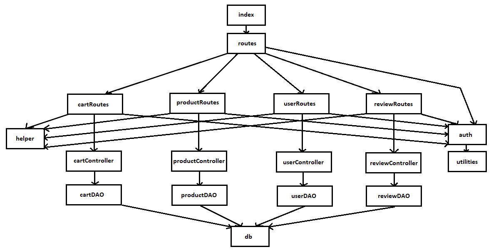
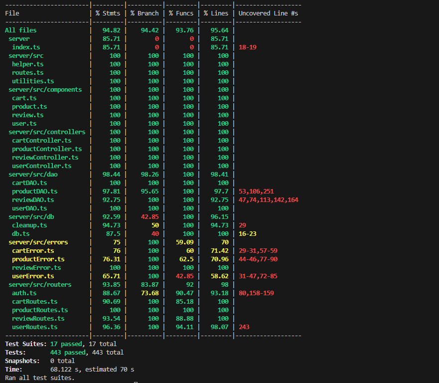

# Test Report

<The goal of this document is to explain how the application was tested, detailing how the test cases were defined and what they cover>

# Contents

- [Test Report](#test-report)
- [Contents](#contents)
- [Dependency graph](#dependency-graph)
- [Integration approach](#integration-approach)
- [Tests](#tests)
- [Coverage](#coverage)
  - [Coverage of FR](#coverage-of-fr)
  - [Coverage white box](#coverage-white-box)

# Dependency graph

# Integration approach

Abbiamo sviluppato gli integration test in maniera Bottom Up, partendo dai test unit su DAO, Controller e Routes; in seguito abbiamo testato l'integrazione delle varie unità tra loro attraverso i test API.
- step1: unit DAO
- step2: unit Controller
- step3: unit Routes
- step4: unit DAO + Controller + Routes

# Tests

Nella colonna "Test case name" abbiamo inserito il nome della test suite che si occupa di testare un determinato metodo. Il pedice "_x" indica tutti i test cases contenuti nella suite.

| Test case name             | Object(s) tested                       | Test level   | Technique used |
| :------------------------: | :------------------------------------: | :----------: | :------------: |
|   CartDAO                  |                                        |              |                |
|   CartDAO_1_x               | addToCart method                       |  unit        |  WB            |
|   CartDAO_2_x               | getCart method                         |  unit        |  WB            |
|   CartDAO_3_x                | checkoutCart method                    |  unit        |  WB            |
|   CartDAO_4_x                | getCustomerCarts method                |  unit        |  WB            |
|   CartDAO_5_x               | removeProductFromCart method           |  unit        |  WB            |
|   CartDAO_6_x                | clearCart method                       |  unit        |  WB            |
|   CartDAO_7_x                | deleteAllCarts method                  |  unit        |  WB            |
|   CartDAO_8_x                | getAllCarts method                     |  unit        |  WB            |
|   CartController           |                                        |              |                |
|   CartController_1_x         | addToCart method                       |  unit        |  WB            |
|   CartController_2_x         | getCart method                         |  unit        |  WB            |
|   CartController_3_x         | checkoutCart method                    |  unit        |  WB            |
|   CartController_4_x         | getCustomerCarts method                |  unit        |  WB            |
|   CartController_5_x         | removeProductFromCart method           |  unit        |  WB            |
|   CartController_6_x         | clearCart method                       |  unit        |  WB            |
|   CartController_7_x         | deleteAllCarts method                  |  unit        |  WB            |
|   CartController_8_x         | getAllCarts method                     |  unit        |  WB            |
|   CartRoutes               |                                        |              |                |
|   CartRoutes_1_x             | route GET /carts                       |  unit        |  WB            |
|   CartRoutes_2_x             | route POST /carts                      |  unit        |  WB            |
|   CartRoutes_3_x             | route PATCH /carts                     |  unit        |  WB            |
|   CartRoutes_4_x             | route GET /carts/history               |  unit        |  WB            |
|   CartRoutes_5_x            | route DELETE /carts/products/:model    |  unit        |  WB            |
|   CartRoutes_6_x             | route DELETE /carts/current            |  unit        |  WB            |
|   CartRoutes_7_x             | route DELETE /carts                    |  unit        |  WB            |
|   CartRoutes_8_x             | route GET /carts/all                   |  unit        |  WB            |
|   CartAPI                  |                                        |              |                |
|   CartAPI_1_x                | route GET /carts                       |  API         |  BB            |
|   CartAPI_2_x                | route POST /carts                      |  API         |  BB            |
|   CartAPI_3_x                | route PATCH /carts                     |  API         |  BB            |
|   CartAPI_4_x                | route GET /carts/history               |  API         |  BB            |
|   CartAPI_5_x                | route DELETE /carts/products/:model    |  API         |  BB            |
|   CartAPI_6_x                | route DELETE /carts/current            |  API         |  BB            |
|   CartAPI_7_x                | route DELETE /carts                    |  API         |  BB            |
|   CartAPI_8_x                | route GET /carts/all                   |  API         |  BB            |
|                            |                                        |              |                |
|   ProductDAO               |                                        |              |                |
|   ProductDAO_1_x             | registerProducts method                |  unit        |  WB            |
|   ProductDAO_2_x             | changeProductQuantity method           |  unit        |  WB            |
|   ProductDAO_3_x             | getProducts method                     |  unit        |  WB            |
|   ProductDAO_4_x             | getAvailableProducts method            |  unit        |  WB            |
|   ProductDAO_5_x             | sellProduct method                     |  unit        |  WB            |
|   ProductDAO_6_x             | deleteAllProducts method               |  unit        |  WB            |
|   ProductDAO_7_x             | deleteProduct method                   |  unit        |  WB            |
|   ProductController        |                                        |              |                |
|   ProductController_1_x      | registerProducts method                |  unit        |  WB            |
|   ProductController_2_x      | changeProductQuantity method           |  unit        |  WB            |
|   ProductController_3_x      | getProducts method                     |  unit        |  WB            |
|   ProductController_4_x      | getAvailableProducts method            |  unit        |  WB            |
|   ProductController_5_x      | sellProduct method                     |  unit        |  WB            |
|   ProductController_6_x      | deleteAllProducts method               |  unit        |  WB            |
|   ProductController_7_x      | deleteProduct method                   |  unit        |  WB            |
|   ProductRoutes            |                                        |              |                |
|   ProductRoutes_1_x          | route POST /products                   |  unit        |  WB            |
|   ProductRoutes_2_x          | route PATCH /products/:model           |  unit        |  WB            |
|   ProductRoutes_3_x          | route PATCH /products/:model/sell      |  unit        |  WB            |
|   ProductRoutes_4_x          | route GET /products                    |  unit        |  WB            |
|   ProductRoutes_5_x          | route GET /products/available          |  unit        |  WB            |
|   ProductRoutes_6_x          | route DELETE /products/:model          |  unit        |  WB            |
|   ProductRoutes_7_x          | route DELETE /products                 |  unit        |  WB            |
|   ProductAPI               |                                        |              |                |
|   ProductAPI_1_x             | route POST /products                   |  API         |  BB            |
|   ProductAPI_2_x             | route PATCH /products/:model           |  API         |  BB            |
|   ProductAPI_3_x             | route PATCH /products/:model/sell      |  API         |  BB            |
|   ProductAPI_4_x             | route GET /products                    |  API         |  BB            |
|   ProductAPI_5_x             | route GET /products/available          |  API         |  BB            |
|   ProductAPI_6_x             | route DELETE /products/:model          |  API         |  BB            |
|   ProductAPI_7_x             | route DELETE /products                 |  API         |  BB            |
|                            |                                        |              |                |
|   ReviewDAO                |                                        |              |                |
|   ReviewDAO_1_x              | addReview method                       |  unit        |  WB            |
|   ReviewDAO_2_x              | getProductReviews method               |  unit        |  WB            |
|   ReviewDAO_3_x              | deleteReview method                    |  unit        |  WB            |
|   ReviewDAO_4_x              | deleteReviewsOfProduct method          |  unit        |  WB            |
|   ReviewDAO_5_x              | deleteAllReviews method                |  unit        |  WB            |
|   ReviewController         |                                        |              |                |
|   ReviewController_1_x       | addReview method                       |  unit        |  WB            |
|   ReviewController_2_x       | getProductReviews method               |  unit        |  WB            |
|   ReviewController_3_x       | deleteReview method                    |  unit        |  WB            |
|   ReviewController_4_x       | deleteReviewsOfProduct method          |  unit        |  WB            |
|   ReviewController_5_x       | deleteAllReviews method                |  unit        |  WB            |
|   ReviewRoutes             |                                        |              |                |
|   ReviewRoutes_1_x           | route POST /reviews/:model             |  unit        |  WB            |
|   ReviewRoutes_2_x           | route GET /reviews/:model              |  unit        |  WB            |
|   ReviewRoutes_3_x           | route DELETE /reviews/:model           |  unit        |  WB            |
|   ReviewRoutes_4_x           | route DELETE /reviews/:model/all       |  unit        |  WB            |
|   ReviewRoutes_5_x           | route DELETE /reviews                  |  unit        |  WB            |
|   ReviewAPI                |                                        |              |                |
|   ReviewAPI_1_x              | route POST /reviews/:model             |  API         |  BB            |
|   ReviewAPI_2_x              | route GET /reviews/:model              |  API         |  BB            |
|   ReviewAPI_3_x              | route DELETE /reviews/:model           |  API         |  BB            |
|   ReviewAPI_4_x             | route DELETE /reviews/:model/all       |  API         |  BB            |
|   ReviewAPI_5_x              | route DELETE /reviews                  |  API         |  BB            |
|                            |                                        |              |                |
|   UserDAO                  |                                        |              |                |
|   UserDAO_1_x                | getIsUserAuthenticated method          |  unit        |  WB            |
|   UserDAO_2_x                | createUser method                      |  unit        |  WB            |
|   UserDAO_3_x                | getUserByUsername method               |  unit        |  WB            |
|   UserDAO_4_x               | getAllUsers method                     |  unit        |  WB            |
|   UserDAO_5_x                | deleteAll method                       |  unit        |  WB            |
|   UserDAO_6_x               | getUsersByRole method                  |  unit        |  WB            |
|   UserDAO_7_x                | updateUserInfo method                  |  unit        |  WB            |
|   UserDAO_8_x                | deleteUser method                      |  unit        |  WB            |
|   UserController           |                                        |              |                |
|   UserController_1_x         | getIsUserAuthenticated method          |  unit        |  WB            |
|   UserController_2_x         | createUser method                      |  unit        |  WB            |
|   UserController_3_x         | getUserByUsername method               |  unit        |  WB            |
|   UserController_4_x         | getAllUsers method                     |  unit        |  WB            |
|   UserController_5_x         | deleteAll method                       |  unit        |  WB            |
|   UserController_6_x         | getUsersByRole method                  |  unit        |  WB            |
|   UserController_7_x         | updateUserInfo method                  |  unit        |  WB            |
|   UserController_8_x         | deleteUser method                      |  unit        |  WB            |
|   UserRoutes               |                                        |              |                |
|   UserRoutes_1_x             | route POST /users                      |  unit        |  WB            |
|   UserRoutes_2_x             | route GET /users                       |  unit        |  WB            |
|   UserRoutes_3_x             | route GET /users/roles/:role           |  unit        |  WB            |
|   UserRoutes_4_x             | route GET /users/:username             |  unit        |  WB            |
|   UserRoutes_5_x             | route DELETE /users/:username          |  unit        |  WB            |
|   UserRoutes_6_x            | route DELETE /users                    |  unit        |  WB            |
|   UserRoutes_7_x            | route PATCH /users/:username           |  unit        |  WB            |
|   UserAPI                  |                                        |              |                |
|   UserAPI_1                | route POST /users                      |  API         |  BB            |
|   UserAPI_2                | route GET /users                       |  API         |  BB            |
|   UserAPI_3                | route GET /users/roles/:role           |  API         |  BB            |
|   UserAPI_4                | route GET /users/:username             |  API         |  BB            |
|   UserAPI_5                | route DELETE /users/:username          |  API         |  BB            |
|   UserAPI_6                | route DELETE /users                    |  API         |  BB            |
|   UserAPI_7                | route PATCH /users/:username           |  API         |  BB            |
|   UserAPI_8                | route DELETE /sessions/current         |  API         |  BB            |
|   UserAPI_9                | route POST /sessions                   |  API         |  BB            |
# Coverage

## Coverage of FR

<Report in the following table the coverage of functional requirements and scenarios(from official requirements) >

| Functional Requirement or scenario | Test(s)                                                           |
| :--------------------------------: | :---------------------------------------------------------------: |
|                FR1                 |                                                                   |
|               FR1.1                | User_API_9                                                        |
|               FR1.2                |  User_API_8                                                       |
|               FR1.3                | UserDAO_2, UserController_2, UserRoutes_1, UserAPI_1              |
|                FR2                 |                                                                   |
|               FR2.1                | UserDAO_4, UserController_4, UserRoutes_2, UserAPI_2              |
|               FR2.2                | UserDAO_6, UserController_6, UserRoutes_3, UserAPI_3              |
|               FR2.3                | UserDAO_3, UserController_3, UserRoutes_4, UserAPI_4              |
|               FR2.4                | UserDAO_7, UserController_7, UserRoutes_7, UserAPI_7              |
|               FR2.5                | UserDAO_8, UserController_8, UserRoutes_5, UserAPI_5              |
|               FR2.6                | UserDAO_5, UserController_5, UserRoutes_6, UserAPI_6              |
|                FR3                 |                                                                   |
|               FR3.1                | ProductDAO_1, ProductController_1, ProductRoutes_1, ProductAPI_1  |
|               FR3.2                | ProductDAO_2, ProductController_2, ProductRoutes_2, ProductAPI_2  |
|               FR3.3                | ProductDAO_5, ProductController_5, ProductRoutes_3, ProductAPI_3  |
|               FR3.4                | ProductDAO_3, ProductController_3, ProductRoutes_4, ProductAPI_4  |
|              FR3.4.1               | ProductDAO_4, ProductController_4, ProductRoutes_5, ProductAPI_5  |
|               FR3.5                | ProductDAO_3, ProductController_3, ProductRoutes_4, ProductAPI_4  |
|              FR3.5.1               | ProductDAO_4, ProductController_4, ProductRoutes_5, ProductAPI_5  |
|               FR3.6                | ProductDAO_3, ProductController_3, ProductRoutes_4, ProductAPI_4  |
|              FR3.6.1               | ProductDAO_4, ProductController_4, ProductRoutes_5, ProductAPI_5  |
|               FR3.7                | ProductDAO_7, ProductController_7, ProductRoutes_6, ProductAPI_6  |
|               FR3.8                | ProductDAO_6, ProductController_6, ProductRoutes_7, ProductAPI_7  |
|                FR4                 |                                                                   |
|               FR4.1                | ReviewDAO_1, ReviewController_1, ReviewRoutes_1, ReviewAPI_1      |
|               FR4.2                | ReviewDAO_2, ReviewController_2, ReviewRoutes_2, ReviewAPI_2      |
|               FR4.3                | ReviewDAO_3, ReviewController_3, ReviewRoutes_3, ReviewAPI_3      |
|               FR4.4                | ReviewDAO_4, ReviewController_4, ReviewRoutes_4, ReviewAPI_4      |
|               FR4.5                | ReviewDAO_5, ReviewController_5, ReviewRoutes_5, ReviewAPI_5      |
|                FR5                 |                                                                   |
|               FR5.1                | CartDAO_2, CartController_2, CartRoutes_1, CartAPI_1              |
|               FR5.2                | CartDAO_1, CartController_1, CartRoutes_2, CartAPI_2              |
|               FR5.3                | CartDAO_3, CartController_3, CartRoutes_3, CartAPI_3              |
|               FR5.4                | CartDAO_4, CartController_4, CartRoutes_4, CartAPI_4              |
|               FR5.5                | CartDAO_5, CartController_5, CartRoutes_5, CartAPI_5              |
|               FR5.6                | CartDAO_6, CartController_6, CartRoutes_6, CartAPI_6              |
|               FR5.7                | CartDAO_7, CartController_7, CartRoutes_7, CartAPI_7              |
|               FR5.8                | CartDAO_8, CartController_8, CartRoutes_8, CartAPI_8              |

## Coverage white box

Report here the screenshot of coverage values obtained with jest-- coverage

