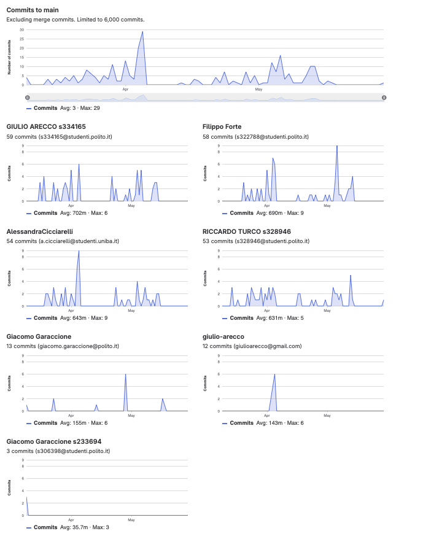

# Gruppo 6

## Valutazione deliverable V1

| gruppo | context diagram | business model | stakeholder | stories | interface | FR | NFR | use cases diagram | use cases | scenario | Glossary | DeploymentDiagram | functionality | estimation doc | precisione valori estimation | valutazione |
| --- | --- | --- | --- | --- | --- | --- | --- | --- | --- | --- | --- | --- | --- | --- | --- | --- |
| - | 1 | 0.5 | 0.5 | 1 | 1 | 3 | 3 | 1 | 5 | 5 | 5 | 2 | 1 | 2 | 2 | 33 |
| 6 | 100 | 100 | 95 | 90 | 100 | 100 | 100 | 100 | 100 | 100 | 85 | 95 | 100 | 95 | 94.7 | 97.95 |

## Valutazione deliverable V2

| gruppo | context diagram | business model | stakeholder | stories | interface | FR | NFR | ACCESS RIGHTS | use cases diagram | use cases | scenario | Glossary | DeploymentDiagram | functionality | estimation | precisione valori estimation | valutazione |
| --- | --- | --- | --- | --- | --- | --- | --- | --- | --- | --- | --- | --- | --- | --- | --- | --- | --- |
| - | 1 | 0.5 | 0.5 | 1 | 1 | 3 | 2 | 1 | 1 | 5 | 5 | 5 | 2 | 1 | 2 | 2 | 33 |
| 6 | 100 | 100 | 100 | 100 | 100 | 100 | 100 | 100 | 100 | 100 | 100 | 100 | 80 | 100 | 100 | 89.63 | 99.69 |

Le percentuali di v2 sono state riscalate in quanto la media pesata delle percentuali portava alcuni gruppi oltre al 100%.

## Valutazione codice e test (V2 + V3)

| Test Unit Totali | Test Unit Passati | Statement Coverage Unit | Branch Coverage Unit | Function Coverage Unit | Line Coverage Unit | Test Integration Totali | Test Integration Falliti | Statement Coverage Integration | Branch Coverage Integration | Function Coverage Integration | Line Coverage Integration | Correttezza V2 | Correttezza V3 | valutazione |
| --- | --- | --- | --- | --- | --- | --- | --- | --- | --- | --- | --- | --- | --- | --- |
| 1 | 0.5 | 2 | 2 | 1 | 1 | 1 | 0.5 | 2 | 2 | 1 | 1 | 16 | 2 | 33 |
| 100 | 100 | 100 | 100 | 100 | 100 | 100 | 100 | 100 | 75 | 100 | 100 | 89.9159663865546 | 100 | 93.6 |

 Unit e integration test prodotti dai gruppi sono stati eseguiti con la versione V2 del codice.

## Risultati Progetto

| Deliverable | Punteggio | Peso |
| --- | --- | --- |
| **Documenti V1** | 97.95% | 6 |
| **Documenti V2** | 98.35% | 2 |
| **Codice e Test** | 93.6% | 22 |
| **Timesheet** | 66.66% | 3 |
| **Valutazione** | 30.44 | 33 |
| **Valutazione** | 12.17 | 13.2 |

## Calcolo pesi progetto per singolo studente

| cognome | nome | email | gruppo | commit studente | commit totali | commit sul totale | coefficiente catme | coefficiente pesato | coefficiente progetto |
| --- | --- | --- | --- | --- | --- | --- | --- | --- | --- |
| ARECCO | GIULIO | s334165@studenti.polito.it | 6 | 59 | 236 | 0.25 | 1.00 | 0.85 | 0.98 |
| CICCIARELLI | ALESSANDRA | s332242@studenti.polito.it | 6 | 54 | 236 | 0.23 | 1.00 | 0.85 | 0.98 |
| FORTE | FILIPPO | s322788@studenti.polito.it | 6 | 58 | 236 | 0.25 | 1.02 | 0.87 | 1.00 |
| TURCO | RICCARDO DANIELE | s328946@studenti.polito.it | 6 | 65 | 236 | 0.28 | 0.93 | 0.80 | 0.92 |

 I pesi del progetto sono ottenuti per l'80% dal valore calcolato da CATME e per il 20% dalla percentuale dei commit del singolo studente sul totale dei commit effettuati dagli studenti dello stesso gruppo. Il risultato è stato poi riscalato in modo che il punteggio più alto del gruppo ottenesse 1.

## Studenti

| Nome | Matricola | Email | Bonus | Voto Primo Appello | Voto Secondo Appello | Voto Progetto | Voto Finale |
| --- | --- | --- | --- | --- | --- | --- | --- |
| ALESSANDRA CICCIARELLI | 332242 | s332242@studenti.polito.it | 1 | 14.18 | | 11.90 | 27 |
| RICCARDO DANIELE TURCO | 328946 | s328946@studenti.polito.it | 0 | 15.48 | | 11.24 | 27 |
| FILIPPO FORTE | 322788 | s322788@studenti.polito.it | 1 |  | 15| 12.17 | 28 |
| GIULIO ARECCO | 334165 | s334165@studenti.polito.it | 0 |  | 13.8 | 11.96 | 26 |
